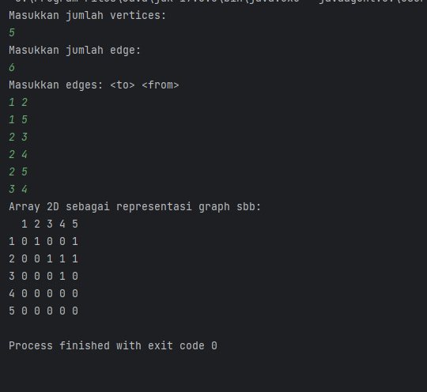

# Laporan Praktikum Pertemuan 15 Graph

---

NIM : 2241720192
Nama : Achmad Raihan Fahrezi Effendy
Kelas : TI 1D

---

## 2.1 Implementasi Graph menggunakan Linked List

### Tahap Percobaan

Pada percobaan ini akan diimplementasikan Graph menggunakan Linked Lists untuk
merepresentasikan graph adjacency. Silakan lakukan langkah-langkah praktikum sebagai berikut.

#### Kode Program

Class Node

``` java
package Graph;

public class Node {
    int data;
    Node next, prev;

    public Node(Node prev, int data, Node next) {
        this.prev = prev;
        this.data = data;
        this.next = next;
    }
}
```

Class DoubleLinkedList

``` java

public class DoubleLinkedList {
    Node head;
    int size;

    public DoubleLinkedList() {
        this.head = null;
        this.size = 0;
    }

    public boolean isEmpty() {
        return head == null;
    }

    public void addFirst(int item) {
        if (isEmpty()) {
            head = new Node(null, item, null);
        } else {
            Node newNode = new Node(null, item, head);
            head.prev = newNode;
            head = newNode;
        }
        size++;
    }

    public void addLast(int item) {
        if (isEmpty()) {
            addFirst(item);
        } else {
            Node current = head;
            while (current.next != null) {
                current = current.next;
            }
            Node newNode = new Node(current, item, null);
            current.next = newNode;
            size++;
        }
    }
    public void add(int item, int index) throws Exception {
        if (isEmpty()) {
            addFirst(item);
        } else if (index < 0 || index > size) {
            throw new Exception("Nilai indeks diluar batas");
        } else {
            Node current = head;
            int i = 0;
            while (i < index) {
                current = current.next;
                i++;
            }
            if (current.prev == null) {
                Node newNode = new Node(null, item, current);
                current.prev = newNode;
                head = newNode;
            } else {
                Node newNode = new Node(current.prev, item, current);
                current.prev.next = newNode;
                current.prev = newNode;

            }
        }
        size++;
    }
    public int size() {
        return size;
    }
    public void clear() {
        head = null;
        size = 0;
    }

    public void print() {
        if (!isEmpty()) {
            Node tmp = head;
            while (tmp != null) {
                System.out.print(tmp.data + "\t");
                tmp = tmp.next;
            }
            System.out.println("\nberhasil diisi");
        } else {
            System.out.println("Linked Lists Kosong");
        }
    }

    /**
     * Kode program di bawah ini tambahkan pada saat melakukan percobaan 2
     * */
    public void removeFirst() throws Exception {
        if (isEmpty()) {
            throw  new Exception("Linked List masih kosong, tidak dapat dihapus");
        } else if (size == 1) {
            removeLast();
        } else {
            head = head.next;
            head.prev = null;
            size--;
        }
    }
    public void removeLast() throws Exception{
        if (isEmpty()) {
            throw  new Exception("Linked List masih kosong, tidak dapat dihapus");
        } else if (head.next == null) {
            head = null;
            size--;
            return;
        }
        Node current = head;
        while (current.next.next != null) {
            current = current.next;
        }
        current.next = null;
        size--;
    }
    public void remove(int index) throws Exception {
        if (isEmpty() || index >= size) {
            throw new Exception("Nilai indeks di luar batas");
        } else if (index == 0) {
            removeFirst();
        } else {
            Node current = head;
            int i = 0;
            while (i < index) {
                current = current.next;
                i++;
            }
            if (current.next == null) {
                current.prev.next = null;
            } else if (current.prev == null) {
                current = current.next;
                current.prev = null;
                head = current;
            } else {
                current.prev.next = current.next;
                current.next.prev = current.prev;
            }
            size--;
        }
    }

    /**
     * Kode program digunakan pada dibawah ini ditambahkan pada saat melakukan percobaan 3
     * */

    public int getFirst() throws Exception {
        if (isEmpty()) {
            throw new Exception("Linked List Kosong");
        }
        return head.data;
    }

    public int getLast() throws Exception {
        if (isEmpty()) {
            throw new Exception("Linked List Kosong");
        }
        Node tmp = head;
        while (tmp.next != null) {
            tmp = tmp.next;
        }
        return tmp.data;
    }

    public int get(int index) throws Exception {
        if (isEmpty() || index >= size) {
            throw new Exception("Nilai indeks di luar batas.");
        }
        Node tmp = head;
        for (int i = 0; i < index; i++) {
            tmp = tmp.next;
        }
        return tmp.data;
    }
}
```

Class Graph

``` java
package Graph;

public class Graph {
    int vertex;
    DoubleLinkedList list[];
    Node right;

    public Graph(int vertex) {
        this.vertex = vertex;
        list = new DoubleLinkedList[vertex];
        for (int i = 0; i < vertex; i++) {
            list[i] = new DoubleLinkedList();
        }
    }

    public void addEdge(int source, int destination) {
        list[source].addFirst(destination);
        list[destination].addFirst(source);
    }
  
    public void degree(int source) throws Exception {
        // degree undirect graph
        System.out.println("degree vertex " + source + " : " + list[source].size);
  
        // degree direct graph
        // inDegree
        int k, totalIn = 0, totalOut = 0;
        for (int i = 0; i < vertex; i++) {
            for (int j = 0; j < list[i].size; j++) {
                if (list[i].get(j) == source) ++totalIn;
            }
            // outDegree
            for (k = 0; k < list[source].size; k++) {
                list[source].get(k);
            }
            totalOut = k;
        }
        System.out.println("Indegree dari vertex " + source + " : " + totalIn);
        System.out.println("Outdegree dari vertex " + source + " : " + totalOut);
        System.out.println("degree vertex " + source + " : " + (totalIn + totalOut));

    }
    public void removeEdge(int source, int destination) throws Exception {
        for (int i = 0; i < vertex; i++) {
            if (i == destination) {
                list[source].remove(destination);
            }
        }
    }
    public void removeAllEdge() {
        for (int i = 0; i < vertex; i++) {
            list[i].clear();
        }
        System.out.println("Graph berhasil dikosongkan");
    }

    public void printGraph() throws Exception {
        for (int i = 0; i < vertex; i++) {
            if (list[i].size > 0) {
                System.out.print("Vertex " + i + " terhubung dengan: ");
                for (int j = 0; j < list[i].size; j++) {
                    System.out.print(list[i].get(j) +" ");
                }
                System.out.println();
            }
        }
        System.out.println();
    }
}
```

Class GraphMain

``` java
package Graph;

public class GraphMain {
    public static void main(String[] args) throws Exception {
        Graph graph = new Graph(6);
        graph.addEdge(0,1);
        graph.addEdge(0,4);
        graph.addEdge(1,2);
        graph.addEdge(1,3);
        graph.addEdge(1,4);
        graph.addEdge(2,3);
        graph.addEdge(3,4);
        graph.addEdge(3,0);
        graph.printGraph();
        graph.degree(2);
        // langkah ke - 13
        graph.removeEdge(1,3);
        graph.removeEdge(3,0);
        graph.printGraph();
    }
}
```

#### Output

Hasil Running pada Langkah ke-11


Hasil Running pada Langkah ke-13


Pertanyaan

1. Beberapa jenis alogaritma yang menggunakan dasar Graph antara lain:
   + Depth-First Search (DFS): Algoritma DFS digunakan untuk menjelajahi atau mencari informasi dalam sebuah graf dengan melakukan pencarian secara mendalam. DFS dapat digunakan untuk menemukan semua simpul yang dapat dicapai dari simpul awal, menemukan jalur tertentu antara dua simpul, atau menentukan apakah graf terhubung atau tidak.
   + Breadth-First Search (BFS): Algoritma BFS digunakan untuk menjelajahi atau mencari informasi dalam sebuah graf dengan melakukan pencarian secara melebar. BFS dapat digunakan untuk mencari jalur terpendek antara dua simpul, menemukan semua simpul dalam graf yang terhubung ke simpul awal, atau menemukan pola atau struktur tertentu dalam graf.
   + Minimum Spanning Tree (MST): Algoritma MST digunakan untuk mencari pohon lintasan terpendek yang menghubungkan semua simpul dalam graf dengan bobot minimum. Algoritma MST seperti Algoritma Prim atau Algoritma Kruskal digunakan dalam masalah jaringan, perencanaan rute, atau optimisasi lintasan di mana penting untuk memilih jalur dengan bobot minimum.
2. Variabel list pada Class Graph digunakan untuk menyimpan  representasi adjacency list dari graf. Setiap elemen dalam array list adalah sebuah objek DoubleLinkedList yang menyimpan simpul-simpul yang terhubung dengan simpul tertentu. Dengan menggunakan array list, kita dapat dengan mudah mengakses simpul-simpul yang terhubung dengan suatu simpul tertentu dalam graf.
3. Karena pemanggilan addFirst() lebih efisien dibanding dengan addLast() atau add(). Pemanggilan method addFirst dilakukan ketika menambahkan edge antara dua simpul dalam graf, kita ingin simpul tersebut ditambahkan di awal list simpul-simpul yang terhubung. Dengan demikian, simpul baru akan menjadi tetangga pertama (terdepan) dari simpul asal. Penggunaan addFirst() lebih efisien.
4. Perlu dilakukan iterasi dari simpul yang akan dihapus untuk menemukan simpul tersebut. Setelah simpul tersebut ditemukan kita mengupdate nilai pointer agar edge dapat dihapus dengan menghubungkan simpul sebelum dan setelahnya.
5. Pada langkah ke-12 tidak menghasilkan output yang diharapkan karena pada saat dilakukan penghapusan pada simpul vertex 1 index 3 kita belum melakukan penghapusan pada vertex source 3 destination 0.
   Hal ini perlu dilakukan untuk representasi graf tidak berarah, kedua graf harus dihapus agar path yang bukan lintasan ikut terhapus secara keseluruhan 

## 2.2 Implementasi Graph menggunakan Matriks

### Tahap Percobaan

Pada praktikum 2.2 ini akan diimplementasikan Graph menggunakan matriks untuk
merepresentasikan graph adjacency. Silakan lakukan langkah-langkah praktikum sebagai berikut.

#### Kode Program

Class Node

``` java
package Graph;

public class Node {
    int data;
    Node next, prev;

    public Node(Node prev, int data, Node next) {
        this.prev = prev;
        this.data = data;
        this.next = next;
    }
}
```

Class DoubleLinkedList

``` java

public class DoubleLinkedList {
    Node head;
    int size;

    public DoubleLinkedList() {
        this.head = null;
        this.size = 0;
    }

    public boolean isEmpty() {
        return head == null;
    }

    public void addFirst(int item) {
        if (isEmpty()) {
            head = new Node(null, item, null);
        } else {
            Node newNode = new Node(null, item, head);
            head.prev = newNode;
            head = newNode;
        }
        size++;
    }

    public void addLast(int item) {
        if (isEmpty()) {
            addFirst(item);
        } else {
            Node current = head;
            while (current.next != null) {
                current = current.next;
            }
            Node newNode = new Node(current, item, null);
            current.next = newNode;
            size++;
        }
    }
    public void add(int item, int index) throws Exception {
        if (isEmpty()) {
            addFirst(item);
        } else if (index < 0 || index > size) {
            throw new Exception("Nilai indeks diluar batas");
        } else {
            Node current = head;
            int i = 0;
            while (i < index) {
                current = current.next;
                i++;
            }
            if (current.prev == null) {
                Node newNode = new Node(null, item, current);
                current.prev = newNode;
                head = newNode;
            } else {
                Node newNode = new Node(current.prev, item, current);
                current.prev.next = newNode;
                current.prev = newNode;

            }
        }
        size++;
    }
    public int size() {
        return size;
    }
    public void clear() {
        head = null;
        size = 0;
    }

    public void print() {
        if (!isEmpty()) {
            Node tmp = head;
            while (tmp != null) {
                System.out.print(tmp.data + "\t");
                tmp = tmp.next;
            }
            System.out.println("\nberhasil diisi");
        } else {
            System.out.println("Linked Lists Kosong");
        }
    }

    /**
     * Kode program di bawah ini tambahkan pada saat melakukan percobaan 2
     * */
    public void removeFirst() throws Exception {
        if (isEmpty()) {
            throw  new Exception("Linked List masih kosong, tidak dapat dihapus");
        } else if (size == 1) {
            removeLast();
        } else {
            head = head.next;
            head.prev = null;
            size--;
        }
    }
    public void removeLast() throws Exception{
        if (isEmpty()) {
            throw  new Exception("Linked List masih kosong, tidak dapat dihapus");
        } else if (head.next == null) {
            head = null;
            size--;
            return;
        }
        Node current = head;
        while (current.next.next != null) {
            current = current.next;
        }
        current.next = null;
        size--;
    }
    public void remove(int index) throws Exception {
        if (isEmpty() || index >= size) {
            throw new Exception("Nilai indeks di luar batas");
        } else if (index == 0) {
            removeFirst();
        } else {
            Node current = head;
            int i = 0;
            while (i < index) {
                current = current.next;
                i++;
            }
            if (current.next == null) {
                current.prev.next = null;
            } else if (current.prev == null) {
                current = current.next;
                current.prev = null;
                head = current;
            } else {
                current.prev.next = current.next;
                current.next.prev = current.prev;
            }
            size--;
        }
    }

    /**
     * Kode program digunakan pada dibawah ini ditambahkan pada saat melakukan percobaan 3
     * */

    public int getFirst() throws Exception {
        if (isEmpty()) {
            throw new Exception("Linked List Kosong");
        }
        return head.data;
    }

    public int getLast() throws Exception {
        if (isEmpty()) {
            throw new Exception("Linked List Kosong");
        }
        Node tmp = head;
        while (tmp.next != null) {
            tmp = tmp.next;
        }
        return tmp.data;
    }

    public int get(int index) throws Exception {
        if (isEmpty() || index >= size) {
            throw new Exception("Nilai indeks di luar batas.");
        }
        Node tmp = head;
        for (int i = 0; i < index; i++) {
            tmp = tmp.next;
        }
        return tmp.data;
    }
}
```

Class GraphArray

``` java
package Graph;

public class graphArray {
    private final int vertices;
    private final int[][] twoD_array;

    public graphArray(int vertices) {
        this.vertices = vertices;
        this.twoD_array = new int[vertices + 1][vertices + 1];
    }

    public void makeEdge(int to, int from, int edge) {
        try {
            twoD_array[to][from] = edge;
        } catch (ArrayIndexOutOfBoundsException index) {
            System.out.println("Vertex tidak ada");
        }
    }

    public int getEdge(int to, int from) {
        try {
            return twoD_array[to][from];
        } catch (ArrayIndexOutOfBoundsException index) {
            System.out.println("Vertex tidak ada");
        }
        return -1;
    }
}
```

Class GraphArrayMain

``` java
package Graph;

import java.util.Scanner;

public class GraphArrayMain {
    public static void main(String[] args) {
        int v, e, count = 1, to = 0, from = 0;
        Scanner sc = new Scanner(System.in);
        graphArray graph;
        try {
            System.out.println("Masukkan jumlah vertices: ");
            v = sc.nextInt();
            System.out.println("Masukkan jumlah edge: ");
            e = sc.nextInt();

            graph = new graphArray(v);

            System.out.println("Masukkan edges: <to> <from>");
            while (count <= e) {
                to = sc.nextInt();
                from = sc.nextInt();

                graph.makeEdge(to, from, 1);
                count++;
            }
            System.out.println("Array 2D sebagai representasi graph sbb: ");
            System.out.print("  ");
            for (int i = 1; i <= v; i++) {
                System.out.print(i + " ");
            }
            System.out.println();

            for (int i = 1; i <= v; i++) {
                System.out.print(i + " ");
                for (int j = 1; j <= v ; j++) {
                    System.out.print(graph.getEdge(i, j) + " ");
                }
                System.out.println();
            }
        } catch (Exception E) {
            System.out.println("Error. Silahkan cek kembali\n" + E.getMessage());
        }
        sc.close();
    }
}
```

#### Output



Pertanyaan

1. Perbedaan degree(derajat) pada directed dan undirected graph adalah:
   + Degree pada directed graph pada in-Deggree jumlah edge yang masuk pada ke suatu simpul, sedangkan out-Degree menunjuknya banyaknya pengaruh keluar dari suatu simpul ke simpul lain
   + Degree pada undirected graph jumlah edge yang terhubung dengan suatu simpul. Degree simpul simpul tetangga dari simpul tersebut memiliki pengaruh yang sama terhadap derajat simpulnya baik itu In-Degree maupun Out-Degree
2. Pada implementasi graph menggunakan adjecency matriks, penambahan 1 pada vertices digunakan menyediakan indeeks array yang mulai dari 1 hingga vertices bukan dari 0 hingga vertices - 1 hal ini dilakukan agar indeks array dapat merepresentasikan simpul dalam graf lebih mudah
3. Method getEdge() digunakan untuk mendapatkan nilai weight/nilai dari suatu edge antara dua vertex yang diberikan. Method ini menerima dua parameter yaitu indeks vertex to dan from, dan mengembalikan nilai weight/nilai dari edge yang menghubungkan vertex to dan from pada adjacency matrix
4. Pada uji coba pada praktikum 2.2 Graph tersebut termasuk dalam jenis graph berarah (directed graph) yang diimplementasikan menggunakan adjecency matriks. Hal ini dapat dilihat dari penentuan nilai dari elemen matriks 2D yang mereprentasikan edge antara simpul simpul. Dalam kasus ini dapat dilihat pada elemen to dan from
5. Pada main method penggunaan try-catch digunakan untuk menangani kemungkinan terjadi Exception(error) ketika program dijalankan. Dengan menggunakan try-catch jika ada Exception yang terjadi pada block try maka akan melompat ke block catch dan menghasilkan handle yang sesuai yang dengan exception untuk dilakukan penangnanan seperti menampilkan pesan kesalahan

### Tugas Praktikum

1. Ubahlah lintasan pada praktikum 2.1 menjadi inputan!

   + Kode Program
     Class GraphMain

     ``` java
      package Graph;

      import java.util.Scanner;

      public class GraphMain {
      public static void main(String[] args) throws Exception {
      Scanner scanner = new Scanner(System.in);

              System.out.print("Masukkan jumlah vertex: ");
              int vertexCount = scanner.nextInt();

              Graph graph = new Graph(vertexCount);

              System.out.print("Masukkan jumlah edge: ");
              int edgeCount = scanner.nextInt();

              System.out.println("Masukkan edge <source> <destination>:");
              for (int i = 0; i < edgeCount; i++) {
                  int source = scanner.nextInt();
                  int destination = scanner.nextInt();
                  graph.addEdge(source, destination);
              }

              System.out.println("Graph awal:");
              graph.printGraph();

              System.out.print("Masukkan vertex untuk menampilkan derajat: ");
              int source = scanner.nextInt();
              graph.degree(source);

              System.out.print("Masukkan edge yang ingin dihapus <source> <destination>: ");
              int removeSource = scanner.nextInt();
              int removeDestination = scanner.nextInt();
              graph.removeEdge(removeSource, removeDestination);

              System.out.println("Graph setelah penghapusan edge:");
              graph.printGraph();

              scanner.close();
          }
      }
     ```
   + Output

     
2. Tambahkan method graphType dengan tipe boolean yang akan membedakan graph termasuk
   directed atau undirected graph. Kemudian update seluruh method yang berelasi dengan method
   graphType tersebut (hanya menjalankan statement sesuai dengan jenis graph) pada praktikum
   2.1

   + Kode Program
     Class Graph

   ``` java
   package Graph;

   public class Graph {
   int vertex;
   DoubleLinkedList list[];
   Node right;
   boolean isDirected; // variabel untuk menentukan jenis graph

       public Graph(int vertex, boolean isDirected) {
           this.vertex = vertex;
           this.vertex = vertex;
           list = new DoubleLinkedList[vertex];
           for (int i = 0; i < vertex; i++) {
               list[i] = new DoubleLinkedList();
           }
       }

       public void addEdge(int source, int destination) {
           list[source].addFirst(destination);
           if (!isDirected) {
               list[destination].addFirst(source);
           }
       }

       public void degree(int source) throws Exception {
           System.out.println("degree vertex " + source + " : " + list[source].size);

           if (isDirected) {
               int totalIn = 0, totalOut = 0;
               for (int i = 0; i < vertex; i++) {
                   for (int j = 0; j < list[i].size; j++) {
                       if (list[i].get(j) == source) {
                           totalIn++;
                       }
                   }
                   totalOut += list[source].size;
               }
               System.out.println("Indegree dari vertex " + source + " : " + totalIn);
               System.out.println("Outdegree dari vertex " + source + " : " + totalOut);
               System.out.println("degree vertex " + source + " : " + (totalIn + totalOut));
           }
       }
       public void removeEdge(int source, int destination) throws Exception {
           for (int i = 0; i < vertex; i++) {
               if (i == destination) {
                   list[source].remove(destination);
               }
           }
       }
       public void removeAllEdge() {
           for (int i = 0; i < vertex; i++) {
               list[i].clear();
           }
           System.out.println("Graph berhasil dikosongkan");
       }

       public void printGraph() throws Exception {
           for (int i = 0; i < vertex; i++) {
               if (list[i].size > 0) {
                   System.out.print("Vertex " + i + " terhubung dengan: ");
                   for (int j = 0; j < list[i].size; j++) {
                       System.out.print(list[i].get(j) +" ");
                   }
                   System.out.println();
               }
           }
           System.out.println();
       }
       public boolean graphType() {
           return isDirected;
       }
   }

   ```
   Class GraphMain

   ``` java
   package Graph;

   import java.util.Scanner;

   public class GraphMain {
   public static void main(String[] args) throws Exception {
   Scanner scanner = new Scanner(System.in);

           System.out.print("Masukkan jumlah vertex: ");
           int vertexCount = scanner.nextInt();

           Graph graph = new Graph(vertexCount, false);

           System.out.print("Masukkan jumlah edge: ");
           int edgeCount = scanner.nextInt();

           System.out.println("Masukkan edge <source> <destination>:");
           for (int i = 0; i < edgeCount; i++) {
               int source = scanner.nextInt();
               int destination = scanner.nextInt();
               graph.addEdge(source, destination);
           }

           System.out.println("Graph awal:");
           graph.printGraph();

           System.out.print("Masukkan vertex untuk menampilkan derajat: ");
           int source = scanner.nextInt();
           graph.degree(source);

           System.out.print("Masukkan edge yang ingin dihapus <source> <destination>: ");
           int removeSource = scanner.nextInt();
           int removeDestination = scanner.nextInt();
           graph.removeEdge(removeSource, removeDestination);

           System.out.println("Graph setelah penghapusan edge:");
           graph.printGraph();

           scanner.close();
       }
   }
   ```
3. Modifikasi method removeEdge() pada praktikum 2.1 agar tidak menghasilkan output yang salah
   untuk path selain path pertama kali!

   + Kode Program
     Change Method removeEdge in Class Graph

   ``` java
   public void removeEdge(int source, int destination) throws Exception {
      list[source].remove(destination);
      if (!isDirected) {
         list[destination].remove(source);
      }
   }
   ```
   4. Ubahlah tipe data vertex pada seluruh graph pada praktikum 2.1 dan 2.2 dari Integer menjadi
      tipe generic agar dapat menerima semua tipe data dasar Java! Misalnya setiap vertex yang
      awalnya berupa angka 0,1,2,3, dst. selanjutnya ubah menjadi suatu nama daerah seperti Gresik,
      Bandung, Yogya, Malang, dst
      Output

      + Graph

        + Kode Program

         Class Node
     
         ``` java
         package Graph.Tugas;
    
         public class Node<T> {
         T data;
         Node<T> prev, next;
    
             public Node(Node<T> prev, T data, Node<T> next) {
                 this.prev = prev;
                 this.data = data;
                 this.next = next;
             }
    
         }
         ```

         Class DoubleLinkedList
    
           ``` java
            package Graph.Tugas;
    
        
           public class DoubleLinkedList<T> {
           public Node<T> head;
           public Node<T> tail;
           public int size;
        
               public DoubleLinkedList() {
                   this.head = null;
                   this.tail = null;
                   this.size = 0;
               }
        
               public boolean isEmpty() {
                   return head == null;
               }
        
               public void addFirst(T data) {
                   Node<T> newNode = new Node<>(null, data, head);
                   if (isEmpty()) {
                       tail = newNode;
                   } else {
                       head.prev = newNode;
                   }
                   head = newNode;
                   size++;
               }
        
               public void addLast(T data) {
                   if (isEmpty()) {
                       addFirst(data);
                   } else {
                       tail = tail.next = new Node<>(tail, data, null);
                       size++;
                   }
               }
        
        
               public void add(T data, int index) throws Exception {
                   if (isEmpty() || index == 0) {
                       addFirst(data);
                   } else if (index < 0 || index > size) {
                       throw new Exception("Nilai indeks diluar batas");
                   } else if (index == size) {
                       addLast(data);
                   } else {
                       Node<T> current = head;
                       int i = 0;
                       while (i < index - 1) {
                           current = current.next;
                           i++;
                       }
                       Node newNode = new Node(current, data, current.next);
                       current.next.prev = newNode;
                       current.next = newNode;
                       size++;
                   }
               }
        
               public int size() {
                   return size;
               }
               public void clear() {
                   head = null;
                   tail = null;
                   size = 0;
               }
        
               public void print() {
                   if (!isEmpty()) {
                       Node<T> tmp = head;
                       while (tmp != null) {
                           System.out.print(tmp.data + "\t");
                           tmp = tmp.next;
                       }
                       System.out.println("\nberhasil diisi");
                   } else {
                       System.out.println("Linked Lists Kosong");
                   }
               }
        
               public T removeFirst() throws Exception {
                   Node<T> tmp = head;
                   if (isEmpty()) {
                       throw  new Exception("Linked List masih kosong, tidak dapat dihapus");
                   } else if (size == 1) {
                       removeLast();
                   } else {
                       head = head.next;
                       head.prev = null;
                       size--;
                   }
                   return tmp.data;
               }
               public T removeLast() throws Exception{
                   if (isEmpty()) {
                       throw  new Exception("Linked List masih kosong, tidak dapat dihapus");
                   }
                   Node<T> tmp = tail;
                   if (head.next == null) {
                       head = tail = null;
                   } else {
                       tail = tail.prev;
                       tail.next = null;
                   }
                   size--;
                   return tmp.data;
               }
               public T remove(int index) throws Exception {
                   if (isEmpty() || index >= size) {
                       throw new Exception("Nilai indeks di luar batas");
                   }
                   if (index == 0) {
                       return removeFirst();
                   } else {
                       Node<T> current = head;
                       int i = 0;
                       while (i < index) {
                           current = current.next;
                           i++;
                       }
                       if (current == tail) {
                           tail = tail.prev.next = null;
                       } else if (current.prev == null) {
                           current = current.next;
                           current.prev = null;
                           head = current;
                       } else {
                           current.prev.next = current.next;
                           current.next.prev = current.prev;
                       }
                       size--;
                       return current.data;
                   }
               }
        
               public T getFirst() throws Exception {
                   if (isEmpty()) {
                       throw new Exception("Linked List Kosong");
                   }
                   return head.data;
               }
        
               public T getLast() throws Exception {
                   if (isEmpty()) {
                       throw new Exception("Linked List Kosong");
                   }
                   return tail.data;
               }
        
               public T get(int index) throws Exception {
                   if (isEmpty() || index >= size) {
                       throw new Exception("Nilai indeks di luar batas.");
                   }
                   Node<T> tmp = head;
                   for (int i = 0; i < index; i++) {
                       tmp = tmp.next;
                   }
                   return tmp.data;
               }
           }
         ```    
      
        Class Graph
            
         ``` java
               package Graph.Tugas;

               public class Graph<T> {
               int vertex;
               DoubleLinkedList<T>[] list;
               Node right;
               boolean isDirected; // variable to determine the type of graph
            
                   public Graph(int vertex, boolean isDirected) {
                       this.vertex = vertex;
                       list = new DoubleLinkedList[vertex];
                       for (int i = 0; i < vertex; i++) {
                           list[i] = new DoubleLinkedList<>();
                       }
                       this.isDirected = isDirected;
                   }
            
                   public void addVertex(int index, T data) {
                       DoubleLinkedList<T> newLink = new DoubleLinkedList<>();
                       newLink.addFirst(data);
                       list[index] = newLink;
                   };
            
                   public void addEdge(T source, T destination) throws Exception {
                       int sourceIndex = getIndex(source);
                       int destinationIndex = getIndex(destination);
                       list[sourceIndex].add(destination, 1);
                       if (!isDirected) {
                           list[destinationIndex].add(source, 1);
                       }
                   }
            
                   private int getIndex(T source) {
                       for (int i = 0; i < vertex; i++) {
                           if (list[i] == source || list[i].head.data.equals(source)) {
                               return i;
                           }
                       }
                      return -1;
                   }
            
                   public void degree(T source) throws Exception {
                       System.out.println("degree vertex " + source + " : " + list[getIndex(source)].size);
            
                       if (isDirected) {
                           int totalIn = 0, totalOut = 0;
                           for (int i = 0; i < vertex; i++) {
                               for (int j = 0; j < list[i].size; j++) {
                                   if (list[i].get(j) == source || list[i].get(j).equals(source)) {
                                       totalIn++;
                                   }
                               }
                               totalOut += list[getIndex(source)].size;
                           }
                           System.out.println("Indegree of vertex " + source + " : " + totalIn);
                           System.out.println("Outdegree of vertex " + source + " : " + totalOut);
                           System.out.println("degree vertex " + source + " : " + (totalIn + totalOut));
                       }
            
                   }
            
                   public void removeEdge(T source, T destination) throws Exception {
                       int sourceIndex = getIndex(source);
                       int destinationIndex = getIndex(destination);
            
                       if (sourceIndex == -1 || destinationIndex == -1) {
                           throw new Exception("Nama daerah tidak ditemukan");
                       }
            
                       int index = -1;
                       for (int i = 0; i < list[sourceIndex].size(); i++) {
                           if (list[sourceIndex].get(i).equals(destination)) {
                               index = i;
                               break;
                           }
                       }
            
                       if (index != -1) {
                           list[sourceIndex].remove(index);
                           if (!isDirected) {
                               for (int i = 0; i < list[destinationIndex].size(); i++) {
                                   if (list[destinationIndex].get(i).equals(source)) {
                                       list[destinationIndex].remove(i);
                                       break;
                                   }
                               }
                           }
                       }
            
                   }
            
                   public void removeAllEdge() {
                       for (int i = 0; i < vertex; i++) {
                           list[i].clear();
                       }
                       System.out.println("Graph has been cleared");
                   }
            
                   public void printGraph() throws Exception {
                       for (int i = 0; i < vertex; i++) {
                           if (list[i].size > 0) {
                               System.out.print("Vertex " + list[i].head.data + " is connected to: ");
                               Node<T> currentNode = list[i].head.next;
                               while (currentNode != null) {
                                   System.out.print(currentNode.data + " ");
                                   currentNode = currentNode.next;
                               }
                               System.out.println();
                           }
                       }
                       System.out.println();
                   }
            
                   public boolean graphType() {
                       return isDirected;
                   }
               }


            ```
        
           Class GraphMain
        ``` java
        package Graph.Tugas;
    
          import java.util.Scanner;
    
          public class GraphMain {
          public static void main(String[] args) throws Exception {
          Scanner scanner = new Scanner(System.in);
    
                  System.out.print("Masukkan jumlah vertex: ");
                  int vertexCount = scanner.nextInt();
                  System.out.print("Masukkan direct/undirected [1|0]: ");
                  int directed = scanner.nextInt();
                  Graph<String> graph = new Graph<>(vertexCount, directed == 1);
                  System.out.println("Masukkan data vertex:");
                  for (int i = 0; i < vertexCount; i++) {
                      String vertex = scanner.next();
                      graph.addVertex(i, vertex);
                  }
                  System.out.print("Masukkan jumlah edge: ");
                  int edgeCount = scanner.nextInt();
    
                  System.out.println("Masukkan edge <source> <destination>:");
                  for (int i = 0; i < edgeCount; i++) {
                      String source = scanner.next();
                      String destination = scanner.next();
                      graph.addEdge(source, destination);
                  }
    
                  System.out.println("Graph awal:");
                  graph.printGraph();
    
                  System.out.print("Masukkan vertex untuk menampilkan derajat: ");
                  String source = scanner.next();
                  graph.degree(source);
    
                  System.out.print("Masukkan edge yang ingin dihapus <source> <destination>: ");
                  String removeSource = scanner.next();
                  String removeDestination = scanner.next();
                  graph.removeEdge(removeSource, removeDestination);
    
                  System.out.println("Graph setelah penghapusan edge:");
                  graph.printGraph();
    
                  scanner.close();
              }
          }

        ```
        
   + Output
     
     
     + GraphArray

       + Kode Program
         Class GraphArray

         ``` java
             package Graph.Tugas;
        
             public class GraphArray<T> {
             private final int vertices;
             private Object[][] twoD_array;
        
                 public GraphArray(int vertices) {
                     this.vertices = vertices;
                     this.twoD_array = new Object[vertices + 1][vertices + 1];
                 }
        
                 public void makeEdge(int to, int from, T edge) {
                     try {
                         twoD_array[to][from] = edge;
                     } catch (ArrayIndexOutOfBoundsException index) {
                         System.out.println("Vertex tidak ada");
                     }
                 }
        
                 public T getEdge(int to, int from) {
                     try {
                         return (T) twoD_array[to][from];
                     } catch (ArrayIndexOutOfBoundsException index) {
                         System.out.println("Vertex tidak ada");
                     }
                     return null;
                 }
             }
         ```
         
         Class GraphArrayMain
         ``` java
            package Graph;
            
               import java.util.Scanner;
            
               public class GraphArrayMain {
               public static void main(String[] args) {
               int v, e, count = 1, to = 0, from = 0;
               Scanner sc = new Scanner(System.in);
               graphArray graph;
               try {
               System.out.println("Masukkan jumlah vertices: ");
               v = sc.nextInt();
               System.out.println("Masukkan jumlah edge: ");
               e = sc.nextInt();
            
                           graph = new graphArray(v);
            
                           System.out.println("Masukkan edges: <to> <from>");
                           while (count <= e) {
                               to = sc.nextInt();
                               from = sc.nextInt();
            
                               graph.makeEdge(to, from, 1);
                               count++;
                           }
                           System.out.println("Array 2D sebagai representasi graph sbb: ");
                           System.out.print("  ");
                           for (int i = 1; i <= v; i++) {
                               System.out.print(i + " ");
                           }
                           System.out.println();
            
                           for (int i = 1; i <= v; i++) {
                               System.out.print(i + " ");
                               for (int j = 1; j <= v ; j++) {
                                   System.out.print(graph.getEdge(i, j) + " ");
                               }
                               System.out.println();
                           }
                       } catch (Exception E) {
                           System.out.println("Error. Silahkan cek kembali\n" + E.getMessage());
                       }
                       sc.close();
                   }
               }

              ```
       + Output


