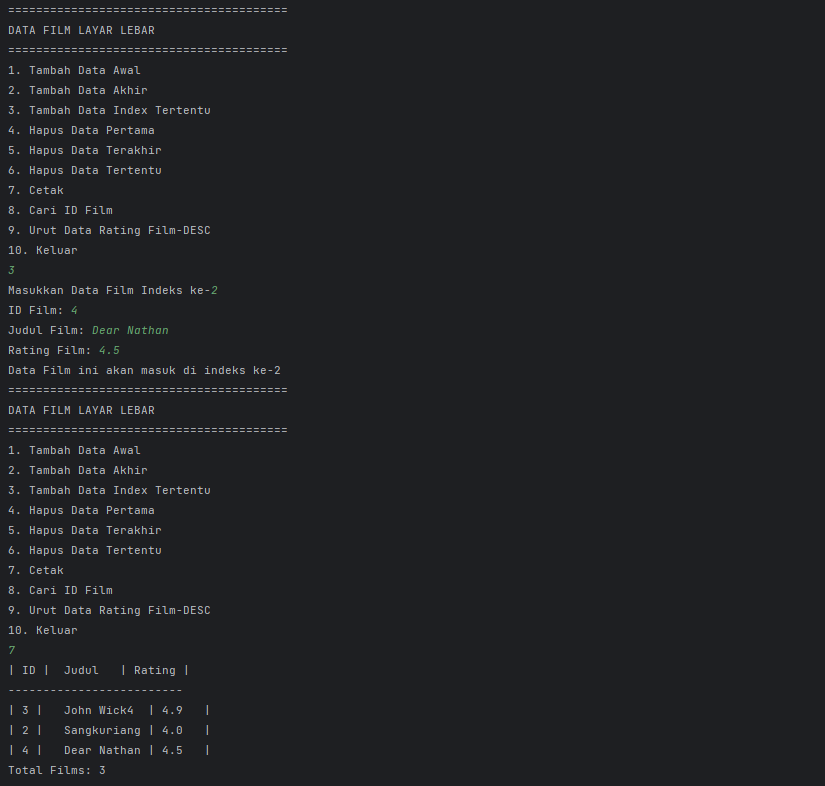

# Laporan Praktikum Pertemuan 12 Double Linked List

---

NIM : 2241720192
Nama : Achmad Raihan Fahrezi Effendy
Kelas : TI 1D

---

## Kegiatan Praktikum 1

### Percobaan 1

Pada percobaan 1 ini akan dibuat class Node dan class DoubleLinkedLists yang didalamnya
terdapat operasi-operasi untuk menambahkan data dengan beberapa cara (dari bagian depan linked
list, belakang ataupun indeks tertentu pada linked list).

#### Kode Program

Class Node

``` java
package doublelinkedlists;

public class Node {
    int data;
    Node prev, next;

    public Node( Node prev, int data, Node next) {
        this.prev = prev;
        this.data = data;
        this.next = next;
    }
}
```

CLass Double Linked Lists

``` java
package doublelinkedlists;

public class DoubleLinkedLists {
    Node head;
    int size;

    public DoubleLinkedLists() {
        this.head = null;
        this.size = 0;
    }

    public boolean isEmpty() {
        return head == null;
    }

    public void addFirst(int item) {
        if (isEmpty()) {
            head = new Node(null, item, null);
        } else {
            Node newNode = new Node(null, item, head);
            head.prev = newNode;
            head = newNode;
        }
        size++;
    }

    public void addLast(int item) {
        if (isEmpty()) {
            addFirst(item);
        } else {
            Node current = head;
            while (current.next != null) {
                current = current.next;
            }
            Node newNode = new Node(current, item, null);
            current.next = newNode;
            size++;
        }
    }
    public void add(int item, int index) throws Exception {
        if (isEmpty()) {
            addFirst(item);
        } else if (index < 0 || index > size) {
            throw new Exception("Nilai indeks diluar batas");
        } else {
            Node current = head;
            int i = 0;
            while (i < index) {
                current = current.next;
                i++;
            }
            if (current.prev == null) {
                Node newNode = new Node(null, item, current);
                current.prev = newNode;
                head = newNode;
            } else {
                Node newNode = new Node(current.prev, item, current);
                current.prev.next = newNode; // tanya
                current.prev = newNode;

            }
        }
        size++;
    }
    public int size() {
        return size;
    }
    public void clear() {
        head = null;
        size = 0;
    }

    public void print() {
        if (!isEmpty()) {
            Node tmp = head;
            while (tmp != null) {
                System.out.print(tmp.data + "\t");
                tmp = tmp.next;
            }
            System.out.println("\nberhasil diisi");
        } else {
            System.out.println("Linked Lists Kosong");
        }
    }
}
```

CLass Double Linked Lists Main

``` java
package doublelinkedlists;

public class DoubleLinkedListsMain {
    public static void main(String[] args) throws Exception {
        DoubleLinkedLists dll = new DoubleLinkedLists();
        dll.print();
        System.out.println("Size : " + dll.size());
        System.out.println("=================================");
        dll.addFirst(3);
        dll.addLast(4);
        dll.addFirst(7);
        dll.print();
        System.out.println("Size : " + dll.size());
        System.out.println("=================================");
        dll.add(40,1);
        dll.print();
        System.out.println("Size : " + dll.size());
        System.out.println("=================================");
        dll.clear();
        dll.print();
        System.out.println("Size : " + dll.size());

    }
}
```

#### Output


Pertanyaan

1. Perbedaan antara Single Linked Lists dengan Double Linked Lists terletak pada jumlah pointer yang dimiliki pada masing masing Linked List seperti yang kita ketahui Single Linked List berasal dari kata 'Single' yang memiliki arti hanya ada satu pointer yang menunjuk ke nilai selanjutnya, sedangkan Double Linked Lists yaitu Linked List yang memiliki dua pointer yang dapat menunjuk ke nilai selanjutnya ataupun nilai sebelum nya
2. Pada class Node astribut 'next' bertujuan untuk menyimpan pointer atau data alamat dari nilai Node selanjutnya sedangkan 'prev' sebaliknya yaitu pointer atau alamat dari nilai Node sebelumnya
3. Kegunaan inisialisasi konstruktor tersebut yaitu pada pertama instansiasi objek Double Linked Lists akan diberikan nilai default null atau 0 yang menandakan bahwa pada saat pertama kali di instansiasi belum memiliki nilai
4. Pada Node paling pertama harus menunjuk ke pointer null atau batas awal dari sebuah Node karena syarat dari Double Linked List Node paling pertama tidak memiliki pointer atau alamat nilai dari Node lain
5. pada method addFirst() arti statement head.prev = newNode digunakan untuk mengganti alamat sebelum head ke newNode karena newNode merupakan data baru dan paling awal dari sebuah Linked List yang akan menggantikan head saat ini oleh karena itu nilai sebelum head yang awalnya null diubah menjadi pointer dari Node baru yang baru ditambahkan
6. pada method addLast() syarat dari Double Linked List yaitu alamat terakhir harus menunujuk ke null dan pada potongan kode program tersebut bertujuan untuk menambahkan Node baru di akhir Double Linked Lists jadi kita mengecek terlebih dahulu alamat paling akhir terletak dimana kemudian nilai baru yang akan ditambahkan di akhir sebuah Double Linked List nilai sebelumnya harus merujuk pada pointer atau alamat dari sebuah double linked list sedangkan nilai setelahnya harus merujuk pada pointer atau alamat yang sama dengan null yang menandakan nilai baru yang ditambahkan adalah nilai paling akhir dari sebuah Double Linked Lists
7. Pada potongan kode program tersebut digunakan pada saat pointer sebelumnya merujuk pada nilai null yang menandakan bahwa nilai tersebut adalah nilai paling awal dari sebuah Double Linked Lists oleh karena itu karena nilai baru merupakan nilai yang akan ditambahkan pada awal dari sebuah linked list ponter sebelum nilai baru harus menunjuk ke null sedangkan pointer ke nilai selanjutnya harus merujuk pada pointer saat ini kemudian pointer dari nilai saat ini harus di ubah ke nilai dari node yang baru setelah semua dilakukan kita perlu mengubah head atau nilai paling pertama dari sebuah double linked list ke node yang baru ditambahkan

## Kegiatan Praktikum 2

### Percobaan 2

Pada praktikum 2 ini akan dibuat beberapa method untuk menghapus isi LinkedLists pada
class DoubleLinkedLists. Penghapusan dilakukan dalam tiga cara di bagian paling depan, paling
belakang, dan sesuai indeks yang ditentukan pada linkedLists. Method tambahan tersebut akan
ditambahkan sesuai pada diagram class berikut ini.

#### Kode Program

Class Node

``` java
package doublelinkedlists;

public class Node {
    int data;
    Node prev, next;

    public Node( Node prev, int data, Node next) {
        this.prev = prev;
        this.data = data;
        this.next = next;
    }
}
```

Class Double Linked Lists

``` java
package doublelinkedlists;

public class DoubleLinkedLists {
    Node head;
    int size;

    public DoubleLinkedLists() {
        this.head = null;
        this.size = 0;
    }

    public boolean isEmpty() {
        return head == null;
    }

    public void addFirst(int item) {
        if (isEmpty()) {
            head = new Node(null, item, null);
        } else {
            Node newNode = new Node(null, item, head);
            head.prev = newNode;
            head = newNode;
        }
        size++;
    }

    public void addLast(int item) {
        if (isEmpty()) {
            addFirst(item);
        } else {
            Node current = head;
            while (current.next != null) {
                current = current.next;
            }
            Node newNode = new Node(current, item, null);
            current.next = newNode;
            size++;
        }
    }
    public void add(int item, int index) throws Exception {
        if (isEmpty()) {
            addFirst(item);
        } else if (index < 0 || index > size) {
            throw new Exception("Nilai indeks diluar batas");
        } else {
            Node current = head;
            int i = 0;
            while (i < index) {
                current = current.next;
                i++;
            }
            if (current.prev == null) {
                Node newNode = new Node(null, item, current);
                current.prev = newNode;
                head = newNode;
            } else {
                Node newNode = new Node(current.prev, item, current);
                current.prev.next = newNode; // tanya
                current.prev = newNode;

            }
        }
        size++;
    }
    public int size() {
        return size;
    }
    public void clear() {
        head = null;
        size = 0;
    }

    public void print() {
        if (!isEmpty()) {
            Node tmp = head;
            while (tmp != null) {
                System.out.print(tmp.data + "\t");
                tmp = tmp.next;
            }
            System.out.println("\nberhasil diisi");
        } else {
            System.out.println("Linked Lists Kosong");
        }
    }
  
    /**
     * Kode program di bawah ini tambahkan pada saat melakukan percobaan 2
     * */
    public void removeFirst() throws Exception {
        if (isEmpty()) {
            throw  new Exception("Linked List masih kosong, tidak dapat dihapus");
        } else if (size == 1) {
            removeLast();
        } else {
            head = head.next;
            head.prev = null;
            size--;
        }
    }
    public void removeLast() throws Exception{
        if (isEmpty()) {
            throw  new Exception("Linked List masih kosong, tidak dapat dihapus");
        } else if (head.next == null) {
            head = null;
            size--;
            return;
        }
        Node current = head;
        while (current.next.next != null) {
            current = current.next;
        }
        current.next = null;
        size--;
    }
    public void remove(int index) throws Exception {
        if (isEmpty() || index >= size) {
            throw new Exception("Nilai indeks di luar batas");
        } else if (index == 0) {
            removeFirst();
        } else {
            Node current = head;
            int i = 0;
            while (i < index) {
                current = current.next;
                i++;
            }
            if (current.next == null) {
                current.prev.next = null;
            } else if (current.prev == null) {
                current = current.next;
                current.prev = null;
                head = current;
            } else {
                current.prev.next = current.next;
                current.next.prev = current.prev;
            }
            size--;
        }
    }
}
```

Class Double Linked Lists Main

``` java
package doublelinkedlists;

public class DoubleLinkedListsMain {
    public static void main(String[] args) throws Exception {
        DoubleLinkedLists dll = new DoubleLinkedLists();
    
        /**
         * Kode program di bawah ini digunakan untuk melakukan percobaan 1
         * */
//        dll.print();
//        System.out.println("Size : " + dll.size());
//        System.out.println("=================================");
//        dll.addFirst(3);
//        dll.addLast(4);
//        dll.addFirst(7);
//        dll.print();
//        System.out.println("Size : " + dll.size());
//        System.out.println("=================================");
//        dll.add(40,1);
//        dll.print();
//        System.out.println("Size : " + dll.size());
//        System.out.println("=================================");
//        dll.clear();
//        dll.print();
//        System.out.println("Size : " + dll.size());

        /**
         * Kode program di bawah ini digunakan untuk melakukan percobaan 2
         * */
        dll.addLast(50);
        dll.addLast(40);
        dll.addLast(10);
        dll.addLast(20);
        dll.print();
        System.out.println("Size : " + dll.size());
        System.out.println("=================================");
        dll.removeFirst();
        dll.print();
        System.out.println("Size : " + dll.size());
        System.out.println("=================================");
        dll.removeLast();
        dll.print();
        System.out.println("Size : " + dll.size());
        System.out.println("=================================");
        dll.remove(1);
        dll.print();
        System.out.println("Size : " + dll.size());
    }
}
```

#### Output


Pertanyaan

1. Pada potongan kode program tersebut karena kita ingin menghapus Double Linked list yang pertama kita perlu mengganti nilai head ke pointer selanjutnya dari head dan kemudian kita menghapus pointer sebelum head dan mengganti pointer ke null
2. Untuk mendeteksi data pada posisi akhir karena kita tidak memiliki tail pada Double Linked List kita perlu melakukan looping satu persatu dari head hingga current.next.next != null yang bertujuan agar looping berhenti sebelum pointer selanjutnya menunujuk pada nilai terakhir setelah hal itu dilakukan baru kita menghapus nilai paling akhir dengan mengganti pointer yang menunjuk ke nilai paling akhir ke null
3. Pada kode program tersebut tidak cocok karena pada node pertama dari sebuah linked list, maka head.next akan menjadi null, sehingga tmp akan menjadi null juga. Selanjutnya, baris ke-2 akan mempunyai error karena head.next akan menghasilkan NullPointerException. Oleh karena itu, perlu dilakukan penanganan kasus khusus untuk menghapus node pertama.
4. Potongan kode program tersebut digunakan untuk menghapus sebuah node dari sebuah linked list. Baris pertama current.prev.next = current.next mengubah pointer next dari node sebelum current agar menunjuk ke node setelah current, sehingga current tidak lagi terhubung dengan linked list. Baris kedua current.next.prev = current.prev mengubah pointer prev dari node setelah current agar menunjuk ke node sebelum current, sehingga current tidak lagi terhubung dengan linked list pada kedua arah. Dengan demikian, node current berhasil dihapus dari linked list.

## Kegiatan Praktikum 3

Pada praktikum 3 ini dilakukan uji coba untuk mengambil data pada linked list dalam 3
kondisi, yaitu mengambil data paling awal, paling akhir dan data pada indeks tertentu dalam
linked list. Method mengambil data dinamakan dengan get. Ada 3 method get yang dibuat pada
praktikum ini sesuai dengan diagram class DoubleLinkedLists.

### Percobaan 3

#### Kode Program

Class Node

``` java
package doublelinkedlists;

public class Node {
    int data;
    Node prev, next;

    public Node( Node prev, int data, Node next) {
        this.prev = prev;
        this.data = data;
        this.next = next;
    }
}
```

Class Double Linked Lists

``` java
package doublelinkedlists;

public class DoubleLinkedLists {
    Node head;
    int size;

    public DoubleLinkedLists() {
        this.head = null;
        this.size = 0;
    }

    public boolean isEmpty() {
        return head == null;
    }

    public void addFirst(int item) {
        if (isEmpty()) {
            head = new Node(null, item, null);
        } else {
            Node newNode = new Node(null, item, head);
            head.prev = newNode;
            head = newNode;
        }
        size++;
    }

    public void addLast(int item) {
        if (isEmpty()) {
            addFirst(item);
        } else {
            Node current = head;
            while (current.next != null) {
                current = current.next;
            }
            Node newNode = new Node(current, item, null);
            current.next = newNode;
            size++;
        }
    }
    public void add(int item, int index) throws Exception {
        if (isEmpty()) {
            addFirst(item);
        } else if (index < 0 || index > size) {
            throw new Exception("Nilai indeks diluar batas");
        } else {
            Node current = head;
            int i = 0;
            while (i < index) {
                current = current.next;
                i++;
            }
            if (current.prev == null) {
                Node newNode = new Node(null, item, current);
                current.prev = newNode;
                head = newNode;
            } else {
                Node newNode = new Node(current.prev, item, current);
                current.prev.next = newNode;
                current.prev = newNode;

            }
        }
        size++;
    }
    public int size() {
        return size;
    }
    public void clear() {
        head = null;
        size = 0;
    }

    public void print() {
        if (!isEmpty()) {
            Node tmp = head;
            while (tmp != null) {
                System.out.print(tmp.data + "\t");
                tmp = tmp.next;
            }
            System.out.println("\nberhasil diisi");
        } else {
            System.out.println("Linked Lists Kosong");
        }
    }

    /**
     * Kode program di bawah ini tambahkan pada saat melakukan percobaan 2
     * */
    public void removeFirst() throws Exception {
        if (isEmpty()) {
            throw  new Exception("Linked List masih kosong, tidak dapat dihapus");
        } else if (size == 1) {
            removeLast();
        } else {
            head = head.next;
            head.prev = null;
            size--;
        }
    }
    public void removeLast() throws Exception{
        if (isEmpty()) {
            throw  new Exception("Linked List masih kosong, tidak dapat dihapus");
        } else if (head.next == null) {
            head = null;
            size--;
            return;
        }
        Node current = head;
        while (current.next.next != null) {
            current = current.next;
        }
        current.next = null;
        size--;
    }
    public void remove(int index) throws Exception {
        if (isEmpty() || index >= size) {
            throw new Exception("Nilai indeks di luar batas");
        } else if (index == 0) {
            removeFirst();
        } else {
            Node current = head;
            int i = 0;
            while (i < index) {
                current = current.next;
                i++;
            }
            if (current.next == null) {
                current.prev.next = null;
            } else if (current.prev == null) {
                current = current.next;
                current.prev = null;
                head = current;
            } else {
                current.prev.next = current.next;
                current.next.prev = current.prev;
            }
            size--;
        }
    }

    /**
     * Kode program digunakan pada dibawah ini ditambahkan pada saat melakukan percobaan 3
     * */

    public int getFirst() throws Exception {
        if (isEmpty()) {
            throw new Exception("Linked List Kosong");
        }
        return head.data;
    }

    public int getLast() throws Exception {
        if (isEmpty()) {
            throw new Exception("Linked List Kosong");
        }
        Node tmp = head;
        while (tmp.next != null) {
            tmp = tmp.next;
        }
        return tmp.data;
    }

    public int get(int index) throws Exception {
        if (isEmpty() || index >= size) {
            throw new Exception("Nilai indeks di luar batas.");
        }
        Node tmp = head;
        for (int i = 0; i < index; i++) {
            tmp = tmp.next;
        }
        return tmp.data;
    }
}
```

Class Double Linked Lists Main

``` java
package doublelinkedlists;

public class DoubleLinkedListsMain {
    public static void main(String[] args) throws Exception {
        DoubleLinkedLists dll = new DoubleLinkedLists();

        /**
         * Kode program di bawah ini digunakan untuk melakukan percobaan 1
         * */
//        dll.print();
//        System.out.println("Size : " + dll.size());
//        System.out.println("=================================");
//        dll.addFirst(3);
//        dll.addLast(4);
//        dll.addFirst(7);
//        dll.print();
//        System.out.println("Size : " + dll.size());
//        System.out.println("=================================");
//        dll.add(40,1);
//        dll.print();
//        System.out.println("Size : " + dll.size());
//        System.out.println("=================================");
//        dll.clear();
//        dll.print();
//        System.out.println("Size : " + dll.size());

        /**
         * Kode program di bawah ini digunakan untuk melakukan percobaan 2
         * */
//        dll.addLast(50);
//        dll.addLast(40);
//        dll.addLast(10);
//        dll.addLast(20);
//        dll.print();
//        System.out.println("Size : " + dll.size());
//        System.out.println("=================================");
//        dll.removeFirst();
//        dll.print();
//        System.out.println("Size : " + dll.size());
//        System.out.println("=================================");
//        dll.removeLast();
//        dll.print();
//        System.out.println("Size : " + dll.size());
//        System.out.println("=================================");
//        dll.remove(1);
//        dll.print();
//        System.out.println("Size : " + dll.size());

        /**
         * Kode program di bawah ini digunakan untuk melakukan percobaan 3
         * */

        dll.print();
        System.out.println("Size : " + dll.size());
        System.out.println("=================================");
        dll.addFirst(3);
        dll.addLast(4);
        dll.addFirst(7);
        dll.print();
        System.out.println("Size : " + dll.size());
        System.out.println("=================================");
        dll.add(40, 1);
        dll.print();
        System.out.println("Size : " + dll.size());
        System.out.println("=================================");
        System.out.println("Data awal pada Linked Lists adalah: " + dll.getFirst());
        System.out.println("Data akhir pada Linked Lists adalah: " + dll.getLast());
        System.out.println("Data indeks ke-1 pada Linked Lists adalah: " + dll.get(1));
    }
}
```

#### Output


Pertanyaan

1. Method size() pada class DoubleLinkedLists digunakan untuk mengembalikan jumlah elemen yang ada dalam linked list tersebut.
2. Untuk mengatur indeks pada double linked list supaya dimulai dari indeks ke-1, kita dapat melakukan penyesuaian pada implementasi linked list. Secara umum, linked list dimulai dari indeks ke-0, tetapi kita dapat membuat perubahan kecil agar dimulai dari indeks ke-1.
   misal pada method get bisa diumpamakan seperti berikut

   ``` java
   public int get(int index) throws Exception {
        if (indeks < 1 || index >= size) {
            throw new Exception("Nilai indeks di luar batas.");
        }
        Node tmp = head;
        for (int i = 1; i < index; i++) { // kita langsung memulai pencarian dari indeks pertama
            tmp = tmp.next;
        }
        return tmp.data;
   }
   ```
3. Perbedaan karakteristik fungsi Add pada Double Linked Lists dan Single Linked Lists adalah pada keterkaitan node-node pada elemen yang baru ditambahkan. Pada Single Linked Lists, setiap node hanya memiliki satu pointer atau referensi ke node berikutnya, sehingga ketika menambahkan sebuah elemen baru, hanya node berikutnya dari elemen terakhir yang perlu diubah. Sedangkan pada Double Linked Lists, setiap node memiliki dua pointer atau referensi, satu untuk node sebelumnya dan satu lagi untuk node berikutnya, sehingga ketika menambahkan sebuah elemen baru, perlu diubah pointer node sebelumnya dan berikutnya dari elemen terakhir. Hal ini menyebabkan operasi tambah pada Double Linked Lists membutuhkan lebih banyak memori dan waktu untuk dilakukan dibandingkan dengan Single Linked Lists. Namun, kelebihan dari Double Linked Lists adalah kemampuannya untuk melakukan operasi mundur atau reverse dengan lebih efisien.
4. a perbedaan logika antara kedua kode program tersebut terletak pada cara memeriksa linked list kosong. Kode program pertama memeriksa langsung apakah head null, sedangkan kode program kedua memeriksa jumlah elemen pada linked list melalui variabel size.

## Tugas

1. Buat program antrian vaksinasi menggunakan queue berbasis double linked list sesuai ilustrasi
   dan menu di bawah ini! (counter jumlah antrian tersisa di menu cetak(3) dan data orang yang
   telah divaksinasi di menu Hapus Data(2) harus ada).

   #### Kode Program
   
   Class Node
   ``` java
   package TugasDoubleLinkedList;
   
   public class Node<T> {
   T data;
   Node<T> prev, next;
   
       public Node(Node<T> prev, T data, Node<T> next) {
           this.prev = prev;
           this.data = data;
           this.next = next;
       }
   
   }
   ```
   
   Class My Double Linked List
   ``` java
   package TugasDoubleLinkedList;
   
   public class MyDoubleLinkedList<T> {
   public Node<T> head;
   public Node<T> tail;
   public int size;
   
       public MyDoubleLinkedList() {
           this.head = null;
           this.tail = null;
           this.size = 0;
       }
   
       public boolean isEmpty() {
           return head == null;
       }
   
       public void addFirst(T data) {
           Node<T> newNode = new Node<>(null, data, head);
           if (isEmpty()) {
               tail = newNode;
           } else {
               head.prev = newNode;
           }
           head = newNode;
           size++;
       }
   
       public void addLast(T data) {
           if (isEmpty()) {
               addFirst(data);
           } else {
               tail = tail.next = new Node<>(tail, data, null);
               size++;
           }
       }
   
   
       public void add(T data, int index) throws Exception {
           if (isEmpty() || index == 0) {
               addFirst(data);
           } else if (index < 0 || index > size) {
               throw new Exception("Nilai indeks diluar batas");
           } else if (index == size) {
               addLast(data);
           } else {
               Node<T> current = head;
               int i = 0;
               while (i < index - 1) {
                   current = current.next;
                   i++;
               }
               Node newNode = new Node(current, data, current.next);
               current.next.prev = newNode;
               current.next = newNode;
               size++;
           }
       }
   
       public int size() {
           return size;
       }
       public void clear() {
           head = null;
           tail = null;
           size = 0;
       }
   
       public void print() {
           if (!isEmpty()) {
               Node<T> tmp = head;
               while (tmp != null) {
                   System.out.print(tmp.data + "\t");
                   tmp = tmp.next;
               }
               System.out.println("\nberhasil diisi");
           } else {
               System.out.println("Linked Lists Kosong");
           }
       }
   
       public T removeFirst() throws Exception {
           Node<T> tmp = head;
           if (isEmpty()) {
               throw  new Exception("Linked List masih kosong, tidak dapat dihapus");
           } else if (size == 1) {
               removeLast();
           } else {
               head = head.next;
               head.prev = null;
               size--;
           }
           return tmp.data;
       }
       public T removeLast() throws Exception{
           if (isEmpty()) {
               throw  new Exception("Linked List masih kosong, tidak dapat dihapus");
           }
           Node<T> tmp = tail;
           if (head.next == null) {
               head = tail = null;
           } else {
               tail = tail.prev;
               tail.next = null;
           }
           size--;
           return tmp.data;
       }
       public T remove(int index) throws Exception {
           if (isEmpty() || index >= size) {
               throw new Exception("Nilai indeks di luar batas");
           }
           if (index == 0) {
               return removeFirst();
           } else {
               Node<T> current = head;
               int i = 0;
               while (i < index) {
                   current = current.next;
                   i++;
               }
               if (current == tail) {
                   tail = tail.prev.next = null;
               } else if (current.prev == null) {
                   current = current.next;
                   current.prev = null;
                   head = current;
               } else {
                   current.prev.next = current.next;
                   current.next.prev = current.prev;
               }
               size--;
               return current.data;
           }
       }
   
       public T getFirst() throws Exception {
           if (isEmpty()) {
               throw new Exception("Linked List Kosong");
           }
           return head.data;
       }
   
       public T getLast() throws Exception {
           if (isEmpty()) {
               throw new Exception("Linked List Kosong");
           }
           return tail.data;
       }
   
       public T get(int index) throws Exception {
           if (isEmpty() || index >= size) {
               throw new Exception("Nilai indeks di luar batas.");
           }
           Node<T> tmp = head;
           for (int i = 0; i < index; i++) {
               tmp = tmp.next;
           }
           return tmp.data;
       }
   }
   ```
   
   CLass Pasien
   ``` java
   package TugasDoubleLinkedList;
   
   public class Pasien {
   int no;
   String nama;
   
       public Pasien(int no, String nama) {
           this.no = no;
           this.nama = nama;
       }
   }
   ```
   Class Tugas1Main
   ``` java
   package TugasDoubleLinkedList;
   
   import java.util.Scanner;
   
   public class Tugas1Main {
   public static void main(String[] args) throws Exception {
   Scanner sc = new Scanner(System.in);
   MyDoubleLinkedList<Pasien> mdll = new MyDoubleLinkedList<>();
   while (true) {
   System.out.println("\n++++++++++++++++++++++++++++++++++++++");
   System.out.println("\tPENGANTRI VAKSIN EXTRA VAGANZA");
   System.out.println("++++++++++++++++++++++++++++++++++++++");
   System.out.println("\n1. Tambah Data penerima Vaksin");
   System.out.println("2. Hapus Data Pengantri Vaksin");
   System.out.println("3. Daftar Penerima Vaksin");
   System.out.println("4. Keluar");
   System.out.println("++++++++++++++++++++++++++++++++++++++");
   System.out.print("Masukkan pilihan: ");
   int input = sc.nextInt();
   switch (input) {
   case 1 -> {
   System.out.println("--------------------------------------");
   System.out.println("\tMasukkan Data Penerima Vaksin");
   System.out.println("--------------------------------------");
   System.out.print("Nomor Antrian : ");
   int nomor = sc.nextInt();
   sc.nextLine();
   System.out.print("Nama Penerima : ");
   String nama = sc.nextLine();
   mdll.addLast(new Pasien(nomor, nama));
   
                   }
                   case 2 -> System.out.println((mdll.size() != 0) ? mdll.removeFirst().nama + " telah selesai di vaksinasi" : "Antrian masih kosong");
   
                   case 3 -> {
                       printPasien(mdll);
                   }
                   case 4 -> {
                       System.out.println("Good bye :)");
                       return;
                   }
                   default -> System.out.println("Number out of range");
               }
           }
   
       }
   
       public static void printPasien(MyDoubleLinkedList data) {
           if (!data.isEmpty()) {
               Node<Pasien> current = data.head;
               System.out.println("| No. |\tNama\t|");
               System.out.println("--------------");
               while (current != null) {
                   System.out.println("| " + current.data.no + " |\t" + current.data.nama + "\t|");
                   current = current.next;
               }
               System.out.println("Sisa Antrian: " + data.size);
           } else {
               System.out.println("Linked List Kosong");
           }
       }
   }
   ```

   #### Output

   

   

   
2. Buatlah program daftar film yang terdiri dari id, judul dan rating menggunakan double linked
   lists, bentuk program memiliki fitur pencarian melalui ID Film dan pengurutan Rating secara
   descending. Class Film wajib diimplementasikan dalam soal ini

   #### Kode Program

   Class Node
   ``` java
   package TugasDoubleLinkedList;
   
   public class Node<T> {
   T data;
   Node<T> prev, next;
   
       public Node(Node<T> prev, T data, Node<T> next) {
           this.prev = prev;
           this.data = data;
           this.next = next;
       }
   
   }
   ```

   Class My Double Linked List
   ``` java
   package TugasDoubleLinkedList;
   
   public class MyDoubleLinkedList<T> {
   public Node<T> head;
   public Node<T> tail;
   public int size;
   
       public MyDoubleLinkedList() {
           this.head = null;
           this.tail = null;
           this.size = 0;
       }
   
       public boolean isEmpty() {
           return head == null;
       }
   
       public void addFirst(T data) {
           Node<T> newNode = new Node<>(null, data, head);
           if (isEmpty()) {
               tail = newNode;
           } else {
               head.prev = newNode;
           }
           head = newNode;
           size++;
       }
   
       public void addLast(T data) {
           if (isEmpty()) {
               addFirst(data);
           } else {
               tail = tail.next = new Node<>(tail, data, null);
               size++;
           }
       }
   
   
       public void add(T data, int index) throws Exception {
           if (isEmpty() || index == 0) {
               addFirst(data);
           } else if (index < 0 || index > size) {
               throw new Exception("Nilai indeks diluar batas");
           } else if (index == size) {
               addLast(data);
           } else {
               Node<T> current = head;
               int i = 0;
               while (i < index - 1) {
                   current = current.next;
                   i++;
               }
               Node newNode = new Node(current, data, current.next);
               current.next.prev = newNode;
               current.next = newNode;
               size++;
           }
       }
   
       public int size() {
           return size;
       }
       public void clear() {
           head = null;
           tail = null;
           size = 0;
       }
   
       public void print() {
           if (!isEmpty()) {
               Node<T> tmp = head;
               while (tmp != null) {
                   System.out.print(tmp.data + "\t");
                   tmp = tmp.next;
               }
               System.out.println("\nberhasil diisi");
           } else {
               System.out.println("Linked Lists Kosong");
           }
       }
   
       public T removeFirst() throws Exception {
           Node<T> tmp = head;
           if (isEmpty()) {
               throw  new Exception("Linked List masih kosong, tidak dapat dihapus");
           } else if (size == 1) {
               removeLast();
           } else {
               head = head.next;
               head.prev = null;
               size--;
           }
           return tmp.data;
       }
       public T removeLast() throws Exception{
           if (isEmpty()) {
               throw  new Exception("Linked List masih kosong, tidak dapat dihapus");
           }
           Node<T> tmp = tail;
           if (head.next == null) {
               head = tail = null;
           } else {
               tail = tail.prev;
               tail.next = null;
           }
           size--;
           return tmp.data;
       }
       public T remove(int index) throws Exception {
           if (isEmpty() || index >= size) {
               throw new Exception("Nilai indeks di luar batas");
           }
           if (index == 0) {
               return removeFirst();
           } else {
               Node<T> current = head;
               int i = 0;
               while (i < index) {
                   current = current.next;
                   i++;
               }
               if (current == tail) {
                   tail = tail.prev.next = null;
               } else if (current.prev == null) {
                   current = current.next;
                   current.prev = null;
                   head = current;
               } else {
                   current.prev.next = current.next;
                   current.next.prev = current.prev;
               }
               size--;
               return current.data;
           }
       }
   
       public T getFirst() throws Exception {
           if (isEmpty()) {
               throw new Exception("Linked List Kosong");
           }
           return head.data;
       }
   
       public T getLast() throws Exception {
           if (isEmpty()) {
               throw new Exception("Linked List Kosong");
           }
           return tail.data;
       }
   
       public T get(int index) throws Exception {
           if (isEmpty() || index >= size) {
               throw new Exception("Nilai indeks di luar batas.");
           }
           Node<T> tmp = head;
           for (int i = 0; i < index; i++) {
               tmp = tmp.next;
           }
           return tmp.data;
       }
   }
   ```

   CLass Film
   ``` java
   package TugasDoubleLinkedList;
   
   public class Film {
   int id;
   String judul;
   double rating;
   
       public Film(int id, String judul, double rating) {
           this.id = id;
           this.judul = judul;
           this.rating = rating;
       }
   }

   ```

   Class Tugas2Main
   ``` java
   package TugasDoubleLinkedList;
   
   import java.util.Scanner;
   
   public class Tugas2Main {
   public static void main(String[] args) throws Exception {
   Scanner sc = new Scanner(System.in);
   MyDoubleLinkedList<Film> mdll = new MyDoubleLinkedList<>();
   while (true) {
   System.out.println("========================================");
   System.out.println("DATA FILM LAYAR LEBAR");
   System.out.println("========================================");
   System.out.println("1. Tambah Data Awal");
   System.out.println("2. Tambah Data Akhir");
   System.out.println("3. Tambah Data Index Tertentu");
   System.out.println("4. Hapus Data Pertama");
   System.out.println("5. Hapus Data Terakhir");
   System.out.println("6. Hapus Data Tertentu");
   System.out.println("7. Cetak");
   System.out.println("8. Cari ID Film");
   System.out.println("9. Urut Data Rating Film-DESC");
   System.out.println("10. Keluar");
   
               int input = sc.nextInt();
               switch (input) {
                   case 1 -> {
                       System.out.println("Masukkan Data Film Posisi Awal");
                       System.out.print("ID Film: ");
                       int id = sc.nextInt();
                       sc.nextLine();
                       System.out.print("Judul Film: ");
                       String judul = sc.nextLine();
                       System.out.print("Rating Film: ");
                       double rating = sc.nextDouble();
                       mdll.addFirst(new Film(id, judul,rating));
   
                   }
                   case 2 -> {
                       System.out.println("Masukkan Data Film Posisi Akhir");
                       System.out.print("ID Film: ");
                       int id = sc.nextInt();
                       sc.nextLine();
                       System.out.print("Judul Film: ");
                       String judul = sc.nextLine();
                       System.out.print("Rating Film: ");
                       double rating = sc.nextDouble();
                       mdll.addLast(new Film(id, judul,rating));
                   }
                   case 3 -> {
                       System.out.print("Masukkan Data Film Indeks ke-");
                       int index = sc.nextInt();
                       System.out.print("ID Film: ");
                       int id = sc.nextInt();
                       sc.nextLine();
                       System.out.print("Judul Film: ");
                       String judul = sc.nextLine();
                       System.out.print("Rating Film: ");
                       double rating = sc.nextDouble();
                       mdll.add(new Film(id, judul,rating), index);
                       System.out.println("Data Film ini akan masuk di indeks ke-" + index);
                   }
                   case 4 -> System.out.println((mdll.size() != 0) ? mdll.removeFirst().judul + " telah berhasil di hapus dari List Film" : "gagal  di hapus dari List Film karena List masih kosong");
                   case 5 -> System.out.println((mdll.size() != 0) ? mdll.removeLast().judul + " telah berhasil di hapus dari List Film" : "gagal  di hapus dari List Film karena List masih kosong");
                   case 6 -> {
                       System.out.println("Masukkan index mana yang ingin dihapus: ");
                       int index = sc.nextInt();
                       System.out.println((mdll.size() != 0) ? mdll.remove(index).judul + " telah berhasil di hapus dari List Film" : "gagal  di hapus dari List Film karena List masih kosong");
                   }
                   case 7 -> {
                       printFilms(mdll);
                   }
                   case 8 -> {
                       System.out.print("Masukkan Data yang ingin dicari: ");
                       int id = sc.nextInt();
                       Node<Film> result = searchByID(mdll, id);
                       if (result != null) {
                           System.out.println("Film found:");
                           System.out.println("Film ID: " + result.data.id);
                           System.out.println("Judul: " + result.data.judul);
                           System.out.println("Rating: " + result.data.rating);
                       } else {
                           System.out.println("ID Film not found");
                       }
   
                   }
                   case 9 -> {
                       sortByRating(mdll);
                       printFilms(mdll);
                   }
                   case 10 -> {
                       return;
                   }
                   default -> System.out.println("Number out of range");
               }
           }
       }
       public static void sortByRating(MyDoubleLinkedList<Film> mdll) {
           if (mdll.isEmpty() || mdll.size == 1) {
               return;
           }
           Node<Film> current = mdll.head;
           Node<Film> index;
           Film temp;
   
           while (current != null) {
               index = current.next;
               while (index != null) {
                   if (current.data.rating < index.data.rating) {
                       temp = current.data;
                       current.data = index.data;
                       index.data = temp;
                   }
                   index = index.next;
               }
   
               current = current.next;
           }
       }
   
       public static void printFilms(MyDoubleLinkedList<Film> data) {
           if (!data.isEmpty()) {
               Node<Film> current = data.head;
               System.out.println("| ID |\tJudul\t| Rating |");
               System.out.println("-------------------------");
               while (current != null) {
                   System.out.println("| " + current.data.id + " |\t" + current.data.judul + "\t| " + current.data.rating + "\t|");
                   current = current.next;
               }
               System.out.println("Total Films: " + data.size);
           } else {
               System.out.println("Linked List Kosong");
           }
       }
   
       public static Node<Film> searchByID(MyDoubleLinkedList<Film> list, int id) {
           Node<Film> current = list.head;
           while (current != null) {
               if (current.data.id == id) {
                   return current;
               }
               current = current.next;
           }
           return null; // ID not found in the list
       }
   
   
   }
   ```

   
   #### Output

   

   

   

   

   

   

   

   

   
