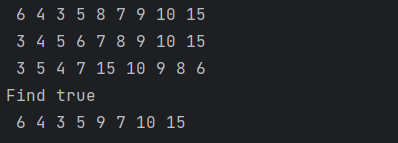
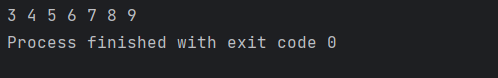

# Laporan Praktikum Pertemuan 13 TREE

---

NIM : 2241720192
Nama : Achmad Raihan Fahrezi Effendy
Kelas : TI 1D

---

## Implementasi Binary Search Tree menggunakan Linked List1

### Percobaan 1

Pada percobaan ini akan diimplementasikan Binary Search Tree dengan operasi dasar,
dengan menggunakan array (praktikum 2) dan linked list (praktikum 1). Sebelumnya,
akan dibuat class Node, dan Class BinaryTree

#### Kode Program

Class Node

``` java
packpackage Praktikum;

public class BinaryTreeMain {
    public static void main(String[] args) {
        BinaryTree bt = new BinaryTree();

        bt.add(6);
        bt.add(4);
        bt.add(8);
        bt.add(3);
        bt.add(5);
        bt.add(7);
        bt.add(9);
        bt.add(10);
        bt.add(15);

        bt.traversePreOrder(bt.root);
        System.out.println();
        bt.traverseInOrder(bt.root);
        System.out.println();
        bt.traversePostOrder(bt.root);
        System.out.println();
        System.out.println("Find " + bt.find(5));
        bt.delete(8);
        bt.traversePreOrder(bt.root);
        System.out.println();
    }
}age Praktikum;

public class Node {
    int data;
    Node left, right;

    public Node() {
    }
    public Node(int data) {
        this.left = null;
        this.data = data;
        this.right = null;
    }
}
```

Class BinaryTree

``` java
packpackage Praktikum;

public class BinaryTreeMain {
    public static void main(String[] args) {
        BinaryTree bt = new BinaryTree();

        bt.add(6);
        bt.add(4);
        bt.add(8);
        bt.add(3);
        bt.add(5);
        bt.add(7);
        bt.add(9);
        bt.add(10);
        bt.add(15);

        bt.traversePreOrder(bt.root);
        System.out.println();
        bt.traverseInOrder(bt.root);
        System.out.println();
        bt.traversePostOrder(bt.root);
        System.out.println();
        System.out.println("Find " + bt.find(5));
        bt.delete(8);
        bt.traversePreOrder(bt.root);
        System.out.println();
    }
}age Praktikum;

public class BinaryTree {
    Node root;
    int size;

    public BinaryTree() {
        this.root = null;
    }
    public boolean isEmpty() {
        return root == null;
    }
    void add(int data) {
        if (isEmpty()) {
            root = new Node(data);
        } else {
            Node current = root;
            while (true) {
                if (data < current.data) {
                    if (current.left != null) {
                        current = current.left;
                    } else {
                        current.left = new Node(data);
                        break;
                    }
                } else if (data > current.data) {
                    if (current.right != null) {
                        current = current.right;
                    } else {
                        current.right = new Node(data);
                        break;
                    }
                } else {
                    break;
                }
            }
        }
    }

    public boolean find(int data) {
        boolean hasil = false;
        Node current = root;
        while (current != null) {
            if (current.data == data) {
                hasil = true;
                break;
            } else if (data < current.data) {
                current = current.left;
            } else {
                current = current.right;
            }
        }
        return hasil;
    }

    public void traversePreOrder(Node node) {
        if (node != null) {
            System.out.print(" " + node.data);
            traversePreOrder(node.left);
            traversePreOrder(node.right);
        }
    }
    public void traversePostOrder(Node node) {
        if (node != null) {
            traversePostOrder(node.left);
            traversePostOrder(node.right);
            System.out.print(" " + node.data);
        }
    }
    public void traverseInOrder(Node node) {
        if (node != null) {
            traverseInOrder(node.left);
            System.out.print(" " + node.data);
            traverseInOrder(node.right);
        }
    }

    public Node getSuccessor(Node del) {
        Node successor = del.right;
        Node successorParent = del;
        while (successor.left != null) {
            successorParent = successor;
            successor = successor.left;
        }
        if (successor != del.right) {
            successorParent.left = successor.right;
            successor.right = del.right;
        }
        return successor;
    }

    public void delete(int data) {
        if (isEmpty()) {
            System.out.println("Tree is empty!");
        }

        Node parent = root;
        Node current = root;
        boolean isLeftChild = false;
        while (current != null) {
            if (current.data == data) {
                break;
            } else if (data < current.data) {
                parent = current;
                current = current.left;
                isLeftChild = true;
            } else if (data > current.data) {
                parent = current;
                current = current.right;
                isLeftChild = false;
            }
        }
        if (current == null) {
            System.out.println("Couldn't find data!");
            return;
        } else {
            if (current.left == null && current.right == null) {
                if (current == root) {
                    root = null;
                } else {
                    if (isLeftChild) {
                        parent.left = null;
                    } else {
                        parent.right = null;
                    }
                }
            } else if (current.left == null){
                if (current == root) {
                    root = current.right;
                } else {
                    if (isLeftChild) {
                        parent.left = current.right;
                    } else {
                        parent.right = current.right;
                    }
                }
            } else if (current.right == null){
                if (current == root) {
                    root = current.left;
                } else {
                    if (isLeftChild) {
                        parent.left = current.left;
                    } else {
                        parent.right = current.left;
                    }
                }
            } else {
                Node successor = getSuccessor(current);
                if (current == root) {
                    root = successor;
                } else {
                    if (isLeftChild) {
                        parent.left = successor;
                    } else {
                        parent.right = successor;
                    }
                    successor.left = current.left;
                }
            }

        }
    }
}
```

Class BinaryTreeMain

``` java
package Praktikum;

public class BinaryTreeMain {
    public static void main(String[] args) {
        BinaryTree bt = new BinaryTree();

        bt.add(6);
        bt.add(4);
        bt.add(8);
        bt.add(3);
        bt.add(5);
        bt.add(7);
        bt.add(9);
        bt.add(10);
        bt.add(15);

        bt.traversePreOrder(bt.root);
        System.out.println();
        bt.traverseInOrder(bt.root);
        System.out.println();
        bt.traversePostOrder(bt.root);
        System.out.println();
        System.out.println("Find " + bt.find(5));
        bt.delete(8);
        bt.traversePreOrder(bt.root);
        System.out.println();
    }
}
```

#### Output



Jawaban Pertanyaan

1. karena Binary search tree (BST) memiliki struktur yang telah terorganisir dengan baik dan memiliki sifat khusus yang memungkinkan pencarian data dapat dilakukan secara efektif. Dengan memastikan setiap node memiliki nilai yang lebih kecil dari semua node di sebelah kanannya dan lebih besar dari semua node di sebelah kirinya.
2. Kegunaan atribut left dan right pada class Node digunakan untuk menyimpan refrensi(alamat) ke anak dari subtree dari suatu node tertentu. Atribut left mengacu pada subtree kiri sedangkan atribut right mengacu pada subtree bagian kanan.
3.

a. Atribut root di dalam class BinaryTree digunakan untuk menyimpan refrensi ke node paling awal sebagai tanda root level 0 atau tingkatan pertama karena Root node adalah node teratas dalam pohon yang menjadi titik awal untuk mengakses seluruh struktur pohon.

b. Pada saat objek tree pertama kali dibuat, nilai dari atribut root akan menjadi null. Hal ini menunjukkan bahwa pohon masih kosong atau belum memiliki node apapun.
4. Pada saat tree masih kosong dan akan ditambahkan node baru proses yang terjadi adalah

+ Pertama, kita memeriksa apakah binary tree kosong atau memiliki nilai.
+ Jika belum pernah di buat kita akan membuat node baru pada root di binary tree
+ Namun jika binary tree tidak kosong makan node baru akan ditambahkan ke posisi yang tepat sesuai dengan aturan BST yaitu dengan membandingkan nilai node baru dengan nilai pada setiap node saat melakukan pencarian. Jika nilai node baru lebih kecil dari nilai node saat ini, maka proses pencarian dilanjutkan ke subtree kiri. Jika nilai node baru lebih besar, maka proses pencarian dilanjutkan ke subtree kanan. Proses ini berlanjut sampai ditemukan posisi yang tepat untuk memasukkan node baru.

5. Proses yang dilakukan kode program tersebut yaitu
   + if(data<current.data): Baris ini memeriksa apakah nilai data yang akan ditambahkan lebih kecil daripada nilai pada node saat ini (current). Jika iya, berarti nilai data tersebut harus ditempatkan di subtree kiri.
   + if(current.left!=null): Baris ini memeriksa apakah subtree kiri dari node saat ini tidak null, yang berarti subtree kiri sudah ada. Jika iya, maka pencarian dilanjutkan ke subtree kiri dengan mengubah node saat ini menjadi subtree kiri.
   + current = current.left: Jika subtree kiri sudah ada, node saat ini (current) diubah menjadi subtree kiri. Langkah ini memungkinkan untuk melanjutkan proses pencarian secara rekursif ke subtree kiri.
   + else: Jika subtree kiri tidak ada (null), berarti posisi yang tepat untuk memasukkan node baru ditemukan. Node baru dengan nilai data akan dibuat dan ditempatkan sebagai subtree kiri dari node saat ini.
   + current.left = new Node(data): Baris ini membuat node baru dengan nilai data dan menempatkannya sebagai subtree kiri dari node saat ini.
   + break: Setelah menambahkan node baru, proses penambahan selesai dan perulangan berhenti.
     Dengan adanya baris kode tersebut, pada saat menggunkan method add() dapat dipastikan bahwa node baru dengan nilai yang lebih kecil dari node saat ini akan ditempatkan di subtree kiri, atau jika subtree kiri sudah ada, maka proses pencarian dilanjutkan ke subtree kiri. Jika subtree kiri belum ada, node baru akan dibuat dan ditempatkan sebagai subtree kiri dari node saat ini.

## 2.2 Implementasi binary tree dengan array

### Percobaan 2

#### Kode Program
Class Node
``` java
package Praktikum;

public class Node {
    int data;
    Node left, right;

    public Node() {
    }
    public Node(int data) {
        this.left = null;
        this.data = data;
        this.right = null;
    }
}
```

Class BinaryTreeArray
``` java
package Praktikum;

public class BinaryTreeArray {
    int[] data;
    int idxLast;

    public BinaryTreeArray() {
        this.data = new int[10];
    }

    public void populateData(int data[], int idxLast) {
        this.data = data;
        this.idxLast = idxLast;
    }

    public void traverseInOrder(int idxStart) {
        if (idxStart <= idxLast) {
            traverseInOrder(2*idxStart+1);
            System.out.print(data[idxStart] + " ");
            traverseInOrder(2*idxStart+2);
        }
    }
}
```

Class BinaryTreeArrayMain
``` java
package Praktikum;

public class BinaryTreeArrayMain {
    public static void main(String[] args) {
        BinaryTreeArray bta = new BinaryTreeArray();
        int[] data = {6,4,8,3,5,7,9,0,0,0};
        int idxLast = 6;
        bta.populateData(data, idxLast);
        bta.traverseInOrder(0);
    }
}
```
#### Output



Jawaban Pertanyaan
1. Kegunaan idxLast untuk menyimpan informasi mengenai indeks terakhir yang digunakan dalam array. Ini membantu menentukan size dari binary tree dan memastikan bahwa elemen terakhir valid
2. Kegunaan method populateData() digunakan untuk menerima data berupa array kemudian mengisi data ke dalam pohon biner yang direpresentasikan dalam bentuk array
3. Kegunaan method traveseInOrder() digunakan untuk melakukan penelusuran pada pohon biner secara in-order yang menggunakan langkah - langkah:
   + Mengunjungi (atau menelusuri) node left child secara rekursif.
   + Memproses (atau melakukan operasi tertentu pada) node saat ini.
   + Mengunjungi (atau menelusuri) node right child secara rekursif.
4. jika suatu node terletak pada indeks ke-2, maka posisi left dan right child berikutnya berada pada:
   + Left child akan berada pada indeks (currentidx * 2) = 4 maka indeks berikutnya berada pada indeks ke-4
   + Right child akan berada pada indeks (currentidx * 2) + 1 = 4 maka indeks berikutnya berada pada indeks ke-5
5. Pada praktikum 2 percobaan nomor 4 digunakan untuk menginisialisasi variabel idxLast dengan nilai 6. Nilai ini menunjukkan bahwa indeks terakhir yang digunakan dalam array adalah indeks 6, sehingga array memiliki ukuran sebanyak 7 elemen (indeks 0 hingga 6).


## Tugas Praktikum

1. Buat method di dalam class BinaryTree yang akan menambahkan node dengan cara rekursif.
   
   di baris paling bawah di class BinaryTree add method berikut 

   ``` java
   /**
     * Tugas No. 1
     * add method add Recursive untuk dapat menambah nilai di binary dengan cara recursive
     * */
   public void addRecursive(Node current, int data) {
      if (data < current.data) {
         if (current.left == null) {
            current.left = new Node(data);
         } else {
            addRecursive(current.left, data);
         }
      } else if (data > current.data) {
         if (current.right == null) {
            current.right = new Node(data);
         } else {
            addRecursive(current.right, data);
         }
      }
   }
   ```
2. Buat method di dalam class BinaryTree untuk menampilkan nilai paling kecil dan yang paling besar yang ada di dalam tree.

   di baris paling bawah di class BinaryTree add method berikut
   ``` java
   /**
     * Tugas No. 2
     * add method findMinValue and findMaxValue kedua method ini digunakan untuk mencari nilai paling kiri(paling kecil) atau digunakan untuk mencari nilai paling kanan(paling besar)
     */
    public int findMinValue() throws Exception {
        if (root == null) {
            throw new Exception("Tree is empty.");
        }
        Node current = root;
        while (current.left != null) {
            current = current.left;
        }
        return current.data;
    }

    public int findMaxValue() throws Exception {
        if (root == null) {
            throw new Exception("Tree is empty.");
        }
        Node current = root;
        while (current.right != null) {
            current = current.right;
        }
        return current.data;
    }
   ```

3. Buat method di dalam class BinaryTree untuk menampilkan data yang ada di leaf.

   di baris paling bawah di class BinaryTree add method berikut
   ``` java
    /**
     * Tugas No. 3
     * add method showLeafNodes yang menerima input berupa nilai root method ini digunakan untuk menampilkan nilai dari daun atau ujung node 
     * jika nilai tersebut kosong maka binary tree masih kosong
     * jika node left dan node right kosong maka tampilkan data tersebut
     * kemudian kita panggil lagi menggunakan recursive tiap cabang node kiri maupun kanan
     */
    public void showLeafNodes(Node node) {
        if (node == null) {
            System.out.println("Binary tree masih kosong!");
            return;
        }
        if (node.left == null && node.right == null) {
            System.out.print(node.data + " ");
        }
        showLeafNodes(node.left);
        showLeafNodes(node.right);
    }
    ```
4. Buat method di dalam class BinaryTree untuk menampilkan berapa jumlah leaf yang ada di dalam tree.

   di baris paling bawah di class BinaryTree add method berikut
   ``` java
   /**
     * Tugas No. 4
     * add method countLeafNodes yang menerima input berupa nilai root method ini digunakan untuk menghitung leaf atau ujung daun dari suatu node
     * jika nilai tersebut kosong maka binary tree akan mengembalikan nilai 0
     * jika node left dan node right kosong maka akan mengembalikan nilai 1
     * kemudian kita akan manampung nilai left node dan right nodes dan mengupdate nilai nodes keduanya
     * setelah itu kita jumlahkan daun kiri dan kanan;
     */
   
    public int countLeafNodes(Node node) {
        if (node == null) {
            return 0;
        }
        if (node.left == null && node.right == null) {
            return 1;
        }
        int leftCount = countLeafNodes(node.left);
        int rightCount = countLeafNodes(node.right);
        return leftCount + rightCount;
    }
   ```
   
5. Modifikasi class BinaryTreeArray, dan tambahkan :
   • method add(int data) untuk memasukan data ke dalam tree
   • method traversePreOrder() dan traversePostOrder()
   
   di baris paling bawah di class BinaryTreeArray add method berikut
   ``` java/**
     * Tugas No. 5
     * Menambahkan method add(int data) untuk memasukan data ke dalam tree
     * Menambahkan method traversePreOrder() dan traversePostOrder() dan  kita anggap nilai index awal yaitu 1
     * untuk mendapatkan nilai child left kita gunakan (2 * index)
     * untuk mendapatkan nilai child right kita gunakan (2 * index) + 1
     * menyamakan method tersebut dengan binary tree 
     */
    public void add(int value) {
        if (idxLast == data.length - 1) {
            System.out.println("Tree is full. Cannot add more elements.");
            return;
        }

        idxLast++;
        data[idxLast] = value;
    }

    private void traversePreOrder(int index) {
        if (index <= idxLast) {
            System.out.print(data[index] + " ");
            traversePreOrder(2 * index);
            traversePreOrder(2 * index + 1);
        }
    }

    private void traversePostOrder(int index) {
        if (index <= idxLast) {
            traversePostOrder(2 * index);
            traversePostOrder(2 * index + 1);
            System.out.print(data[index] + " ");
        }
    }
   ```
