# Laporan Praktikum Pertemuan 16 Collection

---

NIM : 2241720192
Nama : Achmad Raihan Fahrezi Effendy
Kelas : TI 1D

## Kegiatan Praktikum 1

### Percobaan 1

Pada percobaan 1 ini akan dicontohkan penggunaan collection untuk menambahkan sebuah
elemen, mengakses elemen, dan menghapus sebuah elemen.

#### Kode Program
Class ContohList
``` java
package Collection;

import java.util.ArrayList;
import java.util.List;

public class ContohList {
    public static void main(String[] args) {
        List l = new ArrayList();
        l.add(1);
        l.add(2);
        l.add(3);
        l.add("Cireng");
        System.out.printf("Elemen 0: %d total elemen: %d elemen terakhir: %s\n",
                l.get(0), l.size(), l.get(l.size() - 1));
        l.add(4);
        l.remove(0);
        System.out.printf("Elemen 0: %d total elemen: %d elemen terakhir: %s\n",
                l.get(0), l.size(), l.get(l.size() - 1));

        List<String> names = new ArrayList<>();
        names.add("Noureen");
        names.add("Akhleema");
        names.add("Shannum");
        names.add("Uwais");
        names.add("Al-Qarni");
        System.out.printf("Elemen 0: %s total elemen: %s elemen terakhir: %s\n",
                names.get(0), names.size(), names.get(names.size() - 1));
        names.set(0, "My kid");
        System.out.printf("Elemen 0: %s total elemen: %s elemen terakhir: %s\n",
                names.get(0), names.size(), names.get(names.size() - 1));
        System.out.println("Names: " + names.toString());
    }
}
```

#### Output

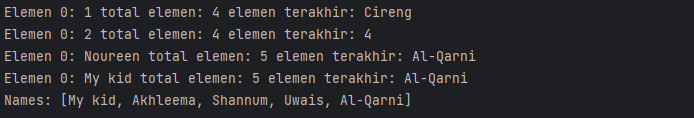

Pertanyaan:
1. Pada baris kode 25 - 26 List akan menampung semua jenis data bisa ditampung ke dalam sebuah arraylist karena semua kelas mewarisi dari kelas 'Object', sehingga 'ArrayList' tanpa parameter type tertentu dapat menampung semua jenis objek. Baik itu type data refrence maupun non refrence
2. Ubah kode program menjadi seperti ini
    
   ``` java
    List<Integer> l = new ArrayList();
    l.add(1);
    l.add(2);
    l.add(3);
    //        l.add("Cireng");
    System.out.printf("Elemen 0: %d total elemen: %d elemen terakhir: %s\n",
                        l.get(0), l.size(), l.get(l.size() - 1));
    l.add(4);
    l.remove(0);
    System.out.printf("Elemen 0: %d total elemen: %d elemen terakhir: %s\n",
                        l.get(0), l.size(), l.get(l.size() - 1));
   ```
   
   Output
    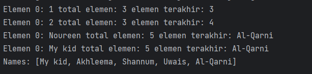
3. Ubah kode menjadi seperti ini
  
    ``` java
    LinkedList<String> names = new LinkedList<>();
    names.add("Noureen");
    names.add("Akhleema");
    names.add("Shannum");
    names.add("Uwais");
    names.add("Al-Qarni");
    System.out.printf("Elemen 0: %s total elemen: %s elemen terakhir: %s\n",
            names.get(0), names.size(), names.get(names.size() - 1));
    names.set(0, "My kid");
    System.out.printf("Elemen 0: %s total elemen: %s elemen terakhir: %s\n",
            names.get(0), names.size(), names.get(names.size() - 1));
    System.out.println("Names: " + names.toString());
   ```
   
4. Penambahan
   ``` java
    // Penambahan baris kode percobaan 1 pertanyaan no 4
    System.out.println();
    names.push("Mei-mei");
    System.out.printf("Elemen 0: %s total elemen: %s elemen terakhir: %s\n",
    names.getFirst(), names.size(), names.getLast());
    System.out.println("Names: " + names.toString());
   ```
    Output
    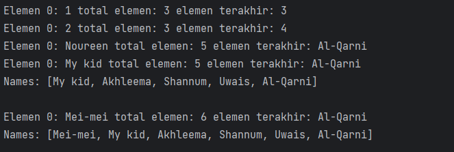
5. Jika kita tidak menuliskan spesifik tipe data apa yang bisa di tampung dalam kelas List ArrayList maupun LinkedList maka tipe data yang akan ditampung adalah tipe data apapun baik itu refrence maupun non refrence seperti object lain. Namun jika menuliskan Tipe saat pertama kali menginstansiasi yang dapat diterima dalam collection tersebut maka tipe data selain itu akan menyebabkan incompetible types. 
    Perbedaan ArrayList dan LinkedList terletak pada susunan penyimpanan data jika kita menggunakan List atau ArrayList maka tipe penyimpanan data akan terurut. Sedangkan jika kita menggunakan Linked List penyimpanan data tidak akan terurut dan tidak ada batas penyimpanan representasi dari LinkedList ini seperti Lahan Parkir

   
   

## Kegiatan Praktikum 2

### Percobaan 2

Pada praktikum 2 ini akan dibuat beberapa method untuk menampilkan beberapa cara yang
dapat dilakukan untuk mengambil/menampilkan elemen pada sebuah collection. Silakan ikutilah
Langkah-langkah di bawah ini

#### Kode Program
Class LoopCollection
``` java
package Collection;

import java.util.Iterator;
import java.util.Stack;

public class LoopCollection {
    public static void main(String[] args) {
        Stack<String> fruits = new Stack<>();
        fruits.push("Banana");
        fruits.add("Orange");
        fruits.add("Watermelon");
        fruits.add("Leci");
        fruits.push("Salak");

        for (String fruit: fruits) {
            System.out.printf("%s ", fruit);
        }
        System.out.println("\n" + fruits.toString());
        while (!fruits.isEmpty()) {
            System.out.printf("%s ", fruits.pop());
        }

        fruits.push("Melon");
        fruits.push("Durian");
        System.out.println();
        for (Iterator<String> it = fruits.iterator(); it.hasNext();) {
            String fruit = it.next();
            System.out.printf("%s ", fruit);
        }
        System.out.println();
        fruits.stream().forEach(e -> {
            System.out.printf("%s ", e);
        });
        System.out.println("");
        for (int i = 0; i < fruits.size(); i++) {
            System.out.printf("%s ", fruits.get(i));
        }
    }
}
```
#### Output
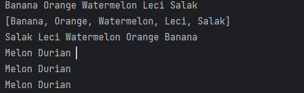

Pertanyaan:

1. Perbedaan diantara 2 method push() dan juga method add() yaitu
    + Pada method push() digunakan untuk memasukkan elemen paling atas(top) dari stack, sehingga elemen tersebut menjadi eleman paling atas dari stack
    + Pada method add() digunkan untuk menambahkan elemen ke dalam stack pada posisi paling terakhir
2. Yang terjadi adalah Output Melon dan Durian akan hilang karena stack tersebut masih kosong dan tidak punya data karena telah dilakukan pop pada baris kode 38-40
3. Pada baris 46-49 fungsi tersebut digunakan untuk mengiterasi setiap elemen fruit menggunakan iterator. Di setiap iterasi, elemen saat ini diambil dari iterator menggunakan it.next() dan disimpan di dalam variable fruit.  Kemudian, elemen tersebut dicetak menggunakan System.out.printf()
4. Pada saat kita mengubah kode program kita maka akan terjadi kesalahan kompilisasi karena Stack adalah subkelas dari Vector, yang mengimplementasikan antarmuka List. Meskipun Stack dapat dianggap sebagai implementasi khusus dari List, mengubah tipe variabel fruits menjadi List<String> menyebabkan data tidak konsisten tipe yang tidak kompatibel diperlukan casting untuk mengubah data tersebut. jika ingin menggunakan Stack sebagai struktur data untuk fruits, tipe variabel harus tetap Stack<String>
   ``` java
    Stack<String> fruits = new Stack<>(); // Sebelum
    List<String> fruits = new Stack<>(); // Sesudah
   ```
   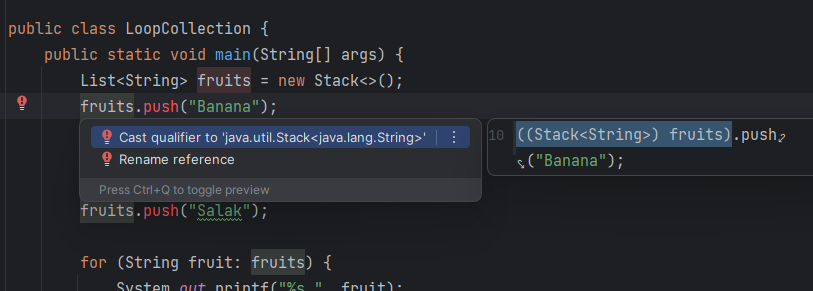
5. Mengubah data
    ``` java
    // Mengubah elemen terakhir dari fruits menjadi Strawbery
        fruits.set(fruits.size() - 1 , "Strawbery");
        System.out.println();
        fruits.stream().forEach(e -> {
            System.out.printf("%s ", e);
        });
    ```
   Output
    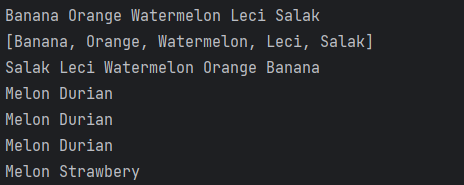
6. Menambahkan data Kemudian Melakukan sorting
    ``` java
   // Menambahkan data dan mengurutkan data
    fruits.add("Mango");
    fruits.add("Guava");
    fruits.add("Avocado");
    System.out.print("\nBefore sort : ");
    fruits.stream().forEach(e -> {
        System.out.printf("%s ", e);
    });
    fruits.sort(null);
    System.out.print("\nAfter sort : ");
    fruits.stream().forEach(e -> {
        System.out.printf("%s ", e);
    });
    ```
    Output
    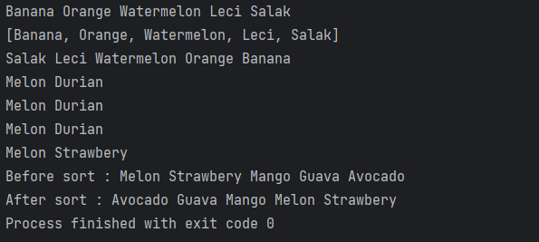


## Kegiatan Praktikum 3

### Percobaan 3
Pada praktikum 3 ini dilakukan uji coba untuk mengimplementasikan sebuah collection untuk
menampung objek yang dibuat sesuai kebutuhan. Objek tersebut adalah sebuah objek
mahasiswa dengan fungsi-fungsi umum seperti menambahkan, menghapus, mengubah, dan
mencari.

#### Kode Program
Class Mahasiswa
``` java
package Collection;

public class Mahasiswa {

    String nim, nama, notelp;

    public Mahasiswa() {

    }
    public Mahasiswa(String nim, String nama, String notelp) {
        this.nim = nim;
        this.nama = nama;
        this.notelp = notelp;
    }

    @Override
    public String toString() {
        return "Mahasiswa{" + "nim=" + nim + ", nama=" + nama + ", notelp=" + notelp + "}";
    }
}
```

Class ListMahasiwa
``` java
package Collection;

import java.util.ArrayList;
import java.util.Arrays;
import java.util.List;

public class ListMahasiswa {
    List<Mahasiswa> mahasiswas = new ArrayList<>();
    public void tambah(Mahasiswa... mahasiswa) {
        mahasiswas.addAll(Arrays.asList(mahasiswa));
    }
    public void hapus(int index) {
        mahasiswas.remove(index);
    }
    public void update(int index, Mahasiswa mhs) {
        mahasiswas.set(index, mhs);
    }
    public void tampil() {
        mahasiswas.stream().forEach(mhs -> {
            System.out.println("" + mhs.toString());
        });
    }
    int linearSearch(String nim) {
        for (int i = 0; i < mahasiswas.size(); i++) {
            if (nim.equals(mahasiswas.get(i).nim)) {
                return i;
            }
        }
        return -1;
    }

    public static void main(String[] args) {
        ListMahasiswa lm = new ListMahasiswa();
        Mahasiswa m = new Mahasiswa("201234", "Noureen", "021xx1");
        Mahasiswa m1 = new Mahasiswa("201235", "Akhleema", "021xx2");
        Mahasiswa m2 = new Mahasiswa("201236", "Shannum", "021xx3");
//        menambahkan objek mahasiswa
        lm.tambah(m, m1, m2);
//        menampilkan list mahasiswa
        lm.tampil();
//        update mahasiswa
        lm.update(lm.linearSearch("201235"), new Mahasiswa("201235", "Akhleema Lela", "021xx2") );
        System.out.println();
        lm.tampil();
    }
}
```
#### Output

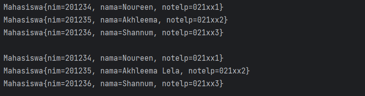

Pertanyaan:
1. Kegunaan menggunakan varrags yaitu fleksibilitasnya dalam menerima sejumlah argumen Mahasiswa tanpa harus menyebutkannya satu per satu. Dalam contoh tersebut, kita dapat menambahkan satu atau lebih objek Mahasiswa dalam satu pemanggilan fungsi tambah().
2. Ubah dari Linear search ke binary search
    ``` java
    int binarySearch(String nim) {
        return Collections.binarySearch(mahasiswas, new Mahasiswa(nim, "", ""), (mhs1, mhs2) -> mhs1.nim.compareTo(mhs2.nim));
    }
   public static void main(String[] args) {
        ListMahasiswa lm = new ListMahasiswa();
        Mahasiswa m = new Mahasiswa("201234", "Noureen", "021xx1");
        Mahasiswa m1 = new Mahasiswa("201235", "Akhleema", "021xx2");
        Mahasiswa m2 = new Mahasiswa("201236", "Shannum", "021xx3");
        // menambahkan objek mahasiswa
        lm.tambah(m, m1, m2);
        // menampilkan list mahasiswa
        lm.tampil();
        // update mahasiswa
        lm.update(lm.linearSearch("201235"), new Mahasiswa("201235", "Akhleema Lela", "021xx2") );
        System.out.println();
        lm.tampil();
    }
    ```
   Output
   
3. Buat method sortingAscenging dan sortDescending
    ``` java
    void sortAscending() {
        Comparator<Mahasiswa> c = Comparator.comparing(mahasiswas -> mahasiswas.nim);
        Collections.sort(mahasiswas, c);
    }
    void sortDescending() {
        Comparator<Mahasiswa> c = Comparator.comparing(mahasiswas -> mahasiswas.nim);
        Collections.sort(mahasiswas, c.reversed());
    }


    public static void main(String[] args) {
        ListMahasiswa lm = new ListMahasiswa();
        Mahasiswa m = new Mahasiswa("201234", "Noureen", "021xx1");
        Mahasiswa m1 = new Mahasiswa("201235", "Akhleema", "021xx2");
        Mahasiswa m2 = new Mahasiswa("201236", "Shannum", "021xx3");
        //   menambahkan objek mahasiswa
        lm.tambah(m, m1, m2);
        //   menampilkan list mahasiswa
        lm.tampil();
        //   update mahasiswa
        lm.update(lm.linearSearch("201235"), new Mahasiswa("201235", "Akhleema Lela", "021xx2") );
        System.out.println();
        lm.tampil();
        //   Sort Ascending
        System.out.println("Sort Ascending: ");
        lm.sortAscending();
        lm.tampil();
        //   Sort Descending
        System.out.println("Sort Descending:");
        lm.sortDescending();
        lm.tampil();
    }
    ```
      
    Output

    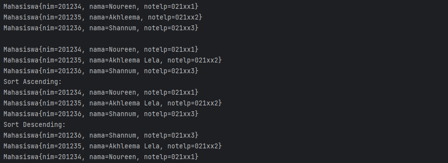


### Tugas 1

#### Kode Program
Class Film
``` java
package Collection.Tugas;

import java.util.Scanner;
import java.util.Stack;

public class Film {
    int id, tahun;
    String judul, director;

    public Film(int id, String judul, int tahun, String director) {
        this.id = id;
        this.judul = judul;
        this.tahun = tahun;
        this.director = director;
    }

    @Override
    public String toString() {
        return "Film{" +
                "ID Film=" + id +
                ", Judul Film='" + judul + '\'' +
                ", Tahun Tayang=" + tahun +
                ", Director='" + director + '\'' +
                '}';
    }

    public static void main(String[] args) {
        Scanner sc = new Scanner(System.in);
        Stack<Film> films = new Stack<>();
        films.push(new Film(1, "Spider-Man: No Way Home", 2021, "Jon Watts"));
        films.push(new Film(2, "Dr. Strange: The Madness of Multiverse", 2022, "Sam Raimi"));
        films.push(new Film(3, "Skyfall", 2012, "Sam Mendes"));
        films.push(new Film(4, "Aquaman", 2018, "James Wan"));
        films.push(new Film(5, "Dark Knight Rises", 2012, "Cristopher Nolan"));
        String pilih;
        while (true) {
            System.out.println("====================================");
            System.out.println("Data Film Layar Lebar Sepanjang Masa");
            System.out.println("====================================");
            System.out.println("\n1. Input Judul Film");
            System.out.println("2. Hapus Data Film Teratas");
            System.out.println("3. Cek Judul Film Teratas");
            System.out.println("4. Info semua Judul Film");
            System.out.println("5. Keluar");
            System.out.println("====================================");
            System.out.print("Pilih menu: ");
            pilih = sc.nextLine().trim();
            switch (pilih) {
                case "1" -> {
                    System.out.println("====================================");
                    System.out.print("Masukkan ID Film       : ");
                    int id = sc.nextInt();
                    sc.nextLine();
                    System.out.print("Masukkan Judul Film    : ");
                    String judul = sc.nextLine();
                    System.out.print("Masukkan Tahun Tayang  : ");
                    int tahun = sc.nextInt();
                    sc.nextLine();
                    System.out.print("Masukkan Director      : ");
                    String director = sc.nextLine();
                    films.push(new Film(id, judul, tahun, director));
                }
                case "2" -> {System.out.println(films.pop());
                }
                case "3" -> {System.out.println(films.peek());
                }
                case "4" -> {
                    films.stream().forEach(film -> {
                        System.out.println("" + film.toString());
                    });
                }
                case "5" -> {
                    return;
                }
                default -> System.out.println("\nKeyword salah\n");
            }
        }
    }
}
```

#### Output
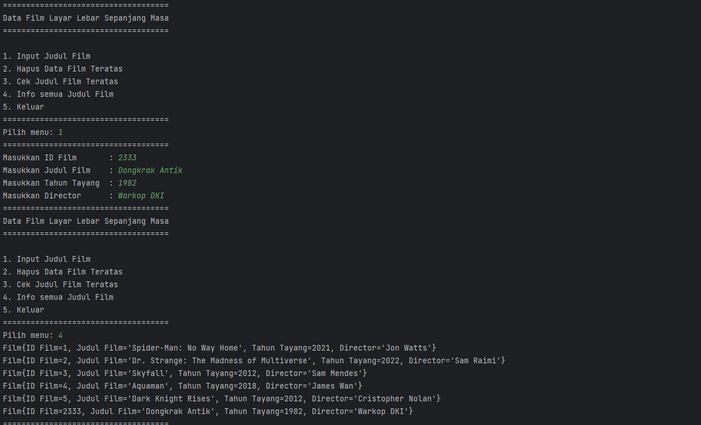
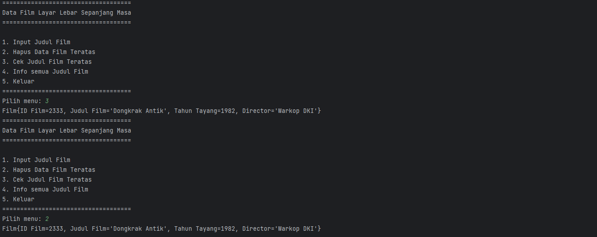
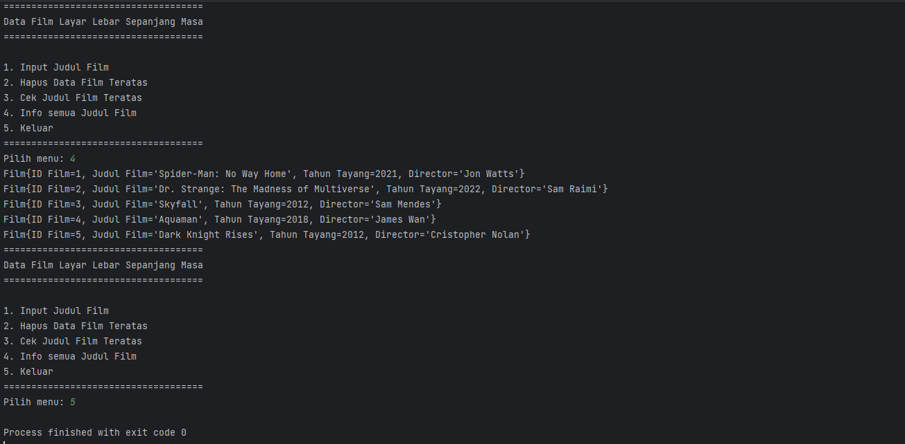
