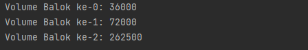

# Laporan Praktikum 3
***
NIM : 2241720192\
Nama : Achmad Raihan Fahrezi Effendy\
Kelas : TI 1D
***
## Praktikum
### 3.2  Membuat Array dari Object, Mengisi dan Menampilkan
#### Kode Program
### Class PersegiPanjang
``` java
package PersegiPanjang;

public class PersegiPanjang {
    public int panjang, lebar;
}
```
### Class ArrayObjects
``` java
package PersegiPanjang;

public class ArrayObjects {
    public static void main(String[] args) {
        PersegiPanjang[] ppArray = new PersegiPanjang[3];

        ppArray[0] = new PersegiPanjang();
        ppArray[0].panjang = 110;
        ppArray[0].lebar = 30;
        
        ppArray[1] = new PersegiPanjang();
        ppArray[1].panjang = 80;
        ppArray[1].lebar = 40;
        
        ppArray[0] = new PersegiPanjang();
        ppArray[0].panjang = 100;
        ppArray[0].lebar = 20;

        System.out.println("Persegi Panjang ke-0, panjang: " + ppArray[0].panjang + ", lebar: " + ppArray[0].lebar);
        System.out.println("Persegi Panjang ke-0, panjang: " + ppArray[1].panjang + ", lebar: " + ppArray[1].lebar);
        System.out.println("Persegi Panjang ke-0, panjang: " + ppArray[2].panjang + ", lebar: " + ppArray[2].lebar);

    }
}
```
#### OUTPUT


Pertanyaan :
1. Tidak sebuah array of object dapat berisi atribut saja
2. Tidak, karena didalam ppArray hanya menyediakan array (wadah) untuk menampung objek namun belum pernah dilakukan inisialisasi objek jadi jika kita tidak dapat mengelola data dari objek PersegiPanjang
3. Pada kode program diatas yaitu kita menyediakan wadah array of objek dari persegi panjang dengan total 3 elemen
4. Kode diatas untuk insialisasi objek yang akan ditaruh pada ppArray pada index ke 1
5. Karena class main mewakili kode utama yang pertama kali dijalankan dan dapat memanggil class" lain sedangkan fungsi class Persegi panjang merepresentasikan Objek dari persegi panjang yang bertugas mengelola data Persegi Panjang

***
### 3.3 Menerima Input Isian Array Menggunakan Looping
#### Kode Program
### Class ArrayObjects
``` java
package PersegiPanjang;
import java.util.Scanner;

public class ArrayObjects {
    public static void main(String[] args) {
        Scanner in = new Scanner(System.in);
        PersegiPanjang[] ppArray = new PersegiPanjang[3];

        for (int i = 0; i < 3; i++) {
            ppArray[i] = new PersegiPanjang();
            System.out.println("Persegi Panjang ke-" + i);
            System.out.print("Masukkan panjang: ");
            ppArray[i].panjang = in.nextInt();
            System.out.print("Masukkan lebar: ");
            ppArray[i].lebar = in.nextInt();

        }
        for (int i = 0; i < 3; i++) {
            System.out.println("Persegi Panjang ke-" + i);
            System.out.println("Panjang: " + ppArray[i].panjang + ", lebar: " + ppArray[i].lebar);
        }
    }
}

```
#### OUTPUT


Pertanyaan: 
1. Iya, Array of Object dapat di implementasikan pada array 2 dimensi
2. Berikut adalah contoh dari soal nomor 1\
    ``` java
    Mahasiswa[][] mhs = new Mahasiswa[2][2];
    mhs[0][0] = new Mahasiswa();
    mhs[0][1] = new Mahasiswa();
    mhs[1][0] = new Mahasiswa();
    mhs[1][1] = new Mahasiswa();
    ```
   
3. Karena kode diatas hanya membuat array (wadah) dari pgArray sejumlah 100 elemen dan belum melakukan insisalisasi dari Objek Persegi sehingga kita tidak dapat mengganti nilai atribut dari objek Persegi
4. Modifikasi\
    ``` java
    Scanner in = new Scanner(System.in);
    System.out.print("Masukkan Panjang Array Persegi Panjang: ");
    int panjang = in.nextInt();
    PersegiPanjang[] ppArray = new PersegiPanjang[panjang];
    for (int i = 0; i < ppArray.length; i++) {
        ppArray[i] = new PersegiPanjang();
        System.out.println("Persegi Panjang ke-" + i);
        System.out.print("Masukkan panjang: ");
        ppArray[i].panjang = in.nextInt();
        System.out.print("Masukkan lebar: ");
        ppArray[i].lebar = in.nextInt();

    }
    for (int i = 0; i < ppArray.length; i++) {
        System.out.println("Persegi Panjang ke-" + i);
        System.out.println("Panjang: " + ppArray[i].panjang + ", lebar: " + ppArray[i].lebar);
    }
    ```
5.  Boleh saja namun sebisa mungkin jangan duplikasi inisialisasi karena akan menimpa nilai yang telah dibuat

***
### 3.4 Operasi Matematika Atribut Object Array
##### KodeProgram
### Class Balok
``` java
package BangunRuang;

public class Balok {
    public int panjang, lebar, tinggi;
    public Balok(int p, int l, int t) {
        panjang = p;
        lebar = l;
        tinggi = t;
    }
    public int hitungVolume() {
        return panjang * lebar * tinggi;
    }

}
```
### Class BangynRuang
``` java
package BangunRuang;

public class BangunRuang {
    public static void main(String[] args) {
        Balok[] blArray = new Balok[3];
        blArray[0] = new Balok(100,30,12);
        blArray[1] = new Balok(120,40,15);
        blArray[2] = new Balok(210,50,25);

        for (int i = 0; i < 3; i++) {
            System.out.println("Volume Balok ke-" + i + ": " + blArray[i].hitungVolume());
        }
    }
}
```
##### Output


Pertanyaan:
1. Bisa didalam satu class dapat memiliki beberapa object sebagai contoh  
   ### Class Rumah
    ``` java
    class Rumah {
        public int panjang, lebar;
        public Rumah() {
        
        }
        public Rumah(int panjang) {
            this.panjang = panjang;
        }
        public Rumah(int lebar) {
            this.lebar = lebar;
        }
        public Rumah(int panjang, int lebar) {
            this.panjang = panjang;
            this.lebar = lebar;
        }
    }
    ```
2. Manambah class Segitiga
   ### Class Segitiga
    ``` java
    package BangunRuang;
    
    public class Segitiga {
        public int alas, tinggi;
    
        public Segitiga(int a, int t) {
            alas = a;
            tinggi = t;
        }
    }
    ```
3. Menambah Method hitungLuas() dan hitungKeliling() pada class Segitiga 
    ``` java
   public float hitungLuas() {
        return alas * tinggi / 2;
    }
    public float hitungKeliling() {
        float sisiMiring = (float) Math.sqrt(alas*alas + tinggi*tinggi);
        return alas + tinggi + sisiMiring;
    }
    ```
4. buat array Segitiga sgArray yang berisi 4 elemen
   ### Class ArraySegitiga
    ``` java
    package BangunRuang;
    
    public class ArraySegitiga {
       public static void main(String[] args) {
         Segitiga[] sgArray = new Segitiga[4];
   
         sgArray[0] = new Segitiga(10, 4);
         sgArray[1] = new Segitiga(20, 10);
         sgArray[2] = new Segitiga(15, 6);
         sgArray[3] = new Segitiga(25, 10);
       }
    }
    ```
5. menggunakan looping, cetak luas dan keliling dengan cara memanggil method hitungLuas() dan hitungKeliling()
    ``` java
    for (int i = 0; i < sgArray.length; i++) {
      System.out.printf("Segitiga ke-%d dengan panjang alas %d dan tinggi %d:\n", (i+1), sgArray[i].alas, sgArray[i].tinggi);
      System.out.println("Luas Segitiga : " + sgArray[i].hitungLuas());
      System.out.println("Keliling Segitiga : " +  sgArray[i].hitungKeliling());
    }
    ```
   #### output
   

### 3.5 Latihan Praktikum
1. Program Menghitung Volume dan Luas Permukaan
   Source Code

   ### Class Kerucut
      ``` java
      package Tugas1;

      public class Kerucut {
      public double jari, sisiMiring;
      public Kerucut(double jari, double sisiMiring) {
      this.jari = jari;
      this.sisiMiring = sisiMiring;
      }
      public double hitungVolume() {
      return (3.14 * (jari * jari) * Math.sqrt((sisiMiring * sisiMiring) - (jari * jari))) / 3;
      }
   
          public double hitungLuasPermukaan() {
              return 3.14 * jari * (jari + sisiMiring);
          }
      }
      ```
   ### Class LimasSegiEmpat
      ``` java
      package Tugas1;
   
      public class LimasSegiEmpat {
      public double sisi, alas, tinggi;
      public LimasSegiEmpat(double sisi, double alas, double tinggi) {
      this.sisi = sisi;
      this.alas = alas;
      this.tinggi = tinggi;
      }
   
          public double hitungVolume() {
              return  (alas * alas) * tinggi /3;
          }
   
          public double hitungLuasPermukaan() {
              double sisiMiring = Math.sqrt(((alas/2) * (alas/2)) + (tinggi * tinggi));
              return ((alas * alas) + (4 * (0.5 * alas * sisiMiring)));
   
          }
      }
      ```
   ### Class Bola
      ``` java
      package Tugas1;
   
      public class Bola {
      public double jari;
   
          public Bola(double jariJari) {
              this.jari = jariJari;
          }
          public double hitungVolume() {
              return 4/3 * 3.14 * (jari * jari * jari) ;
          }
          public double hitungLuasPermukaan() {
              return 4 * 3.14 * jari * jari;
          }
      }
      ```
   ### Class Main
      ``` java
      package Tugas1;
      import java.util.Scanner;
      
      public class Main {
      public static void main(String[] args) {
      Scanner in = new Scanner(System.in);
      Kerucut[] myKerucut = new Kerucut[2];
      Bola[] myBola = new Bola[2];
      LimasSegiEmpat[] myLimas = new LimasSegiEmpat[2];
   
        for (int i = 0; i < myKerucut.length; i++) {
            System.out.println("Nilai Kerucut ke-" + (i+1));
            System.out.print("Masukkan jari-jari: ");
            double jari = in.nextDouble();
            System.out.print("Masukkan sisi Miring: ");
            double sisiMiring = in.nextDouble();
            myKerucut[i] = new Kerucut(jari,sisiMiring);
            System.out.println("=====================");
            System.out.println("Nilai Bola ke-" + (i+1));
            System.out.print("Masukkan jari-jari: ");
            double jariJari = in.nextDouble();
            myBola[i] = new Bola(jariJari);
            System.out.println("=====================");
            System.out.println("Nilai Limas Segi Empat sama sisi ke-" + (i+1));
            System.out.print("Masukkan alas: ");
            double alas = in.nextDouble();
            System.out.print("Masukkan tinggi: ");
            double tinggi = in.nextDouble();
            myLimas[i] = new LimasSegiEmpat(alas,tinggi);
            System.out.println();
        }
        System.out.println("Hasil");
        for (int i = 0; i < myKerucut.length; i++) {
            System.out.printf("Nilai Kerucut ke-%d dengan jari-jari %.2f, dan sisi Miring %.2f :\n",(i+1), myKerucut[i].jari, myKerucut[i].sisiMiring);
            System.out.printf("volume = %.2f \n", myKerucut[i].hitungVolume());
            System.out.printf("luas permukaan = %.2f \n", myKerucut[i].hitungLuasPermukaan());
            System.out.println("================================");
            System.out.printf("Nilai Bola ke-%d dengan jari-jari %.2f :\n",(i+1), myBola[i].jari);
            System.out.printf("volume = %.2f \n", myBola[i].hitungVolume());
            System.out.printf("luas permukaan = %.2f \n", myBola[i].hitungLuasPermukaan());
            System.out.println("================================");
            System.out.printf("Nilai Limas Segi Empat ke-%d dengan alas %.2f dan tinggi %.2f :\n",(i+1),myLimas[i].alas, myLimas[i].tinggi);
            System.out.printf("volume = %.2f \n", myLimas[i].hitungVolume());
            System.out.printf("luas permukaan = %.2f \n", myLimas[i].hitungLuasPermukaan());
            System.out.println();
        }
       }
      }


      ```
      OUTPUT
      
      
2. Informasi Mahasiswa
   
   Source Code
   ### Class Mahasiswa
   ``` java 
   package Tugas2;
   
   public class Mahasiswa {
   String nama, nim, jenisKelamin;
   double ipk;
   
       Mahasiswa(String nama, String nim, String jenisKelamin, double ipk) {
           this.nama = nama;
           this.nim = nim;
           this.jenisKelamin = jenisKelamin;
           this.ipk = ipk;
       }
   
       void tampilInfo() {
           System.out.println("Nama: " + nama);
           System.out.println("NIM: " + nim);
           System.out.println("Jenis Kelamin: " + jenisKelamin);
           System.out.println("IPK: " + ipk);
       }
   
   }

   ```
   ### Class Main
   ``` java
   package Tugas2;
   [
   import java.util.Scanner;
   
   public class Main {
   public static void main(String[] args) {
   Scanner in = new Scanner(System.in);
   System.out.print("Masukkan jumlah mahasiswa: ");
   int jumlahMhs = in.nextInt();
   in.nextLine();
   Mahasiswa[] daftarMhs = new Mahasiswa[jumlahMhs];
   System.out.println("Data Mahasiswa");
   for (int i = 0; i < daftarMhs.length; i++) {
   System.out.println("\nMasukkan data mahasiswa ke-" + (i+1));
   System.out.print("Masukkan Nama: ");
   String nama = in.nextLine();
   
               System.out.print("Masukkan NIM: ");
               String nim = in.nextLine();
   
               System.out.print("Masukkan Jenis Kelamin: ");
               String jenisKelamin = in.nextLine();
   
               System.out.print("Masukkan IPK: ");
               double ipk = in.nextDouble();
               in.nextLine();
   
   
               daftarMhs[i] = new Mahasiswa(nama, nim, jenisKelamin, ipk);
           }
           in.close();
   
           System.out.println("\nList Data Mahasiswa");
           System.out.println("=========================");
           for (int i = 0; i < daftarMhs.length; i++) {
               System.out.println("Data Mahasiswa ke-" + (i+1));
               daftarMhs[i].tampilInfo();
               System.out.println("=========================");
           }
   
       }
   }]()
   ```
    OUTPUT
   
   