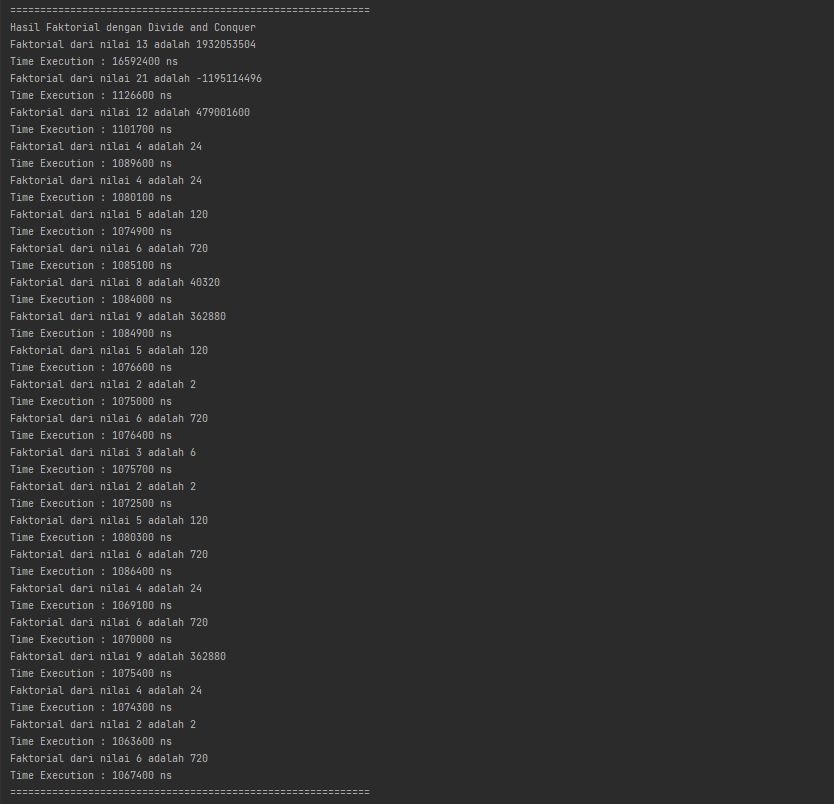

# Laporan Praktikum 4
***
NIM : 2241720192\
Nama : Achmad Raihan Fahrezi Effendy\
Kelas : TI 1D
***
## Praktikum
### 4.2 Menghitung Nilai Faktorial dengan Algoritma Brute Force dan Divide and Conquer
#### Kode Program
Class Faktorial
``` java
 package ObjectFaktorial;

 public class Faktorial {
     public int nilai;
     public int faktorialBF(int n) {
         int fakto = 1;
         for (int i = 1; i <= n; i++) {
             fakto *= i;
         }
         return fakto;
     }
 
     public int faktorialDC(int n) {
         if (n == 1) {
             return 1;
         } else {
             int fakto = n * faktorialDC(n-1);
             return fakto;
         }
     }
 }
```
 Class FaktorialMain
``` java
 package ObjectFaktorial;

 import java.util.Scanner;
 
 public class FaktorialMain {
     public static void main(String[] args) {
         Scanner sc = new Scanner(System.in);
         System.out.println("============================================================");
         System.out.print("Masukkan jumlah elemen yang ingin dihitung : ");
         int elemen = sc.nextInt();
 
         Faktorial[] fk = new Faktorial[elemen];
         for (int i = 0; i < elemen; i++) {
             fk[i] = new Faktorial();
             System.out.print("Masukkan nilai data ke-" + (i+1) + " : ");
             fk[i].nilai = sc.nextInt();
         }
 
         System.out.println("============================================================");
         System.out.println("Hasil Faktorial dengan Brute Force");
         for (int i = 0; i < elemen; i++) {
             System.out.println("Faktorial dari nilai " + fk[i].nilai + " adalah " + fk[i].faktorialBF(fk[i].nilai));
         }
         System.out.println("============================================================");
         System.out.println("Hasil Faktorial dengan Devide and Conquer");
         for (int i = 0; i < elemen; i++) {
             System.out.println("Faktorial dari nilai " + fk[i].nilai + " adalah " + fk[i].faktorialDC(fk[i].nilai));
         }
         System.out.println("============================================================");
 
     }
 }
```

### OUTPUT


Pertanyaan : 

1. Devide dan Conquer akan membagi suatu permasalahan menjadi beberapa bagian permasalahan yang memiliki kemiripan secara rekursif dan kemudian akan digabungkan masing-masing bagian permsalahan sehingga membentuk solusi dari permasahan
2. Tidak, Algoritma Divide and Conquer tidak selalu terdiri dari 3 tahapan divide, conquer, combine. Namun pada kode diatas tidak melibatkan tahap combine menggabungkan solusi submasalah untuk memecahkan masalah
    ``` java
    public int faktorialDC(int n) {
        if (n == 1) { //--> base case dari recursive
            return 1; 
        } else {
            int fakto = n * faktorialDC(n-1); //--> Conquer: memecahkan (menyelesaikan) masing-masing bagian masalah (secara rekursif);
            return fakto;
        }
    }
    ```
3. Bisa, dapat dilakukan dengan menggunakna while loop dan do-while loop
    ``` java
   public int faktorialBFWhile(int n) {
         int fakto = 1;
         int i = 1;
         while (i <= n) {
             fakto *= i;
         i++;
         }
         return fakto;
   }
   public int faktorialBFDoWhile(int n) {
        int fakto = 1;
        int i = 1;
        do {
            fakto *= i;
            i++;
        } while (i <= n);
        return fakto;
    }
    ```
4. Cara Menghitung waktu beserta bigO
   Class Faktorial
   ``` java 
   public int faktorialBF(int n) {
        int fakto = 1; // 1
        for (int i = 1; i <= n; i++) { // 1
            fakto *= i;    // 1
        }
        return fakto; // 1

        // 1 + n (1 + 1) + 1
        // 1 + n*2 + 1
        // n*2
        // n = O(n)
    }

    public int faktorialDC(int n) {
        this.start = System.nanoTime();
        if (n == 1) { // 1
            System.out.println(System.nanoTime() - this.start + " ns");
            return 1; // 1
        } else {
            int fakto = n * faktorialDC(n-1); // 1
            return fakto; // 1
        }
        // misal n = 4
        //    4    *   3     *    2    *   1 
        // (1 + 1) + (1 + 1) + (1 + 1) + 1 + 1
        // 2 + 2 + 2 + 1 + 1
        // 8 = n * 2 = O(n) karena jumlah perhitungan tergantung pada jumlah n
    }
   void getRunningTime() {
        System.out.println("Time Execution : " + (System.nanoTime() - this.start) + " ns");
    }
   ```
   Class FaktorialMain
   ``` java
   
        System.out.println("============================================================");
        System.out.println("Hasil Faktorial dengan Brute Force");
        for (int i = 0; i < elemen; i++) {
            System.out.println("Faktorial dari nilai " + fk[i].nilai + " adalah " + fk[i].faktorialBF(fk[i].nilai));
            fk[i].getRunningTime();
        }
        System.out.println("============================================================");
        System.out.println("Hasil Faktorial dengan Divide and Conquer");
        for (int i = 0; i < elemen; i++) {
            System.out.println("Faktorial dari nilai " + fk[i].nilai + " adalah " + fk[i].faktorialDC(fk[i].nilai));
            fk[i].getRunningTime();
        }
        System.out.println("============================================================");

   ```
   Output
   
5. Cara Menghitung waktu beserta bigO jika n = 22
   Class Faktorial
   ``` java
   public int faktorialBF(int n) {
        this.start = System.nanoTime();
        int fakto = 1; // 1
        for (int i = 1; i <= n; i++) { // 1
            fakto *= i;    // 1
        }
        System.out.println(System.nanoTime() - this.start + " ns");
        return fakto; // 1

        // 1 + n (1 + 1) + 1
        // 1 + n*2 + 1
        // n*2
        // n = O(n)

        // misal n = 20
        // 1 + 22 (1 + 1) + 1
        // 1 + 22*2 + 1
        // 1 + 22*2 + 1
        // 46

    }

    public int faktorialDC(int n) {
        this.start = System.nanoTime();
        if (n == 1) { // 1
            System.out.println(System.nanoTime() - this.start + " ns");
            return 1; // 1
        } else {
            int fakto = n * faktorialDC(n-1); // 1
            return fakto; // 1
        }
        // misal n = 4
        //    4    *   3     *    2    *   1
        // (1 + 1) + (1 + 1) + (1 + 1) + 1 + 1
        // 2 + 2 + 2 + 1 + 1
        // 8 = n * 2 = O(n) karena jumlah perhitungan tergantung pada jumlah n
        // misal n = 22
        // (1+1) * (22-1) + 1 + 1
        // 2 * 21  + 1 + 1
        // 44
    }
   void getRunningTime() {
        System.out.println("Time Execution : " + (System.nanoTime() - this.start) + " ns");
    }
   ```
   Class FaktorialMain 
   ``` java
   
        System.out.println("============================================================");
        System.out.println("Hasil Faktorial dengan Brute Force");
        for (int i = 0; i < elemen; i++) {
            System.out.println("Faktorial dari nilai " + fk[i].nilai + " adalah " + fk[i].faktorialBF(fk[i].nilai));
            fk[i].getRunningTime();
        }
        System.out.println("============================================================");
        System.out.println("Hasil Faktorial dengan Divide and Conquer");
        for (int i = 0; i < elemen; i++) {
            System.out.println("Faktorial dari nilai " + fk[i].nilai + " adalah " + fk[i].faktorialDC(fk[i].nilai));
            fk[i].getRunningTime();
        }
        System.out.println("============================================================");

   ```
   Output
   
   
   

### 4.3 Menghitung Hasil Pangkat dengan Algoritma Brute Force dan Divide and Conquer
#### Kode Program
Class Pangkat 
``` java 
package ObjectPangkat;

public class Pangkat {
    public int nilai, pangkat;
    public int pangkatBF(int a, int n) {
        int hasil = 1;
        for (int i = 0; i < n; i++) {
            hasil *= a;
        }
        return hasil;
    }

    public int pangkatDC(int a, int n) {
        if (n == 0) {
            return 1;
        } else {
            if (n % 2 == 1) {
                return (pangkatDC(a,n/2) * pangkatDC(a, n/2)) * a;
            } else {
                return (pangkatDC(a,n/2) * pangkatDC(a, n/2));
            }
        }
        
    }

}

```
Class PangkatMain
``` java
package ObjectPangkat;

import java.util.Scanner;

public class PangkatMain {
    public static void main(String[] args) {
        Scanner sc = new Scanner(System.in);
        System.out.println("============================================================");
        System.out.print("Masukkan jumlah elemen yang ingin dihitung : ");
        int elemen = sc.nextInt();

        Pangkat[] png = new Pangkat[elemen];
        for (int i = 0; i < elemen; i++) {
            png[i] = new Pangkat();
            System.out.print("Masukkan nilai yang akan dipangkatkan ke-" + (i+1) + " : ");
            png[i].nilai = sc.nextInt();
            System.out.print("Masukkan nilai pemangkat ke-" + (i+1) + " : ");
            png[i].pangkat = sc.nextInt();
        }

        System.out.println("============================================================");
        System.out.println("Hasil Pangkat dengan Brute Force");
        for (int i = 0; i < elemen; i++) {
            System.out.println("Faktorial dari nilai " + png[i].nilai + " adalah " + png[i].pangkatBF(png[i].nilai, png[i].pangkat));
        }
        System.out.println("============================================================");
        System.out.println("Hasil Pangkat dengan Devide and Conquer");
        for (int i = 0; i < elemen; i++) {
            System.out.println("Faktorial dari nilai " + png[i].nilai + " adalah " + png[i].pangkatDC(png[i].nilai, png[i].pangkat));
        }
        System.out.println("============================================================");
    }
}
```
### OUTPUT

Pertanyaan :
1. - pada fungsi PangkatBF() menggunakan Alogaritma Brute Force yaitu alogaritma umumnya tidak “cerdas” dan tidak mangkus, karena ia membutuhkan jumlah komputasi yang besar dan waktu yang lama dalam penyelesaiannya. Algoritma brute force lebih cocok untuk persoalan yang berukuran kecil.
   - pada fungsi PangkatDC() menggunakan Alogaritma Divide and Conquer yaitu alogaritma yang membagi masalah menjadi beberapa bagian masalah yang memiliki kemiripan dengan masalah semula namun berukuran lebih kecil. Dapat digunakan jika suatu permasalahan benar" kompleks
2. Pada potongan program berikut
   ``` java
   if (n % 2 == 1) { // bilangan ganjil
      return (pangkatDC(a,n/2) * pangkatDC(a, n/2)) * a;
     } else { // bilangan genap
         return (pangkatDC(a,n/2) * pangkatDC(a, n/2));
     }
   ```
   Dilakukan pengecekan apakah suatu pangkat itu ganjil atau genap. Jika suatu perpangkatan bernilai ganjil maka Mengalikan hasil pangkat tersebut dengan dirinya sendiri kemudian Mengalikan hasil tersebut dengan a. Sedangkan jika suatu perpangkatan bernilai genap hanya akan Mengalikan hasil pangkat tersebut dengan dirinya sendiri.
3. Tidak, Tahap combine biasanya melibatkan penggabungan hasil dari dua submasalah yang dipecahkan pada tahap divide menjadi solusi utuh. Namun, dalam kasus ini, tidak ada tahap yang secara khusus melakukan penggabungan hasil dari dua pemanggilan rekursif.
4. Tambah Constructirdan Ubah 
   Class Pangkat
   ``` java
    public class Pangkat {
        public int nilai, pangkat;
        Pangkat(int nilai, int pangkat) {
            this.nilai = nilai;
            this.pangkat = pangkat;
    }
   ```
   Class PangkatMain 
   ``` java
   for (int i = 0; i < elemen; i++) {
      System.out.print("Masukkan nilai yang akan dipangkatkan ke-" + (i+1) + " : ");
      int nilai = sc.nextInt();
      System.out.print("Masukkan nilai pemangkat ke-" + (i+1) + " : ");
      int pangkat = sc.nextInt();
      png[i] = new Pangkat(nilai, pangkat);
   }
   ```
   
5. Menambah menu
   Class PangkatMenu 
   ``` java 
     System.out.println("====================================");
     System.out.println("\t\tMenu Hitung Pankat");
     System.out.println("====================================");
     System.out.println("1. Menggunakan Brute Force");
     System.out.println("2. Menggunakan Divide and Conquer");
     System.out.print("Masukkan Pilihan : ");
     int pilihan = sc.nextInt();
     switch (pilihan) {
         case 1 -> {
             System.out.println("============================================================");
             System.out.println("Hasil Pangkat dengan Brute Force");
             for (int i = 0; i < elemen; i++) {
                 System.out.println("Faktorial dari nilai " + png[i].nilai + " adalah " + png[i].pangkatBF(png[i].nilai, png[i].pangkat));
             }
             System.out.println("============================================================");
         }
         case 2 -> {
             System.out.println("============================================================");
             System.out.println("Hasil Pangkat dengan Divide and Conquer");
             for (int i = 0; i < elemen; i++) {
                 System.out.println("Faktorial dari nilai " + png[i].nilai + " adalah " + png[i].pangkatDC(png[i].nilai, png[i].pangkat));
             }
             System.out.println("============================================================");
         }
         default -> {
             System.out.println("Pilihan input salah");
         }
     }
   ```
   OUTPUT
   
### 4.4 Menghitung Sum Array dengan Algoritma Brute Force dan Divide and Conquer
#### Kode Program
   Class Sum
   ``` java
   package ObjectSum;
   
   public class Sum {
       public int elemen;
       public double keuntungan[];
       public double total;
   
       Sum(int elemen) {
           this.elemen = elemen;
           this.keuntungan = new double[elemen];
           this.total = 0;
       }
       double totalBF(double arr[]) {
           for (int i = 0; i < elemen; i++) {
               total = total + arr[i];
           }
           return total;
       }
       double totalDC(double arr[], int l, int r) {
           if(l == r ) {
               return arr[l];
           } else if (l < r) {
               int mid = (l+r)/2;
               double lsum = totalDC(arr,l,mid - 1);
               double rsum = totalDC(arr,mid + 1,r);
               return lsum + rsum + arr[mid];
           }
           return 0;
       }
   }

   ```

   Class SumMain
   ``` java
   package ObjectSum;
   
   import java.util.Scanner;
   
   public class SumMain {
       public static void main(String[] args) {
           Scanner sc = new Scanner(System.in);
           System.out.println("============================================================");
           System.out.println("Program menghitung Keuntungan Total (Satuan Juta. Misal 5.9)");
           System.out.print("Masukkan jumlah bulan : ");
           int elm = sc.nextInt();
   
           Sum sm = new Sum(elm);
           System.out.println("============================================================");
           for (int i = 0; i < sm.elemen; i++) {
               System.out.print("Masukkan untung bulan ke-" + (i+1) + " = ");
               sm.keuntungan[i] = sc.nextDouble();
           }
   
           System.out.println("============================================================");
           System.out.println("ALogaritma Brute Force");
           System.out.println("Total keuntungan perusahaan selama " + sm.elemen + " bulan adalah = " + sm.totalBF(sm.keuntungan));
           System.out.println("============================================================");
           System.out.println("ALogaritma Divide and Conquer");
           System.out.println("Total keuntungan perusahaan selama " + sm.elemen + " bulan adalah = " + sm.totalDC(sm.keuntungan, 0, sm.elemen-1));
           System.out.println("============================================================");
   
       }
   }
   ```
#### OUTPUT


Pertanyaan :
1. Ilustrasi perhitungan untuk total keuntungan pada sebuah array  TotalBF() menggunakan pendekatan brute force dengan menjumlahkan semua elemen array secara berurutan, sementara TotalDC() menggunakan pendekatan divide and conquer dengan membagi array menjadi dua bagian dan melakukan rekursi pada kedua bagian tersebut hingga hanya tersisa satu elemen.
2. Untuk membatasi nilai setelah koma dapat dilakukan dengan beberapa cara saya akan menjelaskan 2 cara yang dapat dilakukan yaitu dengan menggunakan decimalFormat maupun String format.
   Menggunkan library DecimalFormat
   ``` java
   import java.text.DecimalFormat;
   
   public class SumMain {
    public static void main(String[] args) {
        DecimalFormat df = new DecimalFormat("#.##");
        Sum sm = new Sum(3);  
        double arr[] = {10.5, 20.2, 15.4};
        double totalBF = Double.parseDouble(df.format(sm.totalBF(arr)));
        double totalDC = Double.parseDouble(df.format(sm.totalDC(arr, 0, arr.length)));
        System.out.println("Total keuntungan dengan TotalBF(): " + sm.totalBF);
        System.out.println("Total keuntungan dengan TotalDC(): " + sm.totalDC);
   ```
   Menggunakan String Format
   ``` java
    public class SumMain {
    public static void main(String[] args) {
        Sum sm = new Sum(3);  
        double arr[] = {10.5, 20.2, 15.4};
        System.out.printf("Total keuntungan dengan TotalBF(): %.2f\n", sm.totalBF);
        System.out.printf("Total keuntungan dengan TotalDC(): %.2f\n", sm.totalDC);
   ```

3. Pada kode program tersebut merupakan bagian dari Combine dari Divide and Conquer. Combine: mengabungkan solusi masing-masing bagian masalah sehingga membentuk solusi masalah semula.
4. Untuk membagi menjadi beberapa pemecahan masalah menjadi permasalahan yang lebih kecil kita harus mengetahui titik tengah dari suatu permasalahan lalu membagi menjadi 2 permasalahan yang lebih kecil
5. Program perhitungan keuntungan beberapa perusahaan
   Class SumMain
   ``` java
   package ObjectSum;
   
   import java.util.Scanner;
   
   public class SumMain {
   public static void main(String[] args) {
   Scanner sc = new Scanner(System.in);
   System.out.println("============================================================");
   System.out.print("Masukkan jumlah perusahaan : ");
   int jml = sc.nextInt();
   System.out.println("Program menghitung Keuntungan Total (Satuan Juta. Misal 5.9)");
   Sum[] perusahaan = new Sum[jml];
   for (int i = 0; i < perusahaan.length; i++) {
   System.out.println("Perusahaan ke-" + (i+1));
   System.out.print("Masukkan jumlah bulan : ");
   int elm = sc.nextInt();
   perusahaan[i] = new Sum(elm);
   
               System.out.println("============================================================");
               for (int j = 0; j < perusahaan[i].elemen; j++) {
                   System.out.print("Masukkan untung bulan ke-" + (j+1) + " = ");
                   perusahaan[i].keuntungan[j] = sc.nextDouble();
               }
           }
   
           for (int i = 0; i < perusahaan.length; i++) {
               System.out.println("\nKeuntungan perusahaan ke-" + (i+1));
               System.out.println("============================================================");
               System.out.println("ALogaritma Brute Force");
               System.out.println("Total keuntungan perusahaan selama " + perusahaan[i].elemen + " bulan adalah = " + perusahaan[i].totalBF(perusahaan[i].keuntungan));
               System.out.println("============================================================");
               System.out.println("ALogaritma Divide and Conquer");
               System.out.println("Total keuntungan perusahaan selama " + perusahaan[i].elemen + " bulan adalah = " + perusahaan[i].totalDC(perusahaan[i].keuntungan, 0, perusahaan[i].elemen-1));
               System.out.println("============================================================");
           }
       }
   }
   ```
   
   #### OUTPUT
   

### Latihan
   Class Kandidat
   ``` java
   package Tugas;
   
   public class Kandidat {
       String[] nama;
       int[] suara;
   
       int cariMayoritas(int[] suara, int awal, int akhir) {
           if (awal == akhir) {
               return suara[awal];
           }
           // Divide: membagi array menjadi dua bagian
           int tengah = (awal + akhir) / 2;
           int mayoritasKiri = cariMayoritas(suara, awal, tengah);
           int mayoritasKanan = cariMayoritas(suara, tengah + 1, akhir);
   
           if (mayoritasKiri == mayoritasKanan) {
               return mayoritasKiri;
           }
   
           // Conquer: Hitung masing - masing hasil dari kedua bagian
           int suaraMayoritasKiri = hitungSuara(suara, awal, akhir, mayoritasKiri);
           int suaraMayoritasKanan = hitungSuara(suara, awal, akhir, mayoritasKanan);
   
           // Combine: gabungkan hasil dari kedua bagian
           return suaraMayoritasKiri > suaraMayoritasKanan ? mayoritasKiri : mayoritasKanan;
       }
   
       private static int hitungSuara(int[] suara, int awal, int akhir, int kandidat) {
           int suaraKandidat = 0;
   
           for (int i = awal; i <= akhir; i++) {
               if (suara[i] == kandidat) {
                   suaraKandidat++;
               }
           }
   
           return suaraKandidat;
       }
   
   }
   ```

   Class KandidatMain
   ``` java
   package Tugas;
   
   import java.util.Scanner;
   
   public class KandidatMain {
       public static void main(String[] args) {
           Scanner sc = new Scanner(System.in);
   
           System.out.print("Masukkan junlah kandidat : ");
           int jmlKandidat = sc.nextInt();
           sc.nextLine();
           Kandidat kandidat = new Kandidat();
           kandidat.nama = new String[jmlKandidat];
           for (int i = 0; i < kandidat.nama.length; i++) {
               System.out.printf("Masukkan nama kandidat ke-%s : ",(i+1));
               kandidat.nama[i] = sc.nextLine();
           }
           System.out.print("\nMasukkan jumlah suara : ");
           int n = sc.nextInt();
           sc.nextLine();
           kandidat.suara = new int[n];
           System.out.printf("\nPilih kandidat number ke [1-%s]\n", kandidat.nama.length);
           for (int i = 0; i < kandidat.nama.length; i++) {
               System.out.printf("%s. %s\n", (i+1),kandidat.nama[i]);
           }
           for (int i = 0; i < n; i++) {
               System.out.printf("Masukkan pilihan ke-%s: ", (i+1));
               kandidat.suara[i] = sc.nextInt() - 1;
           }
           int indexMayoritas = kandidat.cariMayoritas(kandidat.suara,0, kandidat.suara.length -1);
           if (indexMayoritas > -1) {
               System.out.println("Mayoritas Kandidat : " + kandidat.nama[indexMayoritas]);
           } else {
               System.out.println("Tidak ada mayoritas untuk kandidat");
           }
       }
   }

   ```
   Output
   