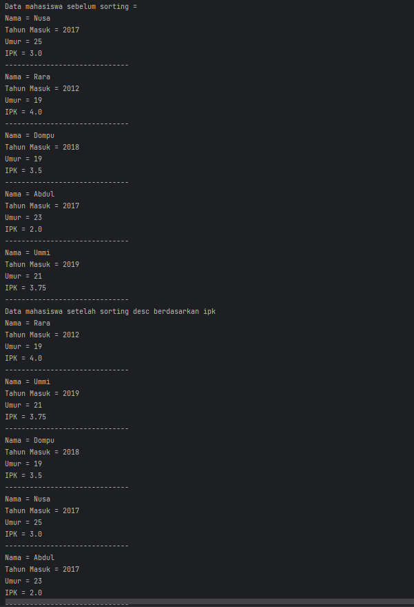
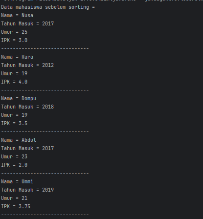
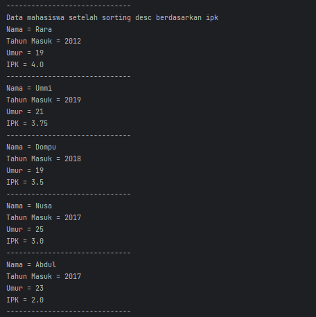
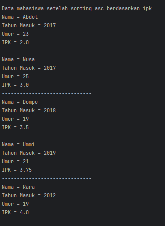
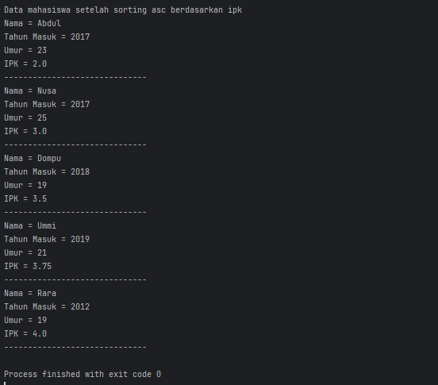
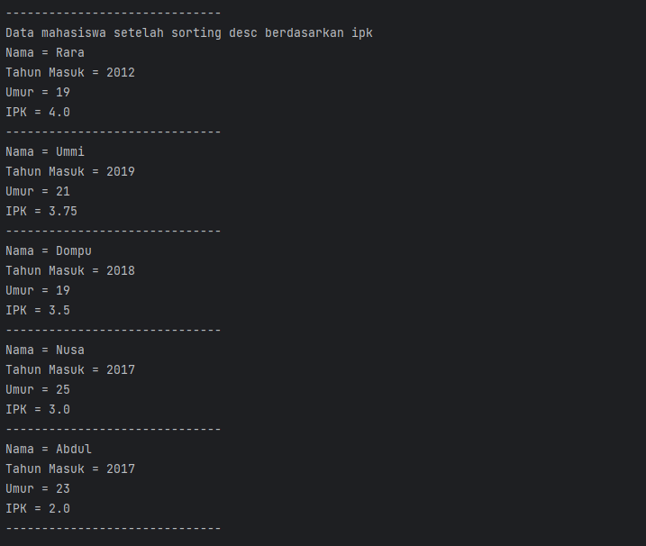
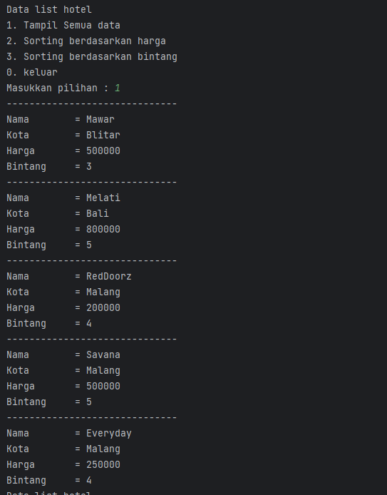
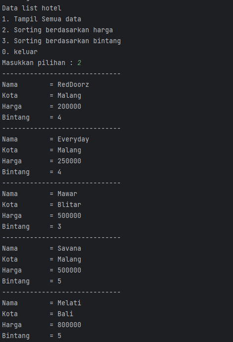
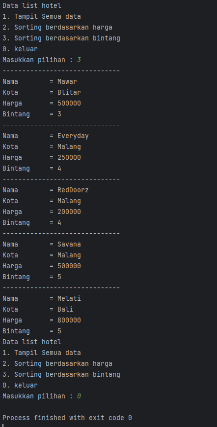

# Laporan Praktikum 5

---

NIM : 2241720192
Nama : Achmad Raihan Fahrezi Effendy
Kelas : TI 1D

---

## Praktikum

### 5.2 Mengurutkan Data Mahasiswa Berdasarkan IPK Menggunakan Bubble Sort

#### Kode Program

Class Mahasiswa

``` java
package BubbleSelectionInsertion.Minggu5;

public class Mahasiswa {
    String nama;
    int thnMasuk, umur;
    double ipk;

    Mahasiswa(String n, int t, int u, double i) {
        nama = n;
        thnMasuk = t;
        umur =u;
        ipk = i;
    }
    void tampil() {
        System.out.println("Nama = " + nama);
        System.out.println("Tahun Masuk = " + thnMasuk);
        System.out.println("Umur = " + umur);
        System.out.println("IPK = " + ipk);
    }
}
```

Class DaftarMahasiswaBerprestasi

``` java
package BubbleSelectionInsertion.Minggu5;

public class DaftarMahasiswaBerprestasi {
    Mahasiswa[] listMhs = new Mahasiswa[5];
    int idx;
    // setelah ini tuliskan method tambah()
    void tambah(Mahasiswa m) {
        if (idx < listMhs.length) {
            listMhs[idx] = m;
            idx++;
        }  else {
            System.out.println("Data sudah penuh!!!");
        }
    }
    // setelah ini tuliskan method tampil()
    void tampil() {
        for (Mahasiswa m : listMhs) {
            m.tampil();
            System.out.println("------------------------------");
        }
    }
    // setelah ini tuliskan method bubbleSort()
    void bubbleSort() {
        for (int i = 0; i < listMhs.length - 1; i++) {
            for (int j = 1; j < listMhs.length - i; j++ ) {
                if (listMhs[j].ipk > listMhs[j - 1].ipk) {
                    Mahasiswa tmp = listMhs[j];
                    listMhs[j] = listMhs[j - 1];
                    listMhs[j - 1] = tmp;
                }
            }
        }
    }

}
```

Class Main

``` java
package BubbleSelectionInsertion.Minggu5;

import java.util.Scanner;

public class Main {
    public static void main(String[] args) {
        Scanner sc = new Scanner(System.in);
        DaftarMahasiswaBerprestasi list = new DaftarMahasiswaBerprestasi();
        Mahasiswa m1 = new Mahasiswa("Nusa", 2017, 25, 3);
        Mahasiswa m2 = new Mahasiswa("Rara", 2012, 19, 4);
        Mahasiswa m3 = new Mahasiswa("Dompu", 2018, 19, 3.5);
        Mahasiswa m4 = new Mahasiswa("Abdul", 2017, 23, 2);
        Mahasiswa m5 = new Mahasiswa("Ummi", 2019, 21, 3.75);

        list.tambah(m1);
        list.tambah(m2);
        list.tambah(m3);
        list.tambah(m4);
        list.tambah(m5);
        System.out.println("Data mahasiswa sebelum sorting =");
        list.tampil();

        System.out.println("Data mahasiswa setelah sorting desc berdasarkan ipk");
        list.bubbleSort();
        list.tampil();
    }
}
```

#### Output



Pertanyaan

1. Terdapat pada method bubbleSort() saat method tersebut dipanggil pada object mahasiswa akan diurutkan berdasarkan ipk dari mahasiswa

   ``` java
   void bubbleSort() {
           for (int i = 0; i < listMhs.length - 1; i++) {
               for (int j = 1; j < listMhs.length - i; j++ ) {
                   if (listMhs[j].ipk > listMhs[j - 1].ipk) {
                       Mahasiswa tmp = listMhs[j];
                       listMhs[j] = listMhs[j - 1];
                       listMhs[j - 1] = tmp;
                   }
               }
           }
       }
   ```
2. Pada method tersebut ipk mahasiswa pada index ke j akan dibandingkan dengan nilai ipk pada index sebelumnya. Jika nilai ipk mahasiwa pada index ke j lebih besar maka akan terjadi proses swap dimana nilai mahasiswa index ke j akan disimpan di temporary kemudian nilai mahasiswa pada index j akan di isi oleh nilai pada index j - 1 (sebelumnya) setelah itu nilai pada index j-1 akan di isi oleh nilai dari temporary
3. Perhatikan perulangan di dalam bubbleSort()

   a. Pada perulangan i digunakan untuk memindahkan elemen terbesar ke posisi paling akhir pada setiap iterasi, sedangkan perulangan j digunakan untuk membandingkan dua elemen sekaligus pada setiap iterasi.

   b. Pada perulangan i < listMhs.length - 1 digunakan karena pada setiap iterasi perulangan i, elemen terakhir pada array sudah pasti merupakan elemen terbesar yang telah diurutkan, sehingga tidak perlu dilakukan perbandingan kembali.

   c. Pada perulangan j < listMhs.length - i digunakan karena pada setiap iterasi perulangan i, elemen terakhir pada array sudah pasti merupakan elemen terbesar yang telah diurutkan, sehingga tidak perlu dilakukan perbandingan lagi pada elemen tersebut. Selain itu, perulangan j juga dimulai dari indeks 1 karena setiap elemen akan dibandingkan dengan elemen sebelumnya.

   d. Perulangan i akan berlangsung sebanyak 49 kali, karena pada iterasi ke-50, elemen terakhir sudah pasti merupakan elemen terbesar yang telah diurutkan. Tahap bubble sort yang ditempuh adalah sebanyak 49 tahap, karena setiap iterasi perulangan i akan mengurutkan satu elemen terbesar ke posisi yang tepat.

### 5.3 Mengurutkan Data Mahasiswa Berdasarkan IPK Menggunakan Selection Sort

#### Kode Program

Class DaftarMahasiswaBerprestasi

``` java
package BubbleSelectionInsertion.Minggu5;

public class DaftarMahasiswaBerprestasi {
    Mahasiswa[] listMhs = new Mahasiswa[5];
    int idx;
    // setelah ini tuliskan method tambah()
    void tambah(Mahasiswa m) {
        if (idx < listMhs.length) {
            listMhs[idx] = m;
            idx++;
        }  else {
            System.out.println("Data sudah penuh!!!");
        }
    }
    // setelah ini tuliskan method tampil()
    void tampil() {
        for (Mahasiswa m : listMhs) {
            m.tampil();
            System.out.println("------------------------------");
        }
    }
    // setelah ini tuliskan method bubbleSort()
    void bubbleSort() {
        for (int i = 0; i < listMhs.length - 1; i++) {
            for (int j = 1; j < listMhs.length - i; j++ ) {
                if (listMhs[j].ipk > listMhs[j - 1].ipk) {
                    Mahasiswa tmp = listMhs[j];
                    listMhs[j] = listMhs[j - 1];
                    listMhs[j - 1] = tmp;
                }
            }
        }
    }

    // setelah ini tuliskan method selectionSort()
    void selectionSort() {
        for (int i = 0; i < listMhs.length; i++) {
            int idxMin = i;
            for (int j = i + 1; j < listMhs.length; j++) {
                if (listMhs[j].ipk < listMhs[idxMin].ipk) {
                    idxMin = j;
                }
            }
            // Swap
            Mahasiswa tmp = listMhs[idxMin];
            listMhs[idxMin] = listMhs[i];
            listMhs[i] = tmp;
        }
    }

}
```

Class Main

``` java
package BubbleSelectionInsertion.Minggu5;

import java.util.Scanner;

public class Main {
    public static void main(String[] args) {
        Scanner sc = new Scanner(System.in);
        DaftarMahasiswaBerprestasi list = new DaftarMahasiswaBerprestasi();
        Mahasiswa m1 = new Mahasiswa("Nusa", 2017, 25, 3);
        Mahasiswa m2 = new Mahasiswa("Rara", 2012, 19, 4);
        Mahasiswa m3 = new Mahasiswa("Dompu", 2018, 19, 3.5);
        Mahasiswa m4 = new Mahasiswa("Abdul", 2017, 23, 2);
        Mahasiswa m5 = new Mahasiswa("Ummi", 2019, 21, 3.75);

        list.tambah(m1);
        list.tambah(m2);
        list.tambah(m3);
        list.tambah(m4);
        list.tambah(m5);
        System.out.println("Data mahasiswa sebelum sorting =");
        list.tampil();

        System.out.println("Data mahasiswa setelah sorting desc berdasarkan ipk");
        list.bubbleSort();
        list.tampil();
      
        // Memanggil method selectionSort
        System.out.println("Data mahasiswa setelah sorting asc berdasarkan ipk");
        list.selectionSort();
        list.tampil();
    }
}
```

#### Output







Pertanyaan:

Jawab :

Pada kode program di method selection sort tersebut digunkan untuk proses  mencari elemen dari ipk yang memiliki nilai paling kecil dalan arrray yang belum terurut. Mulai dari index ke i sampai akhir dari sebuah array. Pada variable idxMin digunakan untuk menyimpan elemen dengan nilai IPK terkecil pada setiap iterasi. Pada setiap iterasi nilai idxMin akan diinisialisasikan dengan nilai ipk pada index ke i karena belum memiliki nilai IPK terkecil.

Perulangan pada varibel j = i+1 hingga akhir dari sebuah array digunakan untuk perbandingan antara nilai IPK pada elemen dengan indeks j dan nilai IPK pada index idxMin. jika nilai IPK pada index j lebih kecil maka nilai IPK pada index idxMin akan di ubah menjadi j. Proses ini akan terus di lakukan iterasi hingga data terurut secara ascending

### 5.4 Mengurutkan Data Mahasiswa Berdasarkan IPK Menggunakan Insertion Sort

#### Kode Program

Class DaftarMahasiswaBerprestasi

``` java
package BubbleSelectionInsertion.Minggu5;

public class DaftarMahasiswaBerprestasi {
    Mahasiswa[] listMhs = new Mahasiswa[5];
    int idx;
    // setelah ini tuliskan method tambah()
    void tambah(Mahasiswa m) {
        if (idx < listMhs.length) {
            listMhs[idx] = m;
            idx++;
        }  else {
            System.out.println("Data sudah penuh!!!");
        }
    }
    // setelah ini tuliskan method tampil()
    void tampil() {
        for (Mahasiswa m : listMhs) {
            m.tampil();
            System.out.println("------------------------------");
        }
    }
    // setelah ini tuliskan method bubbleSort()
    void bubbleSort() {
        for (int i = 0; i < listMhs.length - 1; i++) {
            for (int j = 1; j < listMhs.length - i; j++ ) {
                if (listMhs[j].ipk > listMhs[j - 1].ipk) {
                    Mahasiswa tmp = listMhs[j];
                    listMhs[j] = listMhs[j - 1];
                    listMhs[j - 1] = tmp;
                }
            }
        }
    }

    // setelah ini tuliskan method selectionSort()
     void selectionSort() {
        for (int i = 0; i < listMhs.length; i++) {
            int idxMin = i;
            for (int j = i + 1; j < listMhs.length; j++) {
                if (listMhs[j].ipk < listMhs[idxMin].ipk) {
                    idxMin = j;
                }
            }
            // Swap
            Mahasiswa tmp = listMhs[idxMin];
            listMhs[idxMin] = listMhs[i];
            listMhs[i] = tmp;
        }
    }

    // setelah ini tuliskan method insertionSort()
    void insertionSort() {
        for (int i = 1; i < listMhs.length; i++ ) {
            Mahasiswa temp = listMhs[i];
            int j = i;
            while (j > 0 && listMhs[j - 1].ipk > temp.ipk) {
                listMhs[j] = listMhs [j - 1];
                j--;
            }
            listMhs[j] = temp;
        }
    }

}
```

Class Main

``` java
package BubbleSelectionInsertion.Minggu5;

import java.util.Scanner;

public class Main {
    public static void main(String[] args) {
        Scanner sc = new Scanner(System.in);
        DaftarMahasiswaBerprestasi list = new DaftarMahasiswaBerprestasi();
        Mahasiswa m1 = new Mahasiswa("Nusa", 2017, 25, 3);
        Mahasiswa m2 = new Mahasiswa("Rara", 2012, 19, 4);
        Mahasiswa m3 = new Mahasiswa("Dompu", 2018, 19, 3.5);
        Mahasiswa m4 = new Mahasiswa("Abdul", 2017, 23, 2);
        Mahasiswa m5 = new Mahasiswa("Ummi", 2019, 21, 3.75);

        list.tambah(m1);
        list.tambah(m2);
        list.tambah(m3);
        list.tambah(m4);
        list.tambah(m5);
        System.out.println("Data mahasiswa sebelum sorting =");
        list.tampil();

        System.out.println("Data mahasiswa setelah sorting desc berdasarkan ipk");
        list.bubbleSort();
        list.tampil();
    
        // Memanggil method selectionSort
        System.out.println("Data mahasiswa setelah sorting asc berdasarkan ipk");
        list.selectionSort();
        list.tampil();

        // Memanggil method InsertionSort
        System.out.println("Data mahasiswa setelah sorting asc berdasarkan ipk");
        list.insertionSort();
        list.tampil();
    }
}
```

#### Output




Pernyataan

Jawaban :

``` java
void insertionSort() {
     for (int i = 1; i < listMhs.length; i++ ) {
         Mahasiswa temp = listMhs[i];
         int j = i;
         while (j > 0 && listMhs[j - 1].ipk < temp.ipk) {
             listMhs[j] = listMhs [j - 1];
             j--;
         }
         listMhs[j] = temp;
     }
 }
```

Output



### 5.5 Latihan Praktikum

#### Kode Program

Class Hotel
``` java
package BubbleSelectionInsertion.Minggu5.Praktikum;

public class Hotel {
    String nama, kota;
    int harga;
    byte bintang;

    Hotel(String n, String k, int h, byte b) {
        nama = n;
        kota = k;
        harga = h;
        bintang = b;
    }
}
```

Class HotelService
``` java
package BubbleSelectionInsertion.Minggu5.Praktikum;

public class HotelService {
    Hotel[] rooms = new Hotel[5];
    int index;

    void tambah(Hotel h) {
        if (index < rooms.length) {
            rooms[index] = h;
            index++;
        }  else {
            System.out.println("Data sudah penuh!!!");
        }
    }
    void tampilAll() {
        for (Hotel h : rooms) {
            System.out.println("------------------------------");
            System.out.println("Nama        = " + h.nama);
            System.out.println("Kota        = " + h.kota);
            System.out.println("Harga       = " + h.harga);
            System.out.println("Bintang     = " + h.bintang);

        }
    }

    void  bubbleSort() {
        for (int i = 0; i < rooms.length - 1; i++) {
            for (int j = 1; j < rooms.length - i; j++) {
                if (rooms[j].harga < rooms[j-1].harga) {
                    Hotel temp = rooms[j];
                    rooms[j] = rooms[j-1];
                    rooms[j-1] = temp;
                }
            }
        }
    }

    void selectionSort() {
        for (int i = 0; i < rooms.length; i++) {
            int idxMin = i;
            for (int j = i + 1; j < rooms.length ; j++) {
                if (rooms[j].bintang < rooms[idxMin].bintang ) {
                    idxMin = j;
                }
            }
            Hotel temp = rooms[idxMin];
            rooms[idxMin] = rooms[i];
            rooms[i] = temp;
        }

    }
}
```

Class MainHotel
``` java
package BubbleSelectionInsertion.Minggu5.Praktikum;

import java.util.Scanner;

public class MainHotel {
    public static void main(String[] args) {
        Scanner sc = new Scanner(System.in);

        HotelService hotelService = new HotelService();
        Hotel h1 = new Hotel("Mawar", "Blitar", 500000, (byte) 3);
        Hotel h2 = new Hotel("Melati", "Bali", 800000, (byte) 5);
        Hotel h3 = new Hotel("RedDoorz", "Malang", 200000, (byte) 4);
        Hotel h4 = new Hotel("Savana", "Malang", 500000, (byte) 5);
        Hotel h5 = new Hotel("Everyday", "Malang", 250000, (byte) 4);

        hotelService.tambah(h1);
        hotelService.tambah(h2);
        hotelService.tambah(h3);
        hotelService.tambah(h4);
        hotelService.tambah(h5);

        while (true) {
            System.out.println("Data list hotel");
            System.out.println("1. Tampil Semua data");
            System.out.println("2. Sorting berdasarkan harga");
            System.out.println("3. Sorting berdasarkan bintang");
            System.out.println("0. keluar");
            System.out.print("Masukkan pilihan : ");
            String pilihan = sc.nextLine().trim();
            switch (pilihan) {
                case "1" -> {
                    hotelService.tampilAll();
                }
                case "2" -> {
                    hotelService.bubbleSort();
                    hotelService.tampilAll();
                }
                case "3" -> {
                    hotelService.selectionSort();
                    hotelService.tampilAll();
                }
                case "0" -> {
                    return;
                }
                default -> System.out.println("Pilihan anda salah");
            }
        }

    }

}
```

#### Output







