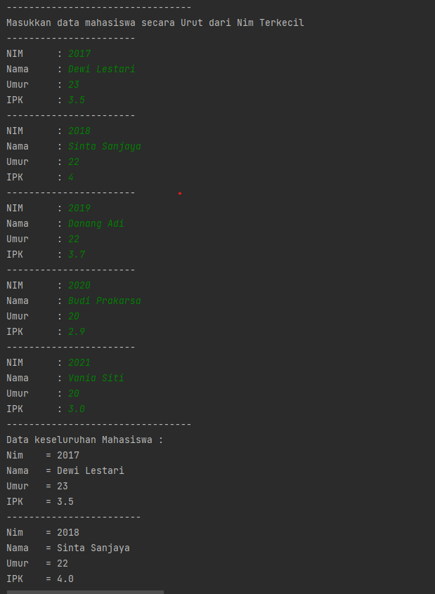
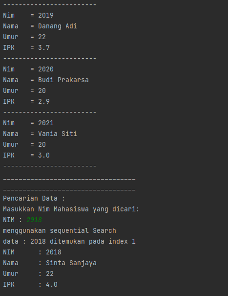
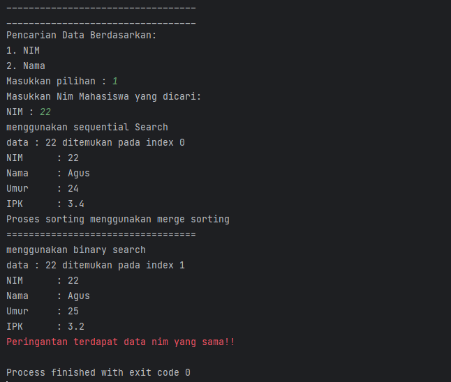

# Laporan Praktikum 6

---

NIM : 2241720192
Nama : Achmad Raihan Fahrezi Effendy
Kelas : TI 1D

---

## Praktikum

### 6.2 Searching / Pencarian Menggunakan Agoritma Sequential Search

#### Kode Program

Class Mahasiswa

``` java
package Minggu7.TestSearching;

public class Mahasiswa {
    int nim, umur;
    String nama;
    double ipk;

    Mahasiswa(int ni, String n, int u, double i) {
        nim = ni;
        nama = n;
        umur = u;
        ipk = i;
    }

    void tampil() {
        System.out.println("Nim    = " + nim);
        System.out.println("Nama   = " + nama);
        System.out.println("Umur   = " + umur);
        System.out.println("IPK    = " + ipk);

    }
}
```

Class PencariMhs

``` java
package Minggu7.TestSearching;

public class PencariMhs {
    Mahasiswa[] listMhs = new Mahasiswa[5];
    int idx;

    // Menambahkan method tambah()
    void tambah(Mahasiswa m) {
        if (idx < listMhs.length) {
            listMhs[idx] = m;
            idx++;
        } else {
            System.out.println("Data sudah penuh !!");
        }
    }

    void tampil() {
        for (Mahasiswa m : listMhs) {
            m.tampil();
            System.out.println("------------------------");
        }
    }

    int FindSeqSearch(int cari) {
        int posisi = -1;
        for (int i = 0; i < listMhs.length; i++) {
            if (listMhs[i].nim == cari) {
                posisi = i;
                break;
            }
        }
        return posisi;
    }

    void TampilPosisi(int x, int pos) {
        if (pos != -1) {
            System.out.println("data : " + x + " ditemukan pada index " + pos);
        } else {
            System.out.println("data : " + x + " tidak ditemukan");
        }
    }

    void TampilData(int x, int pos) {
        if (pos != -1) {
            System.out.println("NIM \t : " + x);
            System.out.println("Nama\t : " + listMhs[pos].nama);
            System.out.println("Umur\t : " + listMhs[pos].umur);
            System.out.println("IPK \t : " + listMhs[pos].ipk);
        } else {
            System.out.println("data " + x + "tidak ditemukan");
        }
    }
}
```

Class MahasiswaMain

``` java
package Minggu7.TestSearching;

import java.util.Scanner;

public class MahasiswaMain {
    public static void main(String[] args) {
        Scanner s = new Scanner(System.in);
        Scanner sl = new Scanner(System.in);

        PencariMhs data = new PencariMhs();
        int jumMhs = 5;

        System.out.println("---------------------------------");
        System.out.println("Masukkan data mahasiswa secara Urut dari Nim Terkecil");
        for (int i = 0; i < jumMhs; i++) {
            System.out.println("-----------------------");
            System.out.print("NIM \t : ");
            int nim = s.nextInt();
            System.out.print("Nama\t : ");
            String nama = sl.nextLine();
            System.out.print("Umur\t : ");
            int umur = s.nextInt();
            System.out.print("IPK \t : ");
            double ipk = s.nextDouble();

            Mahasiswa m = new Mahasiswa(nim, nama, umur, ipk);
            data.tambah(m);
        }

        System.out.println("---------------------------------");
        System.out.println("Data keseluruhan Mahasiswa : ");
        data.tampil();


        System.out.println("__________________________________");
        System.out.println("__________________________________");
        System.out.println("Pencarian Data : ");
        System.out.println("Masukkan Nim Mahasiswa yang dicari: ");
        System.out.print("NIM : ");
        int cari = s.nextInt();
        System.out.println("menggunakan sequential Search");
        int posisi = data.FindSeqSearch(cari);

        data.TampilPosisi(cari, posisi);
        data.TampilData(cari, posisi);

    }

}

```

### OUTPUT





Pertanyaan :

1. pada method TampilPosisi hanya menampilkan informasi tentang posisi (indeks) dari data yang dicari, sedangkan method TampilData menampilkan informasi lengkap tentang data yang dicari, seperti nama, umur, dan IPK.
2. Fungsi break pada program dibawah ini yaitu disaat menemukan data yang cocok dengan key yang sedang kita cari maka akan memberhentikan perulangan sehingga hanya dapat mengembalikan nilai yang sama pertama kali ditemukan sedangkan nilai yang lain akan diabaikan

   ``` java
    if (listMhs[i].nim == cari) {
       posisi = i;
       break;
    }
   ```
3. Program akan tetap berjalan dengan baik, namun hasil yang dikembalikan mungkin tidak benar jika kita memasukkan data yang tidak ter-urut. Hal ini disebabkan karena pencarian data pada array fungsi sequential searching mengharapkan asumsi bahwa data sudah terurut. Jika tidak memungkinkan pencarian tidak akurat

### 6.3. Searching / Pencarian Menggunakan Binary Search

#### Kode Program

Pada Class PencarianMhs/

``` java
//  Menambah method baru FindBinarySearch() 
public int FindBinarySearch(int cari, int left, int right) {
  int mid;
  if (right >= left) {
      mid = (left + right) / 2;
      if (cari == listMhs[mid].nim) {
          return mid;
      } else if(listMhs[mid].nim > cari) {
          return FindBinarySearch(cari, left, mid - 1);
      } else {
          return FindBinarySearch(cari,mid + 1, right);
      }
  }
  return -1;
}

```

Pada Class MahasiswaMain/

``` java
// Menambah kode untuk memanggil method binary search
System.out.println("==================================");
System.out.println("menggunakan binary search");
posisi = data.FindBinarySearch(cari, 0, jumMhs - 1);
data.TampilPosisi(cari, posisi);
data.TampilData(cari, posisi);
```

### OUTPUT


Pertanyaan :

1. Proses divide dalam kode program tersebut terjadi pada Di mana nilai dari variabel left dan right yang merepresentasikan indeks batas kiri dan kanan dari array dijumlahkan lalu dibagi 2 untuk menentukan indeks tengah dari data tersebut.

   ``` java
   mid = (left + right) / 2;
   ```
2. Proses conquer dalam kode program tersebut terjadi pada

   ``` java
   if (cari == listMhs[mid].nim) {
       return mid;
   } else if(listMhs[mid].nim > cari) {
       return FindBinarySearch(cari, left, mid - 1);
   } else {
       return FindBinarySearch(cari,mid + 1, right);
   }
   ```
3. Program akan tetap berjalan dengan baik, namun hasil yang dikembalikan mungkin tidak benar jika kita memasukkan data yang tidak ter-urut. Hal ini disebabkan karena pencarian data pada array fungsi sequential searching mengharapkan asumsi bahwa data sudah terurut. Jika tidak memungkinkan pencarian tidak akurat
4. Dalam kasus ini Program binary search tetap berjalan namun hasil yang dikembalikan tidak ada/tidak sesuai karena pada program sebelumnya diasumsikan bahwa data sudah terurut dari kecil ke besar. Dan untuk mencari data dari besar ke kecil memerlukan perubahan kode seperti berikut
   Sebelumnya (ASC)/

   ``` java
   mid = (left + right) / 2;
   if (cari == listMhs[mid].nim) {
       return mid;
   } else if(listMhs[mid].nim > cari) {
       return FindBinarySearch(cari, left, mid - 1);
   } else {
       return FindBinarySearch(cari,mid + 1, right);
   }
   ```

   SESUDAH (DESC)/

   ``` java
   mid = left + (right - left) / 2;
   if (cari == listMhs[mid].nim) {
       return mid;
   } else if (listMhs[mid].nim < cari) {
       return FindBinarySearchDesc(cari, left, mid - 1);
   } else {
       return FindBinarySearchDesc(cari, mid + 1, right);
   }
   ```

   Pada Class MahasiswaMain ubah/

   ``` java
    // Menambah kode untuk memanggil method binary search
    System.out.println("==================================");
    System.out.println("menggunakan binary search");
    // posisi = data.FindBinarySearch(cari, 0, jumMhs - 1); // ASC
    posisi = data.FindBinarySearchDesc(cari, 0, jumMhs - 1); // DESC
    data.TampilPosisi(cari, posisi);
    data.TampilData(cari, posisi);
   ```

   OUTPUT/
   

   
5. Memodifikasi kode program agar jumlah mahasiswa dapat di inputkan oleh pengguna
   Pada Class PencariMhs Ubah dan tambahkan kode program sebagai berikut

   ``` java
    Mahasiswa[] listMhs;
    int idx;

    PencariMhs(int jumlahMhs) {
        this.listMhs = new Mahasiswa[jumlahMhs];
    }
   ```

   Pada Class MahasiswaMain Ubah dan tambahkan kode program sebagai berikut

   ``` java
     Scanner s = new Scanner(System.in);
     Scanner sl = new Scanner(System.in);
     System.out.print("Masukkan jumlah data Mahasiswa : ");
     int jumMhs = s.nextInt();
     PencariMhs data = new PencariMhs(jumMhs);
   ```

   Output
   

### 6.4. Percobaan Pengayaan Divide and Conquer

#### Kode Program

Class MergeSorting

``` java
package Minggu7.MergeSortTest;

public class MergeSorting {
    public void mergeSort(int[] data) {
        sort(data,0, data.length - 1);
    }
    private void merge(int[] data, int left, int middle, int right) {
        int[] temp = new int[data.length];
        for (int i = left; i <= right; i++) {
            temp[i] = data[i];
        }
        int a = left;
        int b = middle + 1;
        int c = left;

        // membandingkan setiap bagian
        while (a <= middle && b <= right) {
            if (temp[a] <= temp[b]) {
                data[c] = temp[a];
                a++;
            } else {
                data[c] = temp[b];
                b++;
            }
            c++;
        }

        int s = middle - a;
        for (int i = 0; i <= s; i++) {
            data[c + i] = temp[a + i];
        }
    }

    private void sort(int[] data, int left, int right) {
        if (left < right) {
            int middle = (left + right) / 2;
            sort(data, left, middle);
            sort(data, middle + 1, right);
            merge(data, left, middle, right);
        }
    }

    public void printArray(int[] arr) {
        int n = arr.length;
        for (int i = 0; i < n; i++) {
            System.out.print(arr[i]+" ");
        }
        System.out.println();
    }
}
```

Class SortMain

``` java
package Minggu7.MergeSortTest;

public class SortMain {
    public static void main(String[] args) {
        int[] data = {10,40,30,50,70,20,100,90};
        System.out.println("sorting dengan merge sort");
        MergeSorting mSort = new MergeSorting();
        System.out.println("data awal");
        mSort.printArray(data);
        mSort.mergeSort(data);
        System.out.println("setelah diurutkan");
        mSort.printArray(data);
    }
}
```

#### Output


### 6.5. Latihan Praktikum

#### 1. Modifikasi percobaan searching diatas dengan ketentuan berikut ini

* Sebelum dilakukan searching dengan binary search data harus dilakukan pengurutan dengan menggunakan algoritma merge sort!
  Jawaban :

  Pada class MergeSorting buatlah method baru untuk melakukan sorting terhadap data mahasiswa dengan membandingkan nim dari setiap mahasiswa kemudian disatukan membentuk suatu list data mahasiswa yang baru yang sudah tersortir

  Pada Class MergeSorting tambahkan method - method berikut

  ``` java
  public Mahasiswa[] mergeSortDataMhs(PencariMhs m) {
          return sortMhs(m,0, m.listMhs.length - 1);
      }
      public Mahasiswa[] sortMhs(PencariMhs m, int left, int right) {
          if (left < right) {
              int middle = (left + right) / 2;
              sortMhs(m, left, middle);
              sortMhs(m, middle + 1, right);
              return mergeMhs(m, left, middle, right);
          }
          return m.listMhs;
      }

      private Mahasiswa[] mergeMhs(PencariMhs m, int left, int middle, int right) {
          PencariMhs temp = new PencariMhs(right + 1);
          for (int i = left; i <= right; i++) {
              temp.listMhs[i] = m.listMhs[i];
          }
          int a = left;
          int b = middle + 1;
          int c = left;


          // membandingkan setiap bagian
          while (a <= middle && b <= right) {
              if (temp.listMhs[a].nim <= temp.listMhs[b].nim) {
                  m.listMhs[c] = temp.listMhs[a];
                  a++;
              } else {
                  m.listMhs[c] = temp.listMhs[b];
                  b++;
              }
              c++;
          }

          int s = middle - a;
          for (int i = 0; i <= s; i++) {
              m.listMhs[c + i] = temp.listMhs[a + i];
          }
          return m.listMhs;
      }
  ```

  pada method - method diatas akan mengembalikan nilai berupa list data dari mahasiswa yang sudah terurut secara ascendance/

  Pada Class MahasiswaMain lakukan instansiasi object dari Class MergeSorting dan sorting data Mahasiswa kemudian coba lakukan binary searching dan lihat perbedaan sebelum dan sesudah disorting/

  ``` java
    // Menginstansiasi object Merge Sorting dan melakukan sorting terhadap data mahasiswa
          System.out.println("Proses sorting menggunakan merge sorting");
          MergeSorting mSort = new MergeSorting();
          data.listMhs = mSort.mergeSortDataMhs(data);

         // Menambah kode untuk memanggil method binary search
         System.out.println("==================================");
         System.out.println("menggunakan binary search");
         posisi = data.FindBinarySearch(cari, 0, jumMhs - 1); // ASC
         //posisi = data.FindBinarySearchDesc(cari, 0, jumMhs - 1); // DESC
         data.TampilPosisi(cari, posisi);
         data.TampilData(cari, posisi);
  ```

  Hasil dari setelah data disorting sebagai berikut

  Output/


  

  

#### 2. Modifikasi percobaan searching diatas dengan ketentuan berikut ini

* Pencarian dilakukan berdasarkan Nama Mahasiswa (gunakan Algoritma Sequential Search)
* Buat aturan untuk mendeteksi hasil pencarian lebih dari 1 hasil dalam bentuk kalimat peringatan! Pastikan algoritma yang diterapkan sesuai dengan kasus yang diberikan!
  Jawaban :
  Pada Class MahasiswaMain tambah dan ubah baris kode sebagai berikut
    ``` java
    System.out.println("---------------------------------");
    System.out.println("Data keseluruhan Mahasiswa : ");
    data.tampil();
    boolean ulang = true;
    int posisi, cari = - 1;
    String cariNama;
    do {
        System.out.println("__________________________________");
        System.out.println("__________________________________");
        System.out.println("Pencarian Data Berdasarkan: ");
        System.out.println("1. NIM");
        System.out.println("2. Nama");
        System.out.print("Masukkan pilihan : ");
    
        int pilihan = s.nextInt();
        switch (pilihan) {
            case 1 -> {
                System.out.println("Masukkan Nim Mahasiswa yang dicari: ");
                System.out.print("NIM : ");
                cari = s.nextInt();
                System.out.println("menggunakan sequential Search");
                posisi = data.FindSeqSearch(cari);
                data.TampilPosisi(cari, posisi);
                data.TampilData(cari, posisi);
                ulang = false;
            }
            case 2 -> {
                System.out.println("Masukkan Nama Mahasiswa yang dicari: ");
                System.out.print("Nama : ");
                cariNama = sl.nextLine();
                System.out.println("menggunakan sequential Search");
                posisi = data.FindSeqSearchByName(cariNama);
                cari = data.listMhs[posisi].nim;
                data.TampilPosisi(cariNama, posisi);
                data.TampilData(cariNama, posisi);
                ulang = false;
            }
            default -> System.out.println("Pilihan yang anda masukkan salah");
        }
    } while (ulang);
    
    
    // Menginstansiasi object Merge Sorting dan melakukan sorting terhadap data mahasiswa
    System.out.println("Proses sorting menggunakan merge sorting");
    MergeSorting mSort = new MergeSorting();
    data.listMhs = mSort.mergeSortDataMhs(data);
    
    // Menambah kode untuk memanggil method binary search
    System.out.println("==================================");
    System.out.println("menggunakan binary search");
    posisi = data.FindBinarySearch(cari, 0, jumMhs - 1); // ASC
    //posisi = data.FindBinarySearchDesc(cari, 0, jumMhs - 1); // DESC
    data.TampilPosisi(cari, posisi);
    data.TampilData(cari, posisi);
    ```
    
    pada Class PencariMhs tambah dan ubah beberapa baris kode sebagai berikut
    ``` java
    int FindSeqSearch(int cari) {
        int posisi = -1;
        for (int i = 0; i < listMhs.length; i++) {
            if (listMhs[i].nim == cari && posisi == -1) {
                posisi = i;
            } else if (listMhs[i].nim == cari && posisi != -1) {
                System.err.println("Peringantan terdapat data nim yang sama!!");
            }
        }
        return posisi;
    }
    
    int FindSeqSearchByName(String name) {
        int posisi = -1;
        for (int i = 0; i < listMhs.length; i++) {
            if (listMhs[i].nama == name && posisi == -1) {
                posisi = i;
            } else if (listMhs[i].nama == name && posisi != -1) {
                System.err.println("Peringantan terdapat data nama yang sama!!");
            }
        }
        return posisi;
    }
    
    void TampilPosisi(int x, int pos) {
        if (pos != -1) {
            System.out.println("data : " + x + " ditemukan pada index " + pos);
        } else {
            System.out.println("data : " + x + " tidak ditemukan");
        }
    }
    
    void TampilData(int x, int pos) {
        if (pos != -1) {
            System.out.println("NIM \t : " + x);
            System.out.println("Nama\t : " + listMhs[pos].nama);
            System.out.println("Umur\t : " + listMhs[pos].umur);
            System.out.println("IPK \t : " + listMhs[pos].ipk);
        } else {
            System.out.println("data " + x + "tidak ditemukan");
        }
    }
    void TampilPosisi(String x, int pos) {
        if (pos != -1) {
            System.out.println("data : " + x + " ditemukan pada index " + pos);
        } else {
            System.out.println("data : " + x + " tidak ditemukan");
        }
    }
    
    void TampilData(String x, int pos) {
        if (pos != -1) {
            System.out.println("NIM \t : " + x);
            System.out.println("Nama\t : " + listMhs[pos].nama);
            System.out.println("Umur\t : " + listMhs[pos].umur);
            System.out.println("IPK \t : " + listMhs[pos].ipk);
        } else {
            System.out.println("data " + x + "tidak ditemukan");
        }
    }
    ```

Output/


