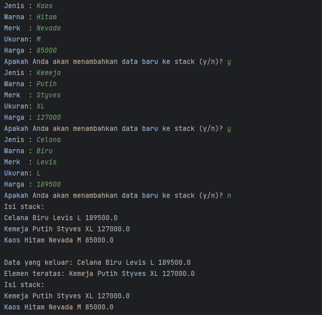
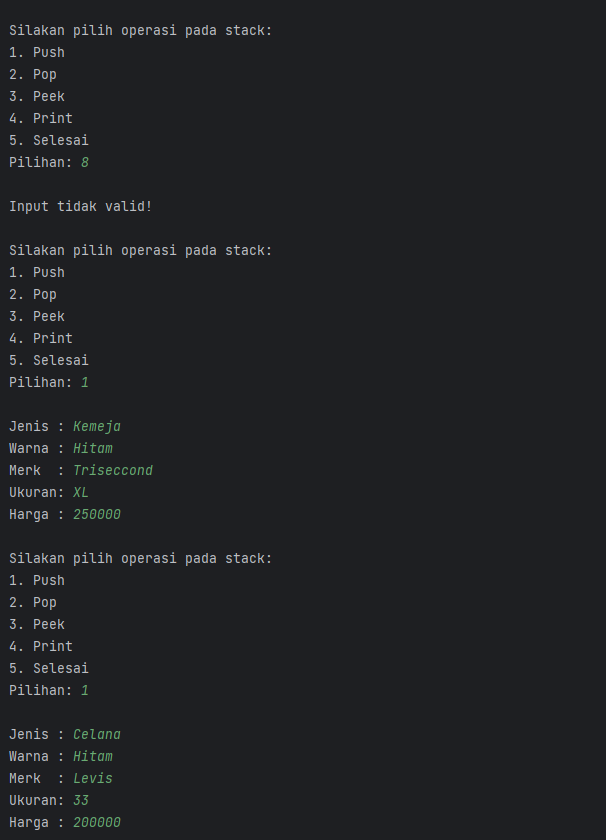
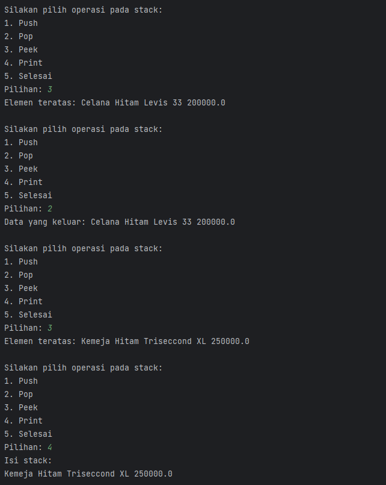
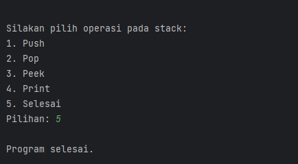
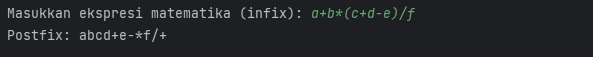
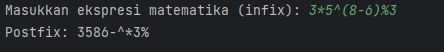
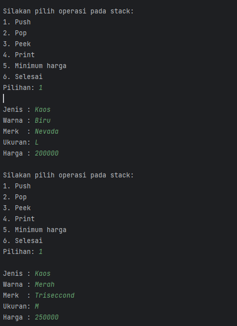
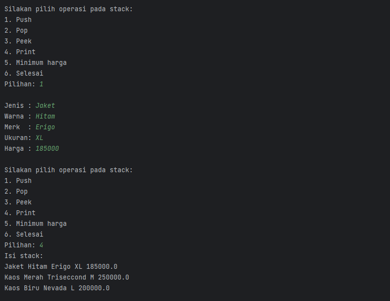
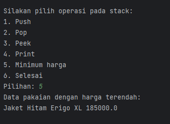
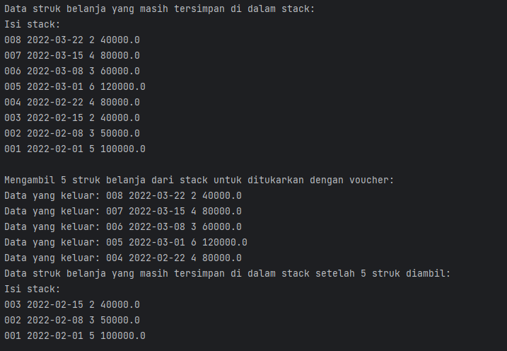

# Laporan Praktikum 7

---

NIM : 2241720192
Nama : Achmad Raihan Fahrezi Effendy
Kelas : TI 1D

---

## Praktikum

### 7.2 Praktikum 1

#### Kode Program

Class Pakaian

``` java
package Praktikum1;

public class Pakaian {
    String jenis, warna, merk, ukuran;
    double harga;

    Pakaian(String jenis, String warna, String merk, String ukuran, double harga) {
        this.jenis = jenis;
        this.warna = warna;
        this.merk = merk;
        this.ukuran = ukuran;
        this.harga = harga;
    }
}

```

Class Stack

``` java
package Praktikum1;

public class Stack {
    int size, top;
    Pakaian[] data;

    public Stack(int size) {
        this.size = size;
        data = new Pakaian[size];
        top = -1;
    }

    public boolean IsEmpty() {
        if (top == -1) {
            return true;
        } else {
            return false;
        }
    }

    public boolean IsFull() {
        if (top == this.size -1) {
            return true;
        } else {
            return false;
        }
    }

    public void push(Pakaian pkn) {
        if (!IsFull()) {
            top++;
            data[top] = pkn;
        } else {
            System.out.println("Isi stack penuh");
        }
    }

    public void pop() {
        if (!IsEmpty()) {
            Pakaian x = data[top];
            top--;
            System.out.println("Data yang keluar: " + x.jenis + " " + x.warna + " " + x.merk + " " + x.ukuran + " " +  x.harga);
        } else {
            System.out.println("Stack masih kosong");
        }
    }
    public void peek() {
        System.out.println("Elemen teratas: " + data[top].jenis + " " + data[top].warna + " " + data[top].merk + " " + data[top].ukuran + " " +  data[top].harga);
    }
    public void print() {
        System.out.println("Isi stack: ");
        for (int i = top; i >= 0 ; i--) {
            System.out.println(data[i].jenis + " " + data[i].warna + " " + data[i].merk + " " + data[i].ukuran + " " +  data[i].harga + " ");
        }
        System.out.println();
    }

    public void clear() {
        if (!IsEmpty()) {
            for (int i = top; i >= 0 ; i--) {
                top--;
            }
            System.out.println("Stack sudah dikosongkan");
        } else {
            System.out.println("Stack masih kosong");
        }

    }
}
```

Class StackMain

``` java
package Praktikum1;

import java.util.Scanner;

public class StackMain {
    public static void main(String[] args) {
        Stack stk = new Stack(5);
        Scanner sc = new Scanner(System.in);
        char pilih;

        do {
            System.out.print("Jenis : ");
            String jenis = sc.nextLine();
            System.out.print("Warna : ");
            String warna = sc.nextLine();
            System.out.print("Merk  : ");
            String merk = sc.nextLine();
            System.out.print("Ukuran: ");
            String ukuran = sc.nextLine();
            System.out.print("Harga : ");
            double harga = sc.nextDouble();

            Pakaian p = new Pakaian(jenis,warna,merk,ukuran,harga);
            System.out.print("Apakah Anda akan menambahkan data baru ke stack (y/n)? ");
            pilih = sc.next().charAt(0);
            sc.nextLine();
            stk.push(p);
        } while (pilih == 'y');
        stk.print();
        stk.pop();
        stk.peek();
        stk.print();
    }
}
```

#### Output



Pertanyaan

1. Data yang dapat ditampung kedalam stack yaitu 5 sesuai dengan instansiasi objek stack pertama kali

   Class Stack

   ``` java

   public class Stack {
   int size, top;
   Pakaian[] data;

       public Stack(int size) {
           this.size = size;
           data = new Pakaian[size];
           top = -1;
       }
   ```

   Class StackMain

   ``` java

   public class StackMain {
       public static void main(String[] args) {
            Stack stk = new Stack(5);
   ```
2. . Data apa yang tersimpan pada variabel p yaitu berisi data objek dari pakaian yang didapat dari input user kemudian di inputkan kedalam objek Pakaian setelah itu data Pakaian ditaruh ke dalam Stack
   Class StackMain

   ``` java
   System.out.print("Jenis : ");
   String jenis = sc.nextLine();
   System.out.print("Warna : ");
   String warna = sc.nextLine();
   System.out.print("Merk  : ");
   String merk = sc.nextLine();
   System.out.print("Ukuran: ");
   String ukuran = sc.nextLine();
   System.out.print("Harga : ");
   double harga = sc.nextDouble();

   Pakaian p = new Pakaian(jenis,warna,merk,ukuran,harga);
   System.out.print("Apakah Anda akan menambahkan data baru ke stack (y/n)? ");
   pilih = sc.next().charAt(0);
   sc.nextLine();
   stk.push(p);
   ```
3. Fungsi penggunaan do-while pada class StackMain adalah untuk mengulang proses penginputan data pakaian ke dalam stack selama pengguna masih ingin menambahkan data baru. Dalam blok do-while ini, pengguna diminta untuk memasukkan jenis, warna, merk, ukuran, dan harga pakaian, yang kemudian digunakan untuk membuat objek Pakaian baru dan dimasukkan ke dalam stack. Setelah pengguna selesai memasukkan data pakaian, mereka akan ditanya apakah mereka ingin menambahkan data pakaian baru ke dalam stack. Jika pengguna memilih 'y' (yes), maka proses penginputan data akan diulang. Jika pengguna memilih 'n' (no), maka proses penginputan data akan dihentikan dan program akan melanjutkan ke proses selanjutnya.
4. Pada Class StackMain ubah kode program sebagai berikut

   Class StackMain

   ``` java
   package Praktikum1;

   import java.util.Scanner;

   public class StackMain {
       public static void main(String[] args) {
           Stack stk = new Stack(5);
           Scanner sc = new Scanner(System.in);
           char pilih;

           do {
               System.out.println("\nSilakan pilih operasi pada stack:");
               System.out.println("1. Push");
               System.out.println("2. Pop");
               System.out.println("3. Peek");
               System.out.println("4. Print");
               System.out.println("5. Selesai");

               System.out.print("Pilihan: ");
               pilih = sc.next().charAt(0);
               sc.nextLine();

               switch(pilih) {
                   case '1' -> {
                       System.out.print("\nJenis : ");
                       String jenis = sc.nextLine();
                       System.out.print("Warna : ");
                       String warna = sc.nextLine();
                       System.out.print("Merk  : ");
                       String merk = sc.nextLine();
                       System.out.print("Ukuran: ");
                       String ukuran = sc.nextLine();
                       System.out.print("Harga : ");
                       double harga = sc.nextDouble();

                       Pakaian p = new Pakaian(jenis, warna, merk, ukuran, harga);
                       stk.push(p);
                   }
                   case '2' -> stk.pop();
                   case '3' -> stk.peek();
                   case '4' -> stk.print();
                   case '5' -> System.out.println("\nProgram selesai.");
                   default -> System.out.println("\nInput tidak valid!");
               }
           } while (pilih != '5');
       }
   }
   ```

Output







### 7.3 Praktikum 2

#### Kode Program

#### Output



Pertanyaan

1. Pada class Postfix digunakan untuk menentukan derajat dari sebuah operator matematika. Derajat tersebut digunakan untuk mengatur urutan operasi pada konversi infix ke postfix.
   Alur kerja method derajat sebagai berikut.
   * Menerima input berupa karakter operator matematika.
   * Mengevaluasi input karakter operator dengan menggunakan switch-case statement
     * Jika operator adalah '^', maka derajatnya adalah 3.
     * Jika operator adalah '%', '/', atau '*', maka derajatnya adalah 2.
     * Jika operator adalah '-' atau '+', maka derajatnya adalah 1.
     * Jika operator tidak sesuai dengan kondisi di atas, maka derajatnya adalah 0.
   * Mengembalikan nilai derajat operator
2. Pada lass Postfix digunakan untuk mendapatkan karakter pada posisi i dari string Q yang merupakan ekspresi matematika dalam notasi infix yang akan dikonversi ke notasi postfix. Dalam method konversi, setiap karakter pada ekspresi matematika akan diperiksa satu per satu menggunakan perulangan for dengan variabel i sebagai indeks. Kemudian, karakter pada posisi i akan disimpan dalam variabel C menggunakan Q.charAt(i). Dengan menggunakan C = Q.charAt(i), kita dapat mengambil karakter pada setiap posisi i dari string Q yang nantinya akan diolah pada method konversi untuk menghasilkan ekspresi matematika dalam notasi postfix.
3. Output Program sebagai berikut

   
4. Tanda kurung tidak ditampilkan pada hasil konversi karena tanda kurung hanya digunakan sebagai tanda pembatas dalam notasi infix untuk menentukan urutan operasi yang akan dieksekusi terlebih dahulu. 

### 7.4 Tugas

1. Tambahkan method getMin pada class Stack yang digunakan untuk mencari dan menampilkan data pakaian dengan harga terendah dari semua data pakaian yang tersimpan di dalam stack!

#### Kode program
Class Postfix
``` java
package Praktikum2;

import Praktikum1.Stack;

public class Postfix {
    int n, top;
    char[] stack;

    public Postfix (int total) {
        this.n = total;
        this.top = -1;
        this.stack = new char[this.n];
        push('(');
    }

    public void push(char c) {
        top++;
        stack[top] = c;
    }

    public char pop() {
        char item = stack[top];
        top--;
        return item;
    }

    public boolean IsOperand(char c) {
        if ((c >= 'A' && c <= 'Z') || (c >= 'a' && c <= 'z') ||
                (c >= '0' && c <= '9') || c == ' ' || c == '.') {
            return true;
        } else {
            return false;
        }
    }

    public boolean IsOperator (char c) {
        if (c == '^' || c == '%' || c == '/' || c == '*' || c == '-' || c == '+') {
            return true;
        } else {
            return false;
        }
    }

    public int derajat(char c) {
        switch (c) {
            case '^' -> {
                return 3;
            }
            case '%', '/', '*' -> {
                return 2;
            }
            case '-', '+' -> {
                return 1;
            }
            default -> {
                return 0;
            }
        }
    }

    public String konversi(String Q) {
        String P = "";
        char C;
        for (int i = 0; i < this.n; i++) {
            C = Q.charAt(i);
            if (IsOperand(C)) {
                P = P + C;
            }
            if (C == '(') {
                push(C);
            }
            if (C == ')') {
                while (stack[top] != '(') {
                    P = P + pop();
                }
                pop();
            }

            if (IsOperator(C)) {
                while (derajat(stack[top]) >= derajat(C)) {
                    P = P + pop();
                }
                push(C);
            }
        }
        return P;
    }

}

```

Class Tugas1Main
``` java
package Tugas.Tugas1;

import Praktikum1.Pakaian;
import Praktikum1.Stack;

import java.util.Scanner;

public class Tugas1Main {
    public static void main(String[] args) {
        Stack stk = new Stack(5);
        Scanner sc = new Scanner(System.in);
        char pilih;

        do {
            System.out.println("\nSilakan pilih operasi pada stack:");
            System.out.println("1. Push");
            System.out.println("2. Pop");
            System.out.println("3. Peek");
            System.out.println("4. Print");
            System.out.println("5. Minimum harga");
            System.out.println("6. Selesai");

            System.out.print("Pilihan: ");
            pilih = sc.next().charAt(0);
            sc.nextLine();

            switch(pilih) {
                case '1' -> {
                    System.out.print("\nJenis : ");
                    String jenis = sc.nextLine();
                    System.out.print("Warna : ");
                    String warna = sc.nextLine();
                    System.out.print("Merk  : ");
                    String merk = sc.nextLine();
                    System.out.print("Ukuran: ");
                    String ukuran = sc.nextLine();
                    System.out.print("Harga : ");
                    double harga = sc.nextDouble();

                    Pakaian p = new Pakaian(jenis, warna, merk, ukuran, harga);
                    stk.push(p);
                }
                case '2' -> stk.pop();
                case '3' -> stk.peek();
                case '4' -> stk.print();
                case '5' -> stk.getMin();
                case '6' -> System.out.println("\nProgram selesai.");
                default -> System.out.println("\nInput tidak valid!");
            }
        } while (pilih != '5');
    }
}

```

#### Output







2. Buat sebuah program stack untuk menyimpan data struk belanja Dewi, kemudian lakukan juga proses pengambilan data struk belanja sesuai dengan jumlah struk yang akan ditukarkan dengan voucher.

### Kode Program
Class MyStruk
``` java
package Tugas.Tugas2;

public class MyStruk {
    String noTransaksi, tglPembelian;
    int  jmlBarang;
    double total;

    MyStruk(String noTransaksi, String tglPembelian, int jmlBarang, double total) {
        this.noTransaksi = noTransaksi;
        this.tglPembelian = tglPembelian;
        this.jmlBarang = jmlBarang;
        this.total = total;
    }


}
```

Class StackMyStruk
``` java
package Tugas.Tugas2;

public class StackMyStruk {
    int size, top;
    MyStruk[] data;

    public StackMyStruk(int size) {
        this.size = size;
        data = new MyStruk[size];
        top = -1;
    }
    public boolean isEmpty() {
        return this.top < 0;
    }

    public boolean isFull() {
        return top > data.length;
    }
    public void push(MyStruk stk) {
        if (!isFull()) {
            top++;
            data[top] = stk;
        } else {
            System.out.println("Isi stack penuh");
        }
    }
    public void pop() {
        if (!isEmpty()) {
            MyStruk x = data[top];
            top--;
            System.out.println("Data yang keluar: " + x.noTransaksi + " " + x.tglPembelian + " " + x.jmlBarang + " " + x.total);
        } else {
            System.out.println("Stack masih kosong");
        }
    }
    public void peek() {
        System.out.println("Elemen teratas: " + data[top].noTransaksi + " " + data[top].tglPembelian + " " + data[top].jmlBarang + " " + data[top].total);
    }
    public void print() {
        System.out.println("Isi stack: ");
        for (int i = top; i >= 0 ; i--) {
            System.out.println(data[i].noTransaksi + " " + data[i].tglPembelian + " " + data[i].jmlBarang + " " + data[i].total);
        }
        System.out.println();
    }
    public void clear() {
        if (!isEmpty()) {
            for (int i = top; i >= 0 ; i--) {
                top--;
            }
            System.out.println("Stack sudah dikosongkan");
        } else {
            System.out.println("Stack masih kosong");
        }

    }
}
```

Class Tugas2Main
``` java
package Tugas.Tugas2;

public class Tugas2Main {
    public static void main(String[] args) {
        StackMyStruk ss = new StackMyStruk(8);

        // Memasukkan data struk belanja Dewi ke dalam stack
        ss.push(new MyStruk("001", "2022-02-01", 5, 100000));
        ss.push(new MyStruk("002", "2022-02-08", 3, 50000));
        ss.push(new MyStruk("003", "2022-02-15", 2, 40000));
        ss.push(new MyStruk("004", "2022-02-22", 4, 80000));
        ss.push(new MyStruk("005", "2022-03-01", 6, 120000));
        ss.push(new MyStruk("006", "2022-03-08", 3, 60000));
        ss.push(new MyStruk("007", "2022-03-15", 4, 80000));
        ss.push(new MyStruk("008", "2022-03-22", 2, 40000));

        // Menampilkan data struk belanja yang masih tersimpan di dalam stack
        System.out.println("Data struk belanja yang masih tersimpan di dalam stack:");
        ss.print();

        // Mengambil 5 struk belanja dari stack untuk ditukarkan dengan voucher
        System.out.println("Mengambil 5 struk belanja dari stack untuk ditukarkan dengan voucher:");
        for (int i = 0; i < 5; i++) {
            ss.pop();
        }

        // Menampilkan data struk belanja yang masih tersimpan di dalam stack setelah 5 struk diambil
        System.out.println("Data struk belanja yang masih tersimpan di dalam stack setelah 5 struk diambil:");
        ss.print();
    }
}

```
### Output



