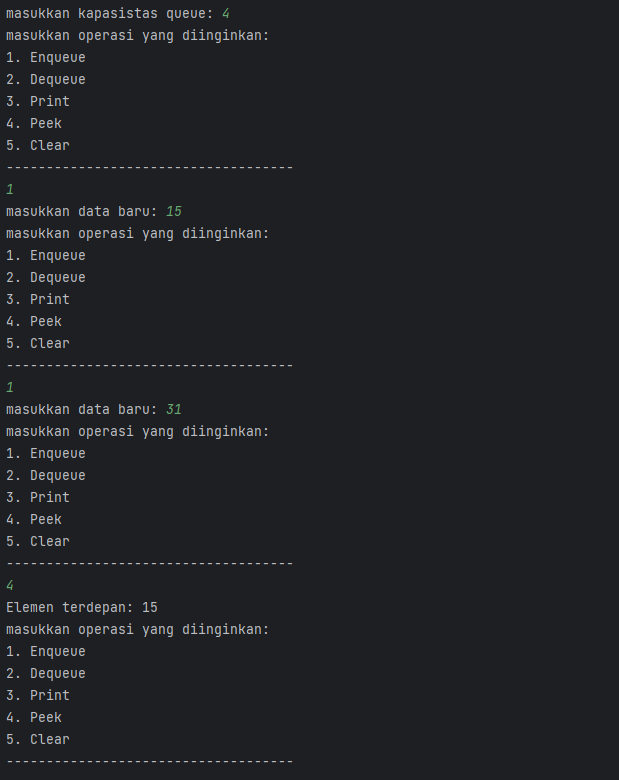
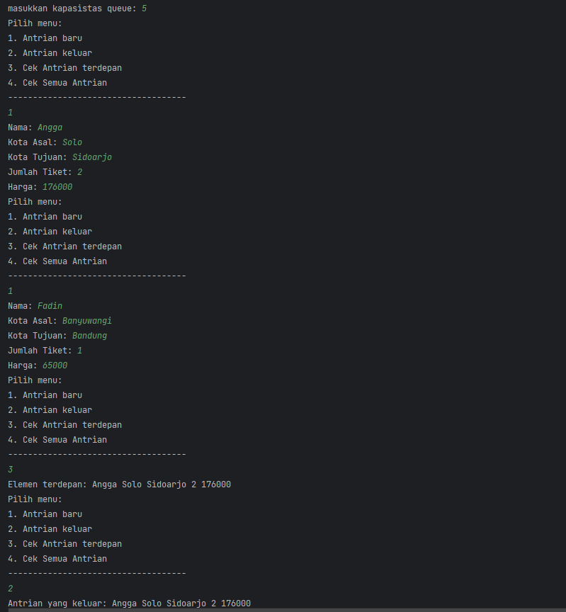
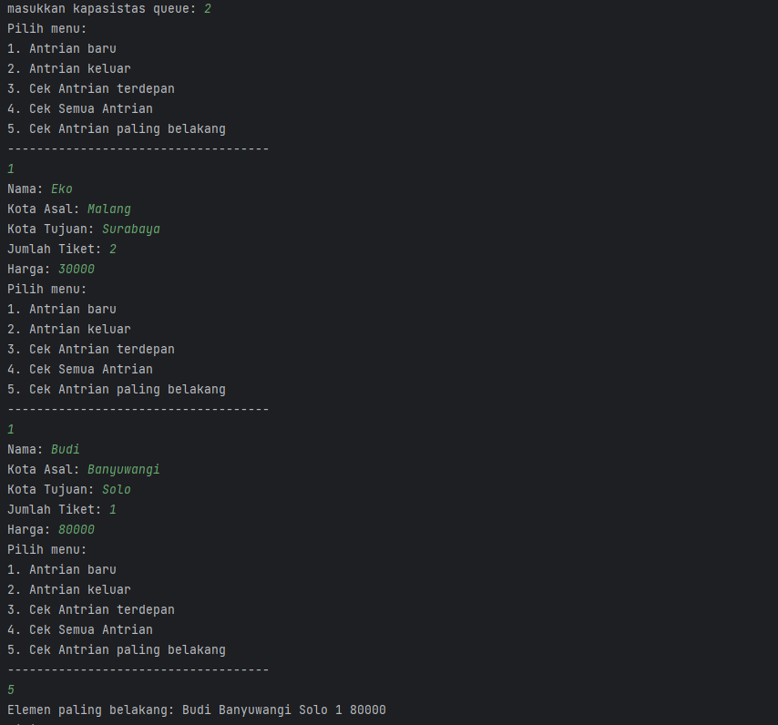
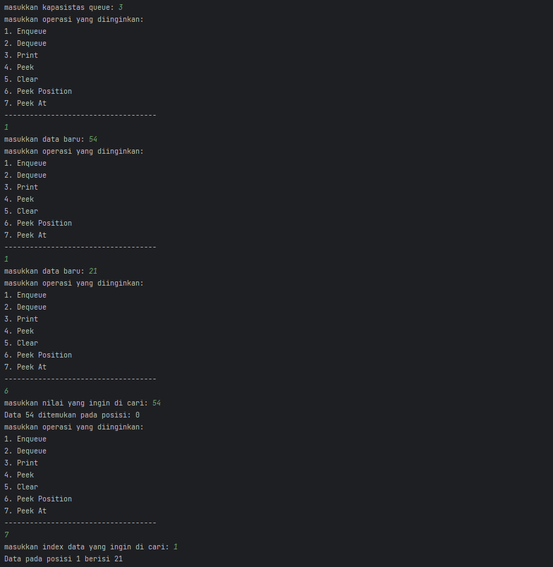
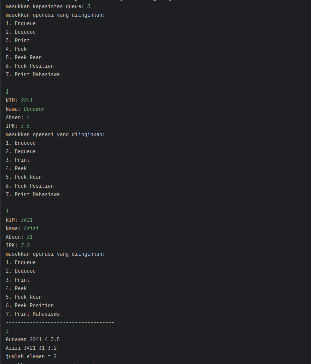
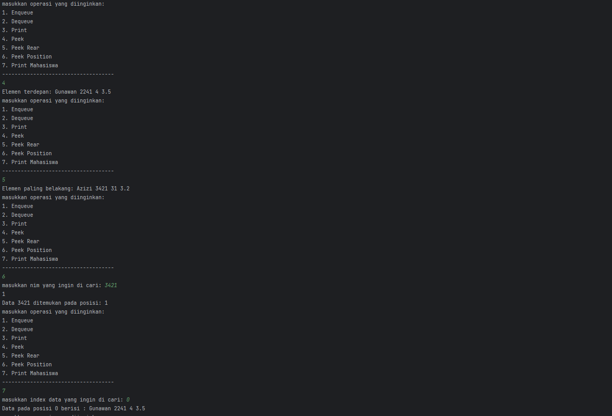

# Laporan Praktikum 8

---

NIM : 2241720192
Nama : Achmad Raihan Fahrezi Effendy
Kelas : TI 1D

---

## Praktikum

### 8.2 Praktikum 1

Pada percobaan ini, kita akan mengimplementasikan penggunaan class Queue.

#### Kode Program

Class Queue

``` java
package jobsheet8.Praktikum1;

public class Queue {
    int max;
    int size;
    int front;
    int rear;
    int[] Q;
    public Queue(int n) {
        max = n;
        Create();
    }

    public void Create() {
        Q = new int[max];
        size = 0;
        front = rear = -1;
    }

    public boolean IsEmpty() {
        if (size == 0) {
            return true;
        } else {
            return false;
        }
    }
    public boolean IsFull() {
        if (size == max) {
            return true;
        } else {
            return false;
        }
    }

    public void peek() {
        if (!IsEmpty()) {
            System.out.println("Elemen terdepan: " + Q[front]);
        } else {
            System.out.println("Queue masih kosong");
        }
    }
    public void print() {
        if (IsEmpty()) {
            System.out.println("Queue masih kosong");
        } else {
            int i = front;
            while (i != rear) {
                System.out.print(Q[i] + " ");
                i = (i+1) % max;
            }
            System.out.println(Q[i] + " ");
            System.out.println("jumlah elemen = " + size);
        }
    }
    public void clear() {
        if (!IsEmpty()) {
            front = rear = -1;
            size = 0;
            System.out.println("Queue berhasil dikosongkan");
        } else {
            System.out.println("Queue masih kosong");
        }
    }
    public void Enqueue(int data) {
        if (IsFull()) {
            System.out.println("Queue sudah penuh");
        } else {
            if (IsEmpty()) {
                front = rear = 0;
            } else {
                if (rear == max -1) {
                    rear = 0;
                } else {
                    rear++;
                }
            }
            Q[rear] = data;
            size++;
        }
    }

    public int Dequeue() {
        int data = 0;
        if (IsEmpty()) {
            System.out.println("Queue masih kosong");
        } else {
            data = Q[front];
            size--;
            if (IsEmpty()) {
                front = rear = -1;
            } else {
                if (front == max -1) {
                    front = 0;
                } else {
                    front++;
                }
            }
        }
        return data;
    }
}
```

Class QueueMain

``` java
package jobsheet8.Praktikum1;

import java.util.Scanner;

public class QueueMain {
    public static void main(String[] args) {
        Scanner sc = new Scanner(System.in);
        int n, pilih;
        System.out.print("masukkan kapasistas queue: ");
        n = sc.nextInt();

        Queue Q = new Queue(n);

        do {
            menu();
            pilih = sc.nextInt();
            switch (pilih) {
                case 1 -> {
                    System.out.print("masukkan data baru: ");
                    int dataMasuk = sc.nextInt();
                    Q.Enqueue(dataMasuk);
                }
                case 2 -> {
                    int dataKeluar = Q.Dequeue();
                    if (dataKeluar != 0) {
                        System.out.println("Data yang dikeluarkan: " + dataKeluar);
                    }
                }
                case 3 -> Q.print();
                case 4 -> Q.peek();
                case 5 -> Q.clear();
            }
        } while (pilih == 1 || pilih == 2 || pilih == 3 || pilih == 4 || pilih == 5);
    }

    public static void menu() {
        System.out.println("masukkan operasi yang diinginkan: ");
        System.out.println("1. Enqueue");
        System.out.println("2. Dequeue");
        System.out.println("3. Print");
        System.out.println("4. Peek");
        System.out.println("5. Clear");
        System.out.println("------------------------------------");
    }
}
```

#### Output



Pertanyaan

1. pada pertama kali pembuatan nilai pada Queue nilai diinisialisasikan dengan -1 untuk memastikan bahwa antrian pada queue masih kosong dan belum ada data yang di masukkan saat pertama kali dibuat
2. Pada logika program tersebut menunjukkan jika indeks rear sama dengan max  - 1 memiliki makna bahwa queue pada indeks terakhir sudah terisi namun queue belum penuh dalam kasus ini rear harus diatur agar dapat kembali ke indeks 0 yang merupakan nilai awal dari sebuah array dengan cara ini ketika elemen baru ditambahkan ke queue maka akan kembali ke indeks awal dan elemen baru dapat ditambahkan ke indeks tersebut, sehingga menjaga properti FIFO (First-In-First-Out) dari struktur data queue.
3. Pada method Enqueue data terakhir akan disimpan pada perintah kode program "Q[rear] = data;" sebelum kode itu dijalankan perlu mengupdate nilai rear agar menunjukkan indeks paling terakhir pada Queue kemudian data baru akan disimpan sesuai indeks rear
4. Pada method Dequeue data yang akan dikeluarkan merupakan data paling terdepan dari sebuah Queue dengan menggunakan kode program "data = Q[front]" setelah variabel front disimpan maka perlu mengupdate indeks dari front setelah data diperbarui kita kembalikan nilai data nilai front yang telah disimpan sebelum melakukan pembaruan
5. Pada logika program tersebut menunjukkan jika indeks front sama dengan max  - 1 memiliki makna bahwa queue pada indeks terakhir sudah terisi namun queue belum penuh dalam kasus ini front harus diatur agar dapat kembali ke indeks 0 yang merupakan nilai awal dari sebuah array dengan cara ini ketika elemen baru ditambahkan ke queue maka akan kembali ke indeks awal dan elemen baru dapat ditambahkan ke indeks tersebut, sehingga menjaga properti FIFO (First-In-First-Out) dari struktur data queue.
6. Pada potongan kode program tersebut nilai dari variabel i akan sesuai dengan front yang merujuk pada urutan pertama dari sebuah antrian Queue
7. Pada potongan kode program tersebut ketika i + 1 telah mencapai max akan di riset kembali ke angka 0 untuk memulai kembali pada index ke 0

## Praktikum

### 8.3 Praktikum 2

Pada percobaan ini, kita akan membuat program yang mengilustrasikan pembelian tiket kereta
api yang dilakukan oleh penumpang di stasiun kereta api.

#### Kode Program

Class Penumpang

``` java
package jobsheet8.Praktikum2;

public class Penumpang {
    String nama, kotaAsal, kotaTujuan;
    int jumlahTiket, harga;

    Penumpang(String nama, String kotaAsal, String kotaTujuan, int jml, int harga) {
        this.nama = nama;
        this.kotaAsal = kotaAsal;
        this.kotaTujuan = kotaTujuan;
        this.jumlahTiket = jml;
        this.harga = harga;
    }

}
```

Class Queue

``` java
package jobsheet8.Praktikum2;

public class Queue {
    int max;
    int size;
    int front;
    int rear;
    Penumpang[] Q;
    public Queue(int n) {
        max = n;
        Create();
    }

    public void Create() {
        Q = new Penumpang[max];
        size = 0;
        front = rear = -1;
    }

    public boolean IsEmpty() {
        if (size == 0) {
            return true;
        } else {
            return false;
        }
    }
    public boolean IsFull() {
        if (size == max) {
            return true;
        } else {
            return false;
        }
    }

    public void peek() {
        if (!IsEmpty()) {
            System.out.println("Elemen terdepan: " + Q[front].nama + " " + Q[front].kotaAsal + " " + Q[front].kotaTujuan + " " + Q[front].jumlahTiket + " " + Q[front].harga);
        } else {
            System.out.println("Queue masih kosong");
        }
    }
    public void print() {
        if (IsEmpty()) {
            System.out.println("Queue masih kosong");
        } else {
            int i = front;
            while (i != rear) {
                System.out.println(Q[i].nama + " " + Q[i].kotaAsal + " " + Q[i].kotaTujuan + " " + Q[i].jumlahTiket + " " + Q[i].harga);
                i = (i+1) % max;
                System.out.println();
            }
            System.out.println(Q[i].nama + " " + Q[i].kotaAsal + " " + Q[i].kotaTujuan + " " + Q[i].jumlahTiket + " " + Q[i].harga);
            System.out.println("jumlah elemen = " + size);
        }
    }
    public void clear() {
        if (!IsEmpty()) {
            front = rear = -1;
            size = 0;
            System.out.println("Queue berhasil dikosongkan");
        } else {
            System.out.println("Queue masih kosong");
        }
    }
    public void Enqueue(Penumpang data) {
        if (IsFull()) {
            System.out.println("Queue sudah penuh");
        } else {
            if (IsEmpty()) {
                front = rear = 0;
            } else {
                if (rear == max -1) {
                    rear = 0;
                } else {
                    rear++;
                }
            }
            Q[rear] = data;
            size++;
        }
    }

    public Penumpang Dequeue() {
        Penumpang data = new Penumpang("", "" , "", 0,0);
        if (IsEmpty()) {
            System.out.println("Queue masih kosong");
        } else {
            data = Q[front];
            size--;
            if (IsEmpty()) {
                front = rear = -1;
            } else {
                if (front == max -1) {
                    front = 0;
                } else {
                    front++;
                }
            }
        }
        return data;
    }
}
```

Class QueueMain

``` java
package jobsheet8.Praktikum2;

import java.util.Scanner;

public class QueueMain {
    public static void main(String[] args) {
        Scanner sc = new Scanner(System.in);
        int n, pilih;
        System.out.print("masukkan kapasistas queue: ");
        n = sc.nextInt();
        Queue antri = new Queue(n);

        do {
            menu();
            pilih = sc.nextInt();
            sc.nextLine();
            switch (pilih) {
                case 1 -> {
                    System.out.print("Nama: ");
                    String nama = sc.nextLine();
                    System.out.print("Kota Asal: ");
                    String asal = sc.nextLine();
                    System.out.print("Kota Tujuan: ");
                    String tujuan = sc.nextLine();
                    System.out.print("Jumlah Tiket: ");
                    int jml = sc.nextInt();
                    System.out.print("Harga: ");
                    int hrg = sc.nextInt();

                    Penumpang p = new Penumpang(nama, asal, tujuan, jml, hrg);
                    sc.nextLine();
                    antri.Enqueue(p);
                }
                case 2 -> {
                    Penumpang data = antri.Dequeue();
                    if (!"".equals(data.nama) && !"".equals(data.kotaAsal) && !"".equals(data.kotaTujuan) && data.jumlahTiket != 0 && data.harga != 0) {
                        System.out.println("Antrian yang keluar: " + data.nama + " " + data.kotaAsal + " " + data.kotaTujuan + " " + data.jumlahTiket + " " + data.harga);
                    }
                }
                case 3 -> antri.peek();
                case 4 -> antri.print();
            }
        } while (pilih == 1 || pilih == 2 || pilih == 3 || pilih == 4);
    }

    public static void menu() {
        System.out.println("Pilih menu: ");
        System.out.println("1. Antrian baru");
        System.out.println("2. Antrian keluar");
        System.out.println("3. Cek Antrian terdepan");
        System.out.println("4. Cek Semua Antrian");
        System.out.println("------------------------------------");
    }
}
```

#### Output\



Pertanyaan

1. Pada implementasi kode program tersebut digunakan untuk membuat objek penumpang baru dan memberi nilai defult untuk data nama, asal, tujuan, jml dan harga sebelum data penumpang di masukkan
2. Pada kode program tersebut akan terjadi eror pada kode program dikarenakan saat menginstansiasi penumpang baru diperlukan memberi nilai untuk konstruktor nilai default pada tiap tiap parameter
3. Berikut kode program yang digunakan untuk menampilkan data yang dikelurkan dari queue

   ``` java
   public Penumpang Dequeue() {
        Penumpang data = new Penumpang("", "" , "", 0,0);
        if (IsEmpty()) {
            System.out.println("Queue masih kosong");
        } else {
            data = Q[front];
            size--;
            if (IsEmpty()) {
                front = rear = -1;
            } else {
                if (front == max -1) {
                    front = 0;
                } else {
                    front++;
                }
            }
        }
        return data;
    }
   ```
4. Memodifikasi class Queue dan QueueMain dan menambahkan method baru
   Class Queue

   ``` java
   package jobsheet8.Praktikum2;

   public class Queue {
   int max;
   int size;
   int front;
   int rear;
   Penumpang[] Q;
   public Queue(int n) {
   max = n;
   Create();
   }

       public void Create() {
           Q = new Penumpang[max];
           size = 0;
           front = rear = -1;
       }

       public boolean IsEmpty() {
           if (size == 0) {
               return true;
           } else {
               return false;
           }
       }
       public boolean IsFull() {
           if (size == max) {
               return true;
           } else {
               return false;
           }
       }

       public void peek() {
           if (!IsEmpty()) {
               System.out.println("Elemen terdepan: " + Q[front].nama + " " + Q[front].kotaAsal + " " + Q[front].kotaTujuan + " " + Q[front].jumlahTiket + " " + Q[front].harga);
           } else {
               System.out.println("Queue masih kosong");
           }
       }
       public void print() {
           if (IsEmpty()) {
               System.out.println("Queue masih kosong");
           } else {
               int i = front;
               while (i != rear) {
                   System.out.print(Q[i].nama + " " + Q[i].kotaAsal + " " + Q[i].kotaTujuan + " " + Q[i].jumlahTiket + " " + Q[i].harga);
                   i = (i+1) % max;
               }
               System.out.println(Q[i] + " ");
               System.out.println("jumlah elemen = " + size);
           }
       }
       public void clear() {
           if (!IsEmpty()) {
               front = rear = -1;
               size = 0;
               System.out.println("Queue berhasil dikosongkan");
           } else {
               System.out.println("Queue masih kosong");
           }
       }
       public void Enqueue(Penumpang data) {
           if (IsFull()) {
               System.out.println("Queue sudah penuh");
           } else {
               if (IsEmpty()) {
                   front = rear = 0;
               } else {
                   if (rear == max -1) {
                       rear = 0;
                   } else {
                       rear++;
                   }
               }
               Q[rear] = data;
               size++;
           }
       }

       public Penumpang Dequeue() {
           Penumpang data = new Penumpang("", "" , "", 0,0);
           if (IsEmpty()) {
               System.out.println("Queue masih kosong");
           } else {
               data = Q[front];
               size--;
               if (IsEmpty()) {
                   front = rear = -1;
               } else {
                   if (front == max -1) {
                       front = 0;
                   } else {
                       front++;
                   }
               }
           }
           return data;
       }

       public void peekRear() {
           if (!IsEmpty()) {
               System.out.println("Elemen paling belakang: " + Q[rear].nama + " " + Q[rear].kotaAsal + " " + Q[rear].kotaTujuan + " " + Q[rear].jumlahTiket + " " + Q[rear].harga);
           } else {
               System.out.println("Queue masih kosong");
           }
       }
   }
   ```

   Class QueueMain

   ``` java
   package jobsheet8.Praktikum2;

   import java.util.Scanner;

   public class QueueMain {
   public static void main(String[] args) {
   Scanner sc = new Scanner(System.in);
   int n, pilih;
   System.out.print("masukkan kapasistas queue: ");
   n = sc.nextInt();
   Queue antri = new Queue(n);

           do {
               menu();
               pilih = sc.nextInt();
               sc.nextLine();
               switch (pilih) {
                   case 1 -> {
                       System.out.print("Nama: ");
                       String nama = sc.nextLine();
                       System.out.print("Kota Asal: ");
                       String asal = sc.nextLine();
                       System.out.print("Kota Tujuan: ");
                       String tujuan = sc.nextLine();
                       System.out.print("Jumlah Tiket: ");
                       int jml = sc.nextInt();
                       System.out.print("Harga: ");
                       int hrg = sc.nextInt();

                       Penumpang p = new Penumpang(nama, asal, tujuan, jml, hrg);
                       sc.nextLine();
                       antri.Enqueue(p);
                   }
                   case 2 -> {
                       Penumpang data = antri.Dequeue();
                       if (!"".equals(data.nama) && !"".equals(data.kotaAsal) && !"".equals(data.kotaTujuan) && data.jumlahTiket != 0 && data.harga != 0) {
                           System.out.println("Antrian yang keluar: " + data.nama + " " + data.kotaAsal + " " + data.kotaTujuan + " " + data.jumlahTiket + " " + data.harga);
                       }
                   }
                   case 3 -> antri.peek();
                   case 4 -> antri.print();
                   case 5 -> antri.peekRear();
               }
           } while (pilih == 1 || pilih == 2 || pilih == 3 || pilih == 4 || pilih == 5);
       }

       public static void menu() {
           System.out.println("Pilih menu: ");
           System.out.println("1. Antrian baru");
           System.out.println("2. Antrian keluar");
           System.out.println("3. Cek Antrian terdepan");
           System.out.println("4. Cek Semua Antrian");
           System.out.println("5. Cek Antrian paling belakang");
           System.out.println("------------------------------------");
       }
   }
   ```

   Output Program
   

### 8.4 Tugas

1. Tambahkan dua method berikut ke dalam class Queue pada Praktikum1:

#### Kode Program

Class Queue

``` java
package jobsheet8.Praktikum1;

public class Queue {
    int max;
    int size;
    int front;
    int rear;
    int[] Q;
    public Queue(int n) {
        max = n;
        Create();
    }

    public void Create() {
        Q = new int[max];
        size = 0;
        front = rear = -1;
    }

    public boolean IsEmpty() {
        if (size == 0) {
            return true;
        } else {
            return false;
        }
    }
    public boolean IsFull() {
        if (size == max) {
            return true;
        } else {
            return false;
        }
    }

    public void peek() {
        if (!IsEmpty()) {
            System.out.println("Elemen terdepan: " + Q[front]);
        } else {
            System.out.println("Queue masih kosong");
        }
    }
    public void print() {
        if (IsEmpty()) {
            System.out.println("Queue masih kosong");
        } else {
            int i = front;
            while (i != rear) {
                System.out.print(Q[i] + " ");
                i = (i+1) % max;
            }
            System.out.println(Q[i] + " ");
            System.out.println("jumlah elemen = " + size);
        }
    }
    public void clear() {
        if (!IsEmpty()) {
            front = rear = -1;
            size = 0;
            System.out.println("Queue berhasil dikosongkan");
        } else {
            System.out.println("Queue masih kosong");
        }
    }
    public void Enqueue(int data) {
        if (IsFull()) {
            System.out.println("Queue sudah penuh");
        } else {
            if (IsEmpty()) {
                front = rear = 0;
            } else {
                if (rear == max -1) {
                    rear = 0;
                } else {
                    rear++;
                }
            }
            Q[rear] = data;
            size++;
        }
    }

    public int Dequeue() {
        int data = 0;
        if (IsEmpty()) {
            System.out.println("Queue masih kosong");
        } else {
            data = Q[front];
            size--;
            if (IsEmpty()) {
                front = rear = -1;
            } else {
                if (front == max -1) {
                    front = 0;
                } else {
                    front++;
                }
            }
        }
        return data;
    }

    public void peekPosition(int data) {
        if (IsEmpty()) {
            System.out.println("Queue masih kosong");
        } else {
            int position = -1;
            for (int i = 0; i < size; i++) {
                int index = (front + i) % max;
                if (Q[index] == data) {
                    position = i;
                    break;
                }
            }
            if (position == -1) {
                System.out.println("Data tidak ditemukan di dalam queue");
            } else {
                System.out.println("Data " + data + " ditemukan pada posisi: " + position);
            }
        }
    }

    public void peekAt(int position) {
        if (IsEmpty()) {
            System.out.println("Queue masih kosong");
        } else if (position > size) {
            System.out.println("Posisi " + position + " di luar range queue");
        } else {
            int index = (front + position) % max;
            System.out.println("Data pada posisi " + position + " berisi " + Q[index]);
        }
    }

}
```

Class QueueMain

``` java
package jobsheet8.Praktikum1;

import java.util.Scanner;

public class QueueMain {
    public static void main(String[] args) {
        Scanner sc = new Scanner(System.in);
        int n, pilih;
        System.out.print("masukkan kapasistas queue: ");
        n = sc.nextInt();

        Queue Q = new Queue(n);

        do {
            menu();
            pilih = sc.nextInt();
            switch (pilih) {
                case 1 -> {
                    System.out.print("masukkan data baru: ");
                    int dataMasuk = sc.nextInt();
                    Q.Enqueue(dataMasuk);
                }
                case 2 -> {
                    int dataKeluar = Q.Dequeue();
                    if (dataKeluar != 0) {
                        System.out.println("Data yang dikeluarkan: " + dataKeluar);
                    }
                }
                case 3 -> Q.print();
                case 4 -> Q.peek();
                case 5 -> Q.clear();
                case 6 -> {
                    System.out.print("masukkan nilai yang ingin di cari: ");
                    int value = sc.nextInt();
                    Q.peekPosition(value);
                }
                case 7 -> {
                    System.out.print("masukkan index data yang ingin di cari: ");
                    int value = sc.nextInt();
                    Q.peekAt(value);
                }
            }
        } while (pilih == 1 || pilih == 2 || pilih == 3 || pilih == 4 || pilih == 5 || pilih == 6 || pilih == 7);
    }

    public static void menu() {
        System.out.println("masukkan operasi yang diinginkan: ");
        System.out.println("1. Enqueue");
        System.out.println("2. Dequeue");
        System.out.println("3. Print");
        System.out.println("4. Peek");
        System.out.println("5. Clear");
        System.out.println("6. Peek Position");
        System.out.println("7. Peek At");
        System.out.println("------------------------------------");
    }
}
```

#### Output Program



2. Buatlah program antrian untuk mengilustasikan mahasiswa yang sedang meminta tanda tangan
   KRS pada dosen DPA di kampus. Ketika seorang mahasiswa akan mengantri, maka dia harus
   menuliskan terlebih dulu NIM, nama, absen, dan IPK seperti yang digambarkan pada Class
   diagram

#### Kode Program

Class Mahasiswa

``` java
package jobsheet8.Tugas;

public class Mahasiswa {
    String name, nim;
    int absen;
    double ipk;

    public Mahasiswa(String name, String nim, int absen, double ipk) {
        this.name = name;
        this.nim = nim;
        this.absen = absen;
        this.ipk = ipk;
    }


}
```

Class Queue

``` java
package jobsheet8.Tugas;
public class Queue {
    int max,front,rear,size;
    Mahasiswa[] antrian;

    public Queue(int max) {
        this.max = max;
        Create();
    }
    public void Create() {
        antrian = new Mahasiswa[max];
        size = 0;
        front = rear = -1;
    }

    public boolean IsEmpty() {
        if (size == 0) {
            return true;
        } else {
            return false;
        }
    }
    public boolean IsFull() {
        if (size == max) {
            return true;
        } else {
            return false;
        }
    }
    public void Enqueue(Mahasiswa antrian) {
        if (IsFull()) {
            System.out.println("Queue sudah penuh");
        } else {
            if (IsEmpty()) {
                front = rear = 0;
            } else {
                if (rear == max -1) {
                    rear = 0;
                } else {
                    rear++;
                }
            }
            this.antrian[rear] = antrian;
            size++;
        }
    }

    public int Dequeue() {
       int data = -1;
        if (IsEmpty()) {
            System.out.println("Queue masih kosong");
        } else {
            data = front;
            size--;
            if (IsEmpty()) {
                front = rear = -1;
            } else {
                if (front == max -1) {
                    front = 0;
                } else {
                    front++;
                }
            }
        }
        return data;
    }
    public void print() {
        if (IsEmpty()) {
            System.out.println("Queue masih kosong");
        } else {
            int i = front;
            while (i != rear) {
                System.out.println(antrian[i].nama + " " + antrian[i].nim + " " + antrian[i].absen + " " + antrian[i].ipk);
                i = (i+1) % max;
            }
            System.out.println(antrian[i].nama + " " + antrian[i].nim + " " + antrian[i].absen + " " + antrian[i].ipk);
            System.out.println("jumlah elemen = " + size);
        }
    }
    public void peek() {
        if (!IsEmpty()) {
            System.out.println("Elemen terdepan: " + antrian[front].nama + " " + antrian[front].nim + " " + antrian[front].absen + " " + antrian[front].ipk);
        } else {
            System.out.println("Queue masih kosong");
        }
    }
    public void peekRear() {
        if (!IsEmpty()) {
            System.out.println("Elemen paling belakang: " + antrian[rear].nama + " " + antrian[rear].nim + " " + antrian[rear].absen + " " + antrian[rear].ipk);
        } else {
            System.out.println("Queue masih kosong");
        }
    }

    public void peekPosition(String nim) {
        if (IsEmpty()) {
            System.out.println("Queue masih kosong");
        } else {
            int position = -1;
            for (int i = 0; i < size; i++) {
                int index = (front + i) % max;
                if (nim.equals(antrian[index].nim)) {
                    position = i;
                    System.out.println(i);
                    break;
                }
            }
            if (position == -1) {
                System.out.println("Data tidak ditemukan di dalam queue");
            } else {
                System.out.println("Data " + nim + " ditemukan pada posisi: " + position);
            }
        }
    }

    public void printMahasiswa(int posisi) {
        if (IsEmpty()) {
            System.out.println("Queue masih kosong");
        } else if (posisi > size) {
            System.out.println("Posisi " + posisi + " di luar range queue");
        } else {
            int index = (front + posisi) % max;
            System.out.println("Data pada posisi " + posisi + " berisi : " + antrian[index].nama + " " + antrian[index].nim + " " + antrian[index].absen + " " + antrian[index].ipk);
        }
    }
}
```

Class MahasiwaMain
``` java
package jobsheet8.Tugas;
import jobsheet8.Praktikum2.Penumpang;

import java.util.Scanner;

public class MahasiswaMain {
    public static void main(String[] args) {
        Scanner sc = new Scanner(System.in);
        int n, pilih;
        System.out.print("masukkan kapasistas queue: ");
        n = sc.nextInt();

        Queue mhs = new Queue(n);

        do {
            menu();
            pilih = sc.nextInt();
            sc.nextLine();
            switch (pilih) {
                case 1 -> {
                    System.out.print("NIM: ");
                    String nim = sc.nextLine();
                    System.out.print("Nama: ");
                    String nama = sc.nextLine();
                    System.out.print("Absen: ");
                    int absen = sc.nextInt();
                    System.out.print("IPK: ");
                    double ipk = sc.nextDouble();

                    Mahasiswa m = new Mahasiswa(nim, nama, absen, ipk);
                    sc.nextLine();
                    mhs.Enqueue(m);
                }
                case 2 -> {
                    int dataKeluar = mhs.Dequeue();
                    if (dataKeluar != -1) {
                        System.out.println("Data yang pada index " + dataKeluar + " berhasil dikeluarkan");
                    }
                }
                case 3 -> mhs.print();
                case 4 -> mhs.peek();
                case 5 -> mhs.peekRear();
                case 6 -> {
                    System.out.print("masukkan nim yang ingin di cari: ");
                    String value = sc.nextLine();
                    mhs.peekPosition(value);
                }
                case 7 -> {

                    System.out.print("masukkan index data yang ingin di cari: ");
                    int value = sc.nextInt();
                    mhs.printMahasiswa(value);
                }
            }
        } while (pilih == 1 || pilih == 2 || pilih == 3 || pilih == 4 || pilih == 5 || pilih == 6 || pilih == 7);
    }

    public static void menu() {
        System.out.println("masukkan operasi yang diinginkan: ");
        System.out.println("1. Enqueue");
        System.out.println("2. Dequeue");
        System.out.println("3. Print");
        System.out.println("4. Peek");
        System.out.println("5. Peek Rear");
        System.out.println("6. Peek Position");
        System.out.println("7. Print Mahasiswa");
        System.out.println("------------------------------------");
    }
}
```
#### Output Program






