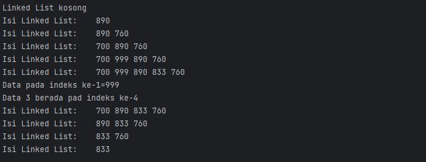
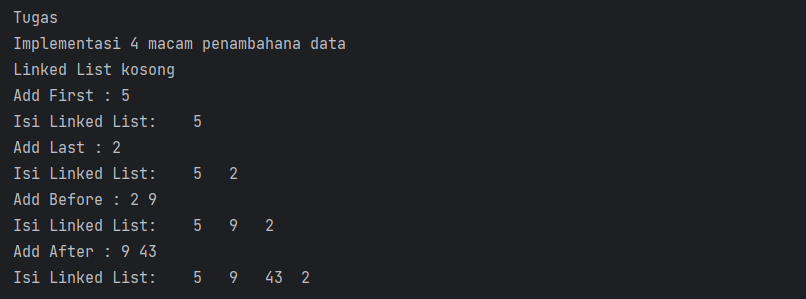
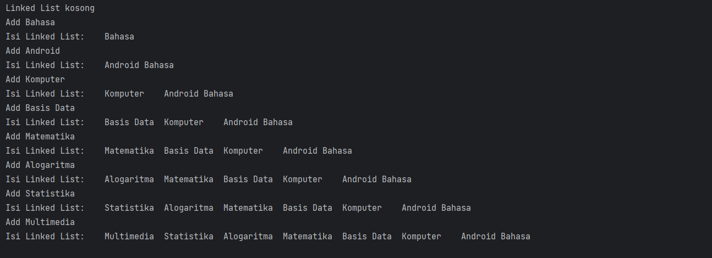

# Laporan Praktikum 9

---

NIM : 2241720192
Nama : Achmad Raihan Fahrezi Effendy
Kelas : TI 1D

---

## Praktikum

### 2.1 Pembuatan Single Linked List

Waktu percobaan : 30 menit

Didalam praktikum ini, kita akan mempraktekkan bagaimana membuat Single Linked List dengan
representasi data berupa Node, pengaksesan linked list dan metode penambahan data.

#### Kode Program

Class Node

``` java
package minggu11;

public class Node {
    int data;
    Node next;

    public Node(int data, Node next) {
        this.data = data;
        this.next = next;
    }
}
```

Class SingleLinkedList

``` java
package minggu11;

public class SingleLinkedList {
    Node head;
    Node tail;

    public boolean IsEmpty() {
        return head == null;
    }
    public void print() {
        if (!IsEmpty()) {
            Node tmp = head;
            System.out.print("Isi Linked List:\t");
            while (tmp != null) {
                System.out.print(tmp.data + "\t");
                tmp = tmp.next;
            }
            System.out.println();
        } else {
            System.out.println("Linked List kosong");
        }
    }

    public void addFirst(int input) {
        Node ndInput = new Node(input, null);
        if (IsEmpty()) {
            head = ndInput;
            tail = ndInput;
        } else {
            ndInput.next = head;
            head = ndInput;
        }
    }
    public void addLast(int input) {
        Node ndInput = new Node(input, null);
        if (IsEmpty()) {
            head = ndInput;
            tail = ndInput;
        } else {
            tail.next = ndInput;
            tail = ndInput;
        }
    }
   public void insertAfter(int key, int input) {
        Node ndInput = new Node(input, null);
        Node temp = head;
        do {
            if (temp.data == key) {
                ndInput.next = temp.next;
                temp.next = ndInput;
                if (ndInput.next ==null) tail = ndInput;
                break;
            }
            temp = temp.next;
        } while (temp != null);
    }

    public void insertAt(int index, int input) {
        if (index < 0) {
            System.out.println("indeks salah");
        } else if (index == 0) {
            addFirst(input);
        } else {
            Node temp = head;
            for (int i = 0; i < index - 1; i++) {
                temp = temp.next;
            }
            temp.next = new Node(input, temp.next);
            if (temp.next.next == null) tail = temp.next;
        }
    }

}
```

Class SSLMain

``` java
package minggu11;

public class SLLMain {
    public static void main(String[] args) {
        SingleLinkedList singLL = new SingleLinkedList();
        singLL.print();
        singLL.addFirst(890);
        singLL.print();
        singLL.addLast(760);
        singLL.print();
        singLL.addFirst(700);
        singLL.print();
        singLL.insertAfter(700,999);
        singLL.print();
        singLL.insertAt(3, 833);
        singLL.print();
    }
}
```

#### Output


Pertanyaan

1. Pada compile pertama kali saat dicetak akan muncul output bahwa linked list masih kosong hal tersebut dikarenakan pada saat instansiasi pertama nilai default Single linked list belum berisi data jika kita ingin menambahkan data pada linked list dapat menggunakan method method yang telah disediakan
2. Kegunaan kode program tersebu digunakan pada saat menambahkan data di tengah tengah linked list jadi kita perlu memperbarui

   ``` java
    ndInput.next = temp.next;
   ```

   nilai baru untuk alamat selanjutnya yaitu pointer selanjutnya yang ditunjuk oleh temp kemudian kita juga memperbarui alamat selanjutnya pada pointer temp agar menunjuk ke nilai baru yang baru ditambahkan

   ``` java
    temp.next = ndInput;
   ```
3. Pada kode program tersebut digunakan untuk memeriksa apakah elemen yang ditambahkan berada di posisi terakhir. Jika ya, maka tail diperbarui untuk menunjuk ke elemen baru ini, yaitu tail = temp.next. Dengan melakukan ini, kita memastikan bahwa tail selalu menunjuk ke elemen terakhir yang valid dalam linked list setelah operasi insertAt dilakukan.

### 2.2 Modifikasi Elemen pada Single Linked List

Waktu percobaan : 30 menit

Didalam praktikum ini, kita akan mempraktekkan bagaimana mengakses elemen, mendapatkan
indeks dan melakukan penghapusan data pada Single Linked List.

#### Kode Program

Class SingleLinkedList

``` java
package minggu11;

public class SingleLinkedList {
    Node head;
    Node tail;

    public boolean IsEmpty() {
        return head == null;
    }
    public void print() {
        if (!IsEmpty()) {
            Node tmp = head;
            System.out.print("Isi Linked List:\t");
            while (tmp != null) {
                System.out.print(tmp.data + "\t");
                tmp = tmp.next;
            }
            System.out.println();
        } else {
            System.out.println("Linked List kosong");
        }
    }

    public void addFirst(int input) {
        Node ndInput = new Node(input, null);
        if (IsEmpty()) {
            head = ndInput;
            tail = ndInput;
        } else {
            ndInput.next = head;
            head = ndInput;
        }
    }
    public void addLast(int input) {
        Node ndInput = new Node(input, null);
        if (IsEmpty()) {
            head = ndInput;
            tail = ndInput;
        } else {
            tail.next = ndInput;
            tail = ndInput;
        }
    }
    public void insertAfter(int key, int input) {
        Node ndInput = new Node(input, null);
        Node temp = head;
        do {
            if (temp.data == key) {
                ndInput.next = temp.next;
                temp.next = ndInput;
                if (ndInput.next ==null) tail = ndInput;
                break;
            }
            temp = temp.next;
        } while (temp != null);
    }

    public void insertAt(int index, int input) {
        if (index < 0) {
            System.out.println("indeks salah");
        } else if (index == 0) {
            addFirst(input);
        } else {
            Node temp = head;
            for (int i = 0; i < index - 1; i++) {
                temp = temp.next;
            }
            temp.next = new Node(input, temp.next);
            if (temp.next.next == null) tail = temp.next;
        }
    }
    public int getData(int index) {
        Node tmp = head;
        for (int i = 0; i < index; i++) {
            tmp = tmp.next;
        }
        return tmp.data;
    }
    public  int indexOf(int key) {
        Node tmp = head;
        int index = 0;
        while (tmp != null && tmp.data != key) {
            tmp = tmp.next;
            index++;
        }
        if (tmp == null) {
            return -1;
        } else {
            return index;
        }
    }

    public void removeFirst() {
        if (IsEmpty()) {
            System.out.println("Linked List masih Kosong, tidak dapat dihapus!");
        } else if (head == tail) {
            head = tail = null;
        } else {
            head = head.next;
        }
    }

    public void removeLast() {
        if (IsEmpty()) {
            System.out.println("Linked List masih Kosong, tidak dapat dihapus!");
        } else if (head == tail) {
            head = tail = null;
        } else {
            Node temp = head;
            while (temp.next != tail) {
                temp = temp.next;
            }
            temp.next = null;
            tail = temp;
        }
    }

    public void remove(int key) {
        if (IsEmpty()) {
            System.out.println("Linked List masih Kosong, tidak dapat dihapus!");
        } else {
            Node temp = head;
            while (temp != null) {
                if (temp.data == key && temp == head) {
                    this.removeFirst();
                    break;
                } else if (temp.next.data == key) {
                    temp.next = temp.next.next;
                    if (temp.next == null) {
                        tail = temp;
                    }
                    break;
                }
                temp = temp.next;
            }
        }
    }

    public void removeAt(int index) {
        if (index == 0) {
            removeFirst();
        } else {
            Node temp = head;
            for (int i = 0; i < index; i++) {
                temp = temp.next;
            }
            temp.next = temp.next.next;
            if (temp.next == null) {
                tail = temp.next;
            }
        }
    }

}
```

Class SSLMain

``` java
package minggu11;

public class SLLMain {
    public static void main(String[] args) {
        SingleLinkedList singLL = new SingleLinkedList();
        singLL.print();
        singLL.addFirst(890);
        singLL.print();
        singLL.addLast(760);
        singLL.print();
        singLL.addFirst(700);
        singLL.print();
        singLL.insertAfter(700,999);
        singLL.print();
        singLL.insertAt(3, 833);
        singLL.print();

        System.out.println("Data pada indeks ke-1=" + singLL.getData(1));
        System.out.println("Data 3 berada pad indeks ke-" + singLL.indexOf(760));

        singLL.remove(999);
        singLL.print();
        singLL.removeAt(0);
        singLL.print();
        singLL.removeFirst();
        singLL.print();
        singLL.removeLast();
        singLL.print();
    }
}
```

#### Output



Pertanyaan

1. Kegunaaan keyword break pada kode method remove yaitu untuk menghentikan perulangan setelah elemen yang ingin dihapus ditemukan dan dihapus. Ketika elemen yang ingin dihapus ditemukan, perulangan tidak perlu dilanjutkan karena elemen tersebut sudah dihapus. Dengan menggunakan break, program keluar dari perulangan dan melanjutkan eksekusi kode setelah perulangan.
2. Pada kode program `else if (temp.next.data == key)` memeriksa apakah nilai data dari elemen berikutnya temp.next sama dengan key. Jika benar, maka elemen berikutnya adalah elemen yang ingin dihapus. Dalam hal ini, kita mengubah referensi temp.next untuk menunjuk langsung ke elemen setelahnya temp.next.next melewati elemen yang ingin dihapus. Dengan melakukannya, elemen yang ingin dihapus secara efektif dihilangkan dari linked list karena tidak ada lagi referensi yang menunjuk kepadanya.
3. Method indexOf mengembalikan nilai  Jika elemen dengan nilai yang dicari ditemukan dalam linked list, maka metode indexOf akan mengembalikan indeks  di mana elemen itu ditemukan. Jika elemen dengan nilai yang dicari tidak ditemukan dalam linked list, maka metode indexOf akan mengembalikan nilai -1.

### Tugas

Waktu pengerjaan : 50 menit

1. Buat method insertBefore untuk menambahkan node sebelum keyword yang diinginkan

   Pada Class SingleLinkedList tambah method berikut

   ``` java
   public void insertBefore(int key, int input) {
        Node ndInput = new Node(input, null);
        if (head == null) {
            System.out.println("Linked List masih Kosong, tidak dapat melakukan insertBefore!");
        } else if (head.data == key) {
            addFirst(input);
        } else {
            Node temp = head;
            while (temp.next != null) {
                if (temp.next.data == key) {
                    ndInput.next = temp.next;
                    temp.next = ndInput;
                    break;
                }
                temp = temp.next;
            }
            if (temp.next == null) {
                System.out.println("Keyword tidak ditemukan di dalam linked list !");
            }
        }
    }
   ```
2. Implementasikan ilustrasi Linked List Berikut. Gunakan 4 macam penambahan data yang telah dipelajari sebelumnya untuk menginputkan data.

   Pada Class SSLMain tambahkan kode program sebagai berikut.

   ``` java
      System.out.println("Tugas");
      System.out.println("Implementasi 4 macam penambahana data");

      SingleLinkedList myLIst = new SingleLinkedList();
      myLIst.print();
      myLIst.addFirst(5);
      System.out.println("Add First : 5");
      myLIst.print();
      myLIst.addLast(2);
      System.out.println("Add Last : 2");
      myLIst.print();
      myLIst.insertBefore(2,9);
      System.out.println("Add Before : 2 9");
      myLIst.print();
      System.out.println("Add After : 9 43");
      myLIst.insertAfter(9, 43);
      myLIst.print();

   ```
   #### Output

   
   3. d

      #### Kode Program
   
      Class Node
      ``` java
      package minggu11.tugas;
   
      public class Node {
      String data;
      Node next;
   
          public Node(String data, Node next) {
              this.data = data;
              this.next = next;
          }
      }
      ```
      Class SingleLinkedList
      ``` java
      package minggu11.tugas;
   
      public class SingleLinkedList {
      Node head;
      Node tail;
   
          public boolean IsEmpty() {
              return head == null;
          }
          public void print() {
              if (!IsEmpty()) {
                  Node tmp = head;
                  System.out.print("Isi Linked List:\t");
                  while (tmp != null) {
                      System.out.print(tmp.data + "\t");
                      tmp = tmp.next;
                  }
                  System.out.println();
              } else {
                  System.out.println("Linked List kosong");
              }
          }
   
          public void addFirst(String input) {
              Node ndInput = new Node(input, null);
              if (IsEmpty()) {
                  head = ndInput;
                  tail = ndInput;
              } else {
                  ndInput.next = head;
                  head = ndInput;
              }
          }
          public void addLast(String input) {
              Node ndInput = new Node(input, null);
              if (IsEmpty()) {
                  head = ndInput;
                  tail = ndInput;
              } else {
                  tail.next = ndInput;
                  tail = ndInput;
              }
          }
      public void insertAfter(String key, String input) {
      Node ndInput = new Node(input, null);
      Node temp = head;
      do {
      if (temp.data == key) {
      ndInput.next = temp.next;
      temp.next = ndInput;
      if (ndInput.next ==null) tail = ndInput;
      break;
      }
      temp = temp.next;
      } while (temp != null);
      }
   
          public void insertAt(int index, String input) {
              if (index < 0) {
                  System.out.println("indeks salah");
              } else if (index == 0) {
                  addFirst(input);
              } else {
                  Node temp = head;
                  for (int i = 0; i < index - 1; i++) {
                      temp = temp.next;
                  }
                  temp.next = new Node(input, temp.next);
                  if (temp.next.next == null) tail = temp.next;
              }
          }
          public String getData(int index) {
              Node tmp = head;
              for (int i = 0; i < index; i++) {
                  tmp = tmp.next;
              }
              return tmp.data;
          }
          public  int indexOf(String key) {
              Node tmp = head;
              int index = 0;
              while (tmp != null && tmp.data != key) {
                  tmp = tmp.next;
                  index++;
              }
              if (tmp == null) {
                  return -1;
              } else {
                  return index;
              }
          }
   
          public void removeFirst() {
              if (IsEmpty()) {
                  System.out.println("Linked List masih Kosong, tidak dapat dihapus!");
              } else if (head == tail) {
                  head = tail = null;
              } else {
                  head = head.next;
              }
          }
   
          public void removeLast() {
              if (IsEmpty()) {
                  System.out.println("Linked List masih Kosong, tidak dapat dihapus!");
              } else if (head == tail) {
                  head = tail = null;
              } else {
                  Node temp = head;
                  while (temp.next != tail) {
                      temp = temp.next;
                  }
                  temp.next = null;
                  tail = temp;
              }
          }
   
          public void remove(String key) {
              if (IsEmpty()) {
                  System.out.println("Linked List masih Kosong, tidak dapat dihapus!");
              } else {
                  Node temp = head;
                  while (temp != null) {
                      if (temp.data == key && temp == head) {
                          this.removeFirst();
                          break;
                      } else if (temp.next.data == key) {
                          temp.next = temp.next.next;
                          if (temp.next == null) {
                              tail = temp;
                          }
                          break;
                      }
                      temp = temp.next;
                  }
              }
          }
   
          public void removeAt(int index) {
              if (index == 0) {
                  removeFirst();
              } else {
                  Node temp = head;
                  for (int i = 0; i < index; i++) {
                      temp = temp.next;
                  }
                  temp.next = temp.next.next;
                  if (temp.next == null) {
                      tail = temp.next;
                  }
              }
          }
   
          public void insertBefore(String key, String input) {
              Node ndInput = new Node(input, null);
              if (head == null) {
                  System.out.println("Linked List masih Kosong, tidak dapat melakukan insertBefore!");
              } else if (head.data == key) {
                  addFirst(input);
              } else {
                  Node temp = head;
                  while (temp.next != null) {
                      if (temp.next.data == key) {
                          ndInput.next = temp.next;
                          temp.next = ndInput;
                          break;
                      }
                      temp = temp.next;
                  }
                  if (temp.next == null) {
                      System.out.println("Keyword tidak ditemukan di dalam linked list !");
                  }
              }
          }
   
      }

      ```
      Class SSLMain
      ``` java 
      package minggu11.tugas;
   
      public class SLLMain {
         public static void main(String[] args) {
            SingleLinkedList StringLinkList = new SingleLinkedList();
            StringLinkList.print();
            StringLinkList.addFirst("Bahasa");
            System.out.println("Add Bahasa");
            StringLinkList.print();
            StringLinkList.addFirst("Android");
            System.out.println("Add Android");
            StringLinkList.print();
            StringLinkList.addFirst("Komputer");
            System.out.println("Add Komputer");
            StringLinkList.print();
            StringLinkList.addFirst("Basis Data");
            System.out.println("Add Basis Data");
            StringLinkList.print();
            StringLinkList.addFirst("Matematika");
            System.out.println("Add Matematika");
            StringLinkList.print();
            StringLinkList.addFirst("Alogaritma");
            System.out.println("Add Alogaritma");
            StringLinkList.print();
            StringLinkList.addFirst("Statistika");
            System.out.println("Add Statistika");
            StringLinkList.print();
            StringLinkList.addFirst("Multimedia");
            System.out.println("Add Multimedia");
            StringLinkList.print();
         }
      }

      ```

   #### Output

   


